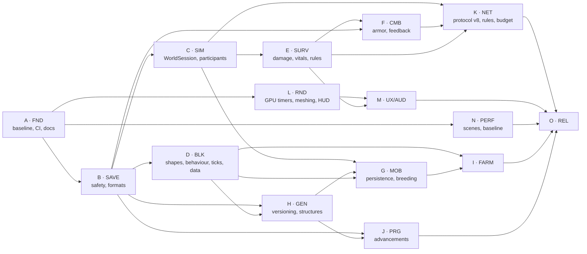
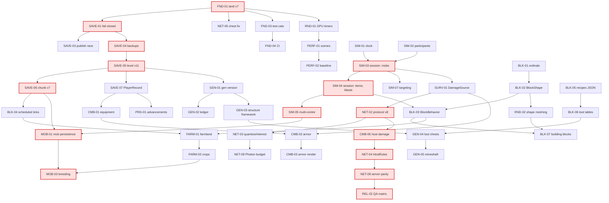

# Mineclone 1.1 Development Roadmap

> **Рабочее название версии:** Mineclone 1.1 — «Выживание и общий мир» (*Survival & Shared World*).
> **Дата аудита:** 24 сентября 2026. **База:** ветка `feature/network-hardening` @ `e6071c8`
> (25 коммитов впереди `master`, плюс незакоммиченная работа: 34 изменённых файла в `src`,
> 43 новых файла, протокол v7). **Горизонт:** 28 рабочих дней + 2 дня выпуска, два потока работы.
>
> Документ — рабочий план lead-разработчика. После утверждения фраза «Начинай Phase 1»
> означает: выполнить milestone **M0** (раздел 9) задачами из раздела 6 в порядке раздела 8.

## 0. Как пользоваться этим документом

- **Phase N = Milestone MN** (раздел 9). Внутри milestone задачи идут в порядке
  календаря (раздел 8); зависимости — в разделе 7.
- **ID задачи** — `<ЭПИК>-<номер>` (`SAVE-03`, `SIM-07`). В сообщениях коммитов
  указывать ID: `fix(save): fail closed on unreadable level (SAVE-01)`.
- **Единица оценки — agent-day (AD):** один рабочий день lead-разработчика с Claude Code
  (1–3 сфокусированные сессии, включая тесты, превью и ревью). Калибровка по истории
  репозитория: 22.09.2026 в один день вошли room codes, connect ladder, выделенный сервер,
  составной транспорт и `WorldSimulation`; 16.09 — вся основа инвентаря (plan A).
- **Правила выполнения каждой задачи** (действуют для всех задач, в карточках не повторяются):
  1. Сначала тест, который воспроизводит проблему или фиксирует свойство (для bug fix —
     регрессионный тест, для детерминированной системы — детерминированный тест, для сети —
     `LoopbackTransport` + реальные сокеты, для рендера — снимок/preview, для сейва — round-trip
     и миграция).
  2. `.\run-tests.ps1` зелёный до и после. Для задач с сетью — ещё `.\run-net-test.ps1`, с
     сервером — `.\run-server-test.ps1`, с UI/игровым циклом — автопилот.
  3. Замер «до/после» для любой задачи с пометкой **PERF** (раздел 11: сцены и метрики).
  4. Обновить `docs/architecture/<подсистема>.md` и, если решение нетривиальное, ADR в
     `knowledge/decisions/`. Запись в `CHANGELOG.md` → `## [Unreleased]`.
  5. Не расширять scope задачи молча: найденное по дороге — в backlog (раздел 17) или
     отдельной задачей.
- **Обозначения статусов:** ✅ есть и проверено, 🟡 частично, ❌ нет, ⚠️ риск/дефект.

---

## 1. Executive Summary

### Что такое Mineclone сейчас

Воксельная песочница на Java 17 + LWJGL 3.3.6 (OpenGL 3.3 core, OpenAL, GLFW):
**262 файла / 57,3 тыс. строк** основного кода, **25 файлов / 12,7 тыс. строк** тестов,
**455 тестов проходят за 17 с** (проверено 24.09.2026 прогоном `run-tests.ps1`).

Техническая «витрина» у проекта сильная и местами на уровне коммерческих инди:
HDR-конвейер с каскадными тенями, bloom, god rays, DoF и объёмным туманом; осадки
на GPU; молния и погода как чистые функции `(seed, time)`; реверберация с раздельными
замкнутостью и размером комнаты; музыкальный директор; кинематографический фон меню;
immediate-mode UI с автопилотом; реестр предметов на данных с компонентами; каркас
окон контейнеров; вода и лава с термодинамикой; инкрементальный небесный свет;
игра по сети через Photon Cloud (собственный клиент), LAN, прямое соединение
(UPnP/NAT-PMP/STUN) и выделенный сервер.

### Главная проблема текущей версии

**Глубина презентации и инфраструктуры сильно опережает глубину игры и корректность
симуляции.**

1. **Игровой цикл короткий и линейный.** `SurvivalProgress` — 14 шагов, которые
   заканчиваются алмазной киркой. Нет брони, земледелия, добычи в постройках,
   утопления, насыщения, сложности, потерь при смерти (инвентарь сохраняется всегда).
   Постройки — четыре шаблона ≤7×7 внутри одного чанка, одна на регион 160×160, без
   сундуков. Медные инструменты имеют рецепты, но медной руды в мире нет.
2. **Мир не «общий».** Мобы видят ровно одного игрока (`Mob.update(world, playerPos, …)`):
   у хозяина — его самого, на выделенном сервере — первого участника. Зомби не бьют
   гостя вблизи (гостя ранят только снаряды). На выделенном сервере мобы вообще не
   наносят урон в ближнем бою, криперы не взрываются, добыча с мобов не падает — логика
   мобов продублирована в `Game.updateMobs` и `DedicatedServer.tickMobs`, и серверная
   копия неполна. Мобы не сохраняются и исчезают дальше 72 блоков → разведение животных
   невозможно в принципе.
3. **Есть реальные пути потери данных** (P0, раздел 3): сервер перезаписывает нечитаемый
   `level.dat` новым миром; нечитаемый чанк молча генерируется заново и перезаписывается;
   чанк публикуется в карту мира раньше, чем восстановлен из сейва; гость, сломавший
   сундук, уничтожает его содержимое; сборка 1.0 откроет мир 1.1 и испортит его; любая
   правка генератора незаметно меняет все нетронутые чанки старых миров.
4. **Архитектурный долг блокирует контент.** `Game.java` — 6 837 строк, ~200 полей,
   ~250 методов. Форма и поведение блоков размазаны по `BlockType`, `Player`,
   `ChunkMesher`, `EntityPhysics`, `Raycaster`, `Game.handleInteraction`. Рецепты,
   плавка и добыча — в Java. Формат чанка без секций. Урон — шесть разных входов без
   `DamageSource`.

### Какой должна стать 1.1

**Не «больше рельефа», а больше смысла в мире, который уже есть**, и одинаковая игра в
одиночку, по LAN, через Photon и на выделенном сервере:

- **Выживание с последствиями:** насыщение, воздух и утопление, статус-эффекты,
  сложность, броня, смерть с выпадением вещей (с правилом `keepInventory`), еда
  с прогрессией.
- **Причины исследовать мир:** многочанковые постройки с сундуками и таблицами добычи
  (заброшенная шахта, пирамида, склеп, сторожевая башня), медь, растительность,
  журнал и достижения вместо линейной цепочки.
- **Возобновляемость:** фермы, саженцы, разведение животных, сохранение мобов.
- **Общий мир:** одно ядро симуляции для игры и сервера, мобы атакуют любого участника,
  протокол v8 с проверками на хозяине и экономным трафиком.
- **Фундамент на будущее:** секционные форматы сейва с защитой от старых сборок,
  версия генератора с журналом чанков, `BlockShape`/`BlockBehavior`, запланированные
  тики, JSON-рецепты/добыча/достижения, CI, замеры производительности.

**Почему не «World Expansion» в буквальном смысле:** рельеф уже разнообразен
(11 биомов, реки, озёра, пещеры, мезы, вулканические плато), а высота мира 128
(`Chunk.SIZE_Y`) ограничивает горы; её увеличение — это смена формата чанка, мешера,
света и сети ради одного эффекта (раздел 17). Максимальный прирост ощущения даёт то,
**что** игрок находит в мире и **зачем** идёт дальше.

---

## 2. Current State Audit

Статусы: **mature** — зрелая, трогать только при необходимости; **functional** —
работает, но неполна; **prototype** — концепт; **fragile** — ломается на краях;
**tech debt** — мешает развитию; **missing** — нет.

| Подсистема | Статус | Сильные стороны | Проблемы (проверено по коду) | Приоритет 1.1 |
|---|---|---|---|---|
| Жизненный цикл приложения (`Main`, `Window`, `Game.run`) | tech debt | Корректная очистка ресурсов (`cleanup`, `unloadWorld` + `System.gc`), закрытие окна сохраняет мир | Всё в одном `Game` (6 837 строк); выход закрывает окно только у хозяина (`closeWindow` вне клиента) | P1 |
| Игровой цикл | tech debt | Профилировщик фаз (`FrameProfiler`), лог `FRAME_SPIKE` | Переменный `dt` (cap 50 мс) для симуляции мобов, предметов, снарядов; сервер тикает фиксированно 20 Гц → поведение SP и сервера расходится; редкий спайк UPDATE 43 мс (аудит 24.09) | P1 |
| Ввод (`Input`, `KeyBindings`, `UiInput`) | mature | Переназначение клавиш по имени действия, снимок `UiInput` без GLFW | Кнопки мыши в `Game.handleInteraction` читаются напрямую из GLFW и не переназначаются | P3 |
| Игрок (`Player`) | functional | Здоровье, голод, неуязвимость, режимы, полёт в креативе | Нет насыщения, воздуха, брони, эффектов; `Player.update(dt, world, Input)` связан с GLFW-вводом → правила игрока нельзя выполнить на хозяине/сервере | P0 (геймплей) |
| Движение/физика | mature | MC-подобное ускорение, вода, лёд (`grip`), автоподъём | Ступени — частный случай (`Player.resolveStairs`); у мобов (`EntityPhysics`) ступени — полный куб; нет общей модели форм | P1 |
| Камера | mature | F5, фоторежим, тряска, `CameraMotion` | — | — |
| Бой (`Combat`, `AttackSpec`) | functional | Урон и темп из данных, готовность удара, крит, отброс | Нет `DamageSource`, брони, щита; клиент сам присылает урон (`C_MOB_HIT` ≤ 100) | P0 |
| Снаряды (`Projectile`, `Bow`) | functional | Трассировка отрезка, подбор стрел, баллистика скелета (`aimWithLead`) | Один тип снаряда; клиент присылает скорость и урон (`C_SHOOT`) | P2 |
| Предметы (`ItemRegistry`, `ItemComponents`, `TagRegistry`) | mature | Строгая загрузка JSON, неизменяемые компоненты, вычисляемые теги, мост `LegacyItems` | Нет `ArmorSpec`/слота экипировки; `FoodSpec` только `nutrition` | P1 |
| Инвентарь (`Inventory`) | functional | 36 слотов, операции покрыты тестами | Нет брони и второй руки; `PlayerData` жёстко проверяет длину 36 | P1 |
| Контейнеры (`ContainerMenu`, v7 `InventorySync`) | functional | Единые правила клика/Shift/протяжки; жесты сундука и печи исполняет хозяин (v7) | Работа v7 **не закоммичена**; стиль `InventorySync` (однострочные методы) выбивается из кода проекта | P0 (закоммитить) |
| Крафт (`Recipes`, `CraftingGrid`) | functional | Формованные и бесформенные рецепты, зеркальность, общая сетка 2×2/3×3 | Таблица в Java; медные инструменты недостижимы (нет руды); нет открытия рецептов | P1 |
| Печи (`Furnace`, `Smelting`) | functional | Чистая логика, сохранение только при смене слотов | Таблица в Java; тикают только в радиусе 4 чанков от **одной** точки (`WorldSimulation.update(…, around, …)`) | P1 |
| Выживание | prototype | Голод гейтит регенерацию, сон перематывает ночь | Нет насыщения, утопления, урона кактусом/удушьем, сложности; смерть без последствий; мгновенная еда со звуком клика UI | P0 |
| Прогрессия (`SurvivalProgress`) | prototype | Монотонность, восстановление по инвентарю, своя секция сейва | 14 линейных шагов в Java, конец — алмазная кирка | P1 |
| Мобы (`Mob`, `MobType`) | functional | 11 видов с разными нравами, элиты, конечности, анимации | Не сохраняются; все исчезают дальше 72 блоков (`MobSpawner.despawnFar`); добыча в `switch` | P0 |
| ИИ мобов (`Behavior`, `MobTactics`, `Wildlife`) | fragile | Дерево поведения, мораль, распорядок, стая, охота волков | Одна цель — `playerPos`; вблизи гостя не бьют; на сервере `justAttacked`/`justExploded` игнорируются | P0 |
| Поиск пути (`PathFinder`) | mature | A* с прыжками, провалами, ценой света; замер 0,20 мс средн./1,9 мс худш. | Нет общего бюджета на тик при нескольких целях; двери — просто твёрдый блок | P2 |
| Спавн мобов (`MobSpawner`) | functional | Кольцо, капы, полосы глубины, стаи | Всё вокруг одной точки; нет таблиц по биомам в данных; животные бесконечно возрождаются → разводить бессмысленно | P1 |
| Мировой тик (`WorldSimulation`) | functional | Общий класс для игры и сервера | Один центр; сервер передаёт `precipitation = 0` → на сервере не ложится снег и дождь не тушит огонь | P1 |
| Блоки (`BlockType`) | tech debt | Порядковые номера зафиксированы комментарием «append only» | Свойства — `switch` по enum в 6 местах; ordinal = id в сейве без golden-теста; 50/256 id заняты | P1 |
| Состояния блоков (meta) | prototype | 1 байт meta на ячейку, `BlockState` для пипетки | Дверь = два типа (`DOOR_OPEN/CLOSED`) + meta; нет форм (`BlockShape`); `Raycaster` видит только полные кубы и цепляет лаву | P1 |
| Тики блоков (`BlockTicker`) | functional | Трава, снег, лёд, огонь, мох, лава, пепел | 3 случайные позиции на **колонну 16×128×16** раз в 0,25 с → ячейка тикается ~раз в 45 мин; нет запланированных тиков — ферма на этом невозможна | P1 |
| Жидкости (`WaterSimulator`, `LavaSimulator`, `FluidThermodynamics`) | mature | Стоимость тика снижена 11,4 → 4,8 мс, встреча по геометрии | — | — |
| Падающие блоки (`FallingBlocks`) | mature | По событию, потолки на кадр, сохранение массы | — | — |
| Огонь | functional | Распространение, тушение дождём, поджог молнией | Поджог молнией есть только в `Game` (нет на сервере) | P2 |
| Взрывы (`Explosion`) | functional | Прямая видимость, прочность, линейный спад | Не ранит гостей; блоки не дают добычу; на сервере не выполняется | P1 |
| Погода (`Weather`), молния (`Lightning`), ночное небо | mature | Чистые функции, без пакетов в протоколе | — | — |
| Биомы (`Biome`, `BiomeProvider`) | functional | 11 биомов, 4 климатических шума, сглаживание высоты | Таблица в Java; нет подвидов и декора (трава, цветы) | P2 |
| Рельеф (`World.columnHeight`) | functional | Мезы, альпика, вулканика, непрерывный фильтр | Высота мира 128 ограничивает горы | P3 |
| Пещеры (`Caves`) | functional | Связные тоннели, защита дна | Нет залов и подземных озёр | P2 |
| Руды (`OreGenerator`) | functional | Детерминированные жилы, полосы | Нет меди | P1 |
| Постройки (`Structures`) | prototype | Детерминированный выбор региона, резерв под деревья | 4 шаблона внутри одного чанка, 1 кандидат на регион 160×160 (¾ шанс), нет сундуков и добычи | P0 (геймплей) |
| Реки и озёра (`Rivers`) | functional | Высота, а не блок; затухание размыва | — | — |
| Загрузка чанков (`ChunkLoader`) | fragile | Приоритеты, правки вне очереди, LOD | ⚠️ Чанк публикуется (`World.getChunk` → `computeIfAbsent`) до `applySnapshot`; `Chunk.chests/furnaces` — `HashMap` из двух потоков; `Chunk.modified` не `volatile` | P0 |
| Хранение чанка (`PaletteStorage`) | mature | Чтение без монитора, 16,3 → 1,9 нс | — | — |
| Мешинг (`ChunkMesher`) | mature | Фоновые потоки, AO, жадные грани, LOD освещения, версии мешей | Формы (дверь, ступени, слой) — частные случаи | P1 (через `BlockShape`) |
| Освещение | mature | Инкрементальный небесный свет, BFS блочного света | — | — |
| Сохранения (`SaveManager`, `SaveFormat`) | fragile | Атомарная запись через `.tmp` + `ATOMIC_MOVE`; секции в `level.dat` v10; тегированный хвост `options.dat` | ⚠️ нет бэкапов; нечитаемый чанк → регенерация и перезапись; сервер перезаписывает нечитаемый уровень; нет защиты от старых сборок; чанк без секций; мобы не сохраняются; `saveLevel` пишет на главном потоке | P0 |
| Данные (`assets/data/mineclone`) | functional | Предметы, теги, категории, строгие ошибки с путём до ключа | Рецепты, плавка, добыча, спавн, достижения — в коде | P1 |
| Рендер (`render/`) | mature | Линейный HDR, `SceneLighting` как единый источник света, аварийный путь без пост-эффектов | Нет GPU-таймеров; мобы и предметы режутся только дистанцией, не фрустумом | P2 |
| Шейдеры (`Shaders`) | mature/tech debt | Общие библиотеки `LIB_COLOR/SHADOW/LIGHT` | 1 618 строк строковых литералов, нет hot reload | P3 |
| Тени (`ShadowMap`, `SunLight`) | mature | Ленивые каскады, матрица, которой карта реально отрисована | Мерцание при движении не измерялось (нужна проверка привязки к текселю) | P2 |
| Пост-обработка (`PostProcess`) | mature | ACES, bloom, god rays, DoF только в фоторежиме | — | — |
| Частицы (`ParticleSystem`, `GpuParticlePhysics`) | mature | Бюджет, пиксельные маски | — | — |
| Рендер сущностей (`MobRenderer`, `PlayerRenderer`, `ItemRenderer`) | functional | Общий куб и шейдер, тени, анимации, правая рука исправлена 24.09 | Нет слоя брони, масштаба детёнышей | P1 |
| Небо, осадки | mature | Палитра `SkyPalette`, снос по интегралу ветра | — | — |
| Аудио (`SoundEngine`, `Sounds`) | mature | Позиционный звук, окклюзия, пул источников | `alGenSources` без жёсткого потолка и приоритетов при пустом пуле | P2 |
| Акустика помещений (`AcousticProbe`, `RoomAcoustics`) | mature | Раздельные замкнутость и размер, тесты | **Не трогать** | — |
| Музыка (`MusicDirector`, `MusicPlayer`, `MusicSense`) | mature | 14 треков, края по биомам, реакция на бой | **Не трогать** (кроме новых моментов) | — |
| Меню (`com.mineclone.ui`) | mature | Стек экранов, тема, автопилот, снимки | Нет выбора сложности и правил мира | P1 |
| Настройки (`SettingsModel`, `Options`) | mature | Пресеты-заготовки, тегированный хвост v7 | Нет субтитров | P2 |
| HUD (`Hud`) | functional | Стекло, компас, сердца, голод, цель | Нет брони, воздуха, эффектов, направления урона | P1 |
| Отладка (`FrameProfiler`, `StressFlight`, `Bench*`) | functional | Худший кадр, перцентили, GC | Только CPU; нет счётчиков трафика; нет сохранённых базовых замеров | P1 |
| Игра по сети (`Multiplayer`, `NetProto` v7) | fragile | Хозяин — власть, дельты чанков, проверка отправителя, переподключение | Мобы бьют только хозяина; гость ломает сундук → вещи исчезают; клиент присылает урон, id блока и контрольную точку инвентаря; мобы и предметы рассылаются **всем целиком** | P0 |
| Photon (`PhotonPeer`, `PhotonTransport`) | functional | Свой клиент без SDK, лестница подключения, коды комнат | Общий встроенный App ID (лимит 100 CCU на всех); лимит сообщений комнаты не замерен | P2 |
| LAN (`LanTransport`, `LanBeacon`) | mature | Heartbeat, маяк, отсев чужой версии | — | — |
| Прямое соединение (`PortMapper`, `UpnpGateway`, `NatPmp`, `PublicAddress`) | prototype | Два механизма проброса, STUN | Не проверено между реальными NAT | P3 |
| Выделенный сервер (`DedicatedServer`) | functional | Фиксированный тик 20 Гц, консоль, `/stop` с записью | ⚠️ перезаписывает нечитаемый мир; нет урона мобов вблизи, взрывов, добычи; центр мира — первый участник; дублирует `saveWorld`/`itemsInChunk` из `Game` | P0 |
| Протокол | functional | Версия в приложении Photon, `truncated()` везде | Нет метрик по пакетам; нет фазз-тестов обработчиков | P1 |
| Власть сервера | prototype | Хозяин симулирует мир, контейнеры (v7) | Доверие к клиенту полное (модель «только друзья» не зафиксирована ADR) | P1 |
| Сборка | tech debt | `run.ps1`, `run-tests.ps1`, Gradle с jpackage | Две системы сборки; Gradle не запускает тесты; версия только в `build.gradle`; нет CI | P1 |
| Упаковка | functional | `gradlew portableZip`, `Sync` вместо `Copy` | Нет пакета сервера | P2 |
| Тесты | functional | 455 тестов, 17 с, без GL | Один `TestMain` на 3 851 строку, нет категорий и фильтра; нет эталонных сейвов старых версий; нет golden-хэшей генерации | P1 |
| Профилирование | functional | `StressFlight`, `BenchShaders`, `BenchWater`, `BenchPathfinder`, `BenchUi` | Нет единого набора сцен и хранения базовых замеров | P1 |
| Инструменты (`tools/`, 39 файлов) | functional | Превью, импорт, замеры, смоуки | Нет каталога; часть генераторов лежит в корне (`HeartSpriteGen.java/.class`, `WaterParticleGen`, `WaterTextureGen`) | P2 |
| Документация/DX | tech debt | 32 ADR, аудиты, спеки | CLAUDE.md 131 КБ (≈40–50 тыс. токенов каждую сессию); AGENTS.md устарел; граф от 20.05; 383 заглушки в vault; CHANGELOG стоит на 1.0.0-alpha | P1 |

### Documentation drift (проверено по коду)

| Утверждение | Где | Реальность |
|---|---|---|
| «No Maven/Gradle wrapper» | `CLAUDE.md`, `AGENTS.md`, комментарий в `TestMain` | Есть `gradlew`, `gradle/wrapper` (Gradle 9.2.0), `build.gradle` с `jpackage`/`portableZip` |
| «No tests exist. The game has no test suite.» | `AGENTS.md` | 455 тестов |
| «`World.generate()` is two-pass» | `AGENTS.md`, `knowledge/architecture/overview.md` | Четыре прохода + реки + постройки |
| «five programs: CHUNK, LINE, PARTICLE, TEXT, UI» | `AGENTS.md` | ~20 программ, включая пост и тени |
| «TextureAtlas procedurally generates a 256×256 atlas» | `AGENTS.md` | Загружает PNG, атлас 512×512, 139/256 тайлов занято |
| «Семь MP3 из `assets/music/`» | `CLAUDE.md` | 14 файлов, все в `MusicLibrary.CATALOG` |
| «руина 1/70, обелиск 1/90, хижина 1/110» | `CLAUDE.md` (таблица ручек) | Один кандидат на регион 10×10 чанков с шансом ¾, 4 шаблона включая `DUNGEON` |
| «Мир крутится вокруг участников» | `CLAUDE.md` (сервер) | Чанки грузятся вокруг всех, но тики, печи и мобы — вокруг **первого** участника (`DedicatedServer.centre()`) |
| «Снимок мобов вокруг участника» | `NetProto.S_MOBS` (javadoc) | `sendMobs()` рассылает всех мобов всем (`NetChannel.ALL`) |
| «17 кластеров, 511 узлов» | `CLAUDE.md`, `graphify-out/` | Граф от 20.05.2026 по 58 файлам; сейчас 262 |
| «Перед решением по архитектуре читай `GRAPH_REPORT.md`» | `CLAUDE.md` | Отчёт устарел — инструкция вредна |
| CHANGELOG | `CHANGELOG.md` | Последняя запись 1.0.0-alpha (21.09), после неё 25+ коммитов (сеть, сервер, бой, мобы, гроза) не описаны |

---

## 3. Technical Debt Audit

### P0 — корректность, потеря данных, порча мира, рассинхрон сети

| ID | Проблема | Доказательство в коде | Последствие | Задача |
|---|---|---|---|---|
| TD-01 | Незакоммиченная работа: протокол v7, сохранность инвентаря (`InventorySync`, `PlayerData`), текстуры экипировки, анимации игрока, фон меню, звук дождя/грозы | `git status`: 34 файла `src` изменены (+1 399/−552), 43 новых файла | Потеря недель работы; невозможность параллельных веток | FND-01 |
| TD-02 | Сервер создаёт новый мир поверх нечитаемого `level.dat` | `DedicatedServer.openWorld`: `lvl == null` → новый сид → `saveLevel()`; `SaveManager.loadLevel` возвращает `null` и для «нет файла», и для «повреждён», и для «версия новее» | Перезапись мира; старые чанки ложатся на рельеф другого сида | SAVE-01 |
| TD-03 | Нечитаемый чанк молча генерируется заново | `SaveManager.loadChunk` → `null` при `IOException` или `version > CHUNK_VERSION`; `ChunkLoader.applySnapshot` → свежая генерация; при правке файл перезаписывается | Тихая потеря построек | SAVE-02 |
| TD-04 | Чанк публикуется до восстановления из сейва | `ChunkLoader.submitGen`: `applySnapshot(world.getChunk(cx, cz))` — `getChunk` уже вставил чанк в `ConcurrentHashMap`; `restoreChests` пишет в `HashMap` на потоке генерации | Главный поток видит чанк без правок (симуляция, дельта гостю, сохранение), возможна порча `HashMap` | SAVE-03 |
| TD-05 | Гость ломает сундук/печь — содержимое уничтожается | `Game.applyRemoteBlock` и `DedicatedServer.applyRemoteBlock` → `World.setBlock` → `removeChest`/`removeFurnace` без высыпания; у гостя содержимого нет | Потеря вещей в сетевой игре | NET-05 |
| TD-06 | Старая сборка испортит мир новой | `level.dat` v10 принимает любые секции; сборка 1.0 откроет мир 1.1, неизвестные id блоков прочтёт как `AIR`, чанк новой версии регенерирует и перезапишет | Необратимая порча при откате версии | SAVE-05 |
| TD-07 | Любое изменение генератора меняет старые миры | Сохраняются только изменённые чанки (`saveChunkIfModified`), остальные каждый раз генерируются из сида; гость генерирует чанк сам и получает только дельту | Швы у каждой постройки игрока; дельта гостю неверна, если версии генератора разные | GEN-01, GEN-02 |

### P1 — архитектура, блокирующая развитие

| ID | Проблема | Доказательство | Что блокирует | Задача |
|---|---|---|---|---|
| TD-10 | God object `Game` | 6 837 строк; ввод, взаимодействия, лук, снаряды, команды, гроза, эмбиент, шаги, `render()` на 430 строк, меню, анонимный `NetContext` на ~200 строк | Параллельную работу (конфликты), контекст агента (~90 тыс. токенов на файл), тестируемость | SIM-03/04/08, BLK-03 |
| TD-11 | Дублирование симуляции игры и сервера | `DedicatedServer.tickMobs/tickItems/saveWorld/itemsInChunk` ≈ копии из `Game`; `TIME_SCALE` объявлен дважды | Паритет сервера (нет урона, взрывов, добычи) | SIM-01, SIM-03, SIM-04 |
| TD-12 | Однопользовательские допущения в симуляции | `Mob.update(…, Vector3f playerPos, …)`, `MobSpawner.trySpawn/despawnFar(player)`, `WorldSimulation.update(…, around, …)` | Мобы против гостей, печи/тики у гостей, спавн вокруг всех | SIM-02, SIM-05, SIM-07 |
| TD-13 | Нет источника урона | `Player.takeDamage`, `takeAttackDamage`, `Mob.hurt` (3 перегрузки), `hurtLimb`, `Hittable.takeProjectile`, урон ядом в `Game.updateActiveWorld` | Броня, щит, сложность, сообщения о смерти, направление урона | SURV-01 |
| TD-14 | Форма блоков захардкожена | `Player.resolveStairs`, `ChunkMesher.emitDoor/emitStairs/emitLayer`, `EntityPhysics` (только `isSolid`), `Raycaster` (полные кубы) | Полублоки, заборы, лестницы, люки, посевы | BLK-02 |
| TD-15 | Поведение блоков в `Game.handleInteraction` | Цепочка `if (target == CHEST / FURNACE / CRAFTING_TABLE / BEDROLL / DOOR…)`, установка двери/факела/ступеней/спальника там же; гость выполняет всё локально | Пашня, посевы, люки, калитки; исполнение действий гостя на хозяине | BLK-03 |
| TD-16 | Мобы не сохраняются и исчезают | `MobSpawner.despawnFar` удаляет **всех** дальше 72 блоков; в `ChunkSnapshot` мобов нет | Разведение, загоны, приручение | MOB-01 |
| TD-17 | Формат чанка без секций | `saveChunkBlocking` пишет поля подряд, каждая фича = `CHUNK_VERSION++`, неизвестное не сохраняется | Сущности, запланированные тики | SAVE-06 |
| TD-18 | Контент в Java | `Recipes.table()`, `Smelting.TABLE`, `MobType.drop()`, `BlockType.getDrop()`, `Game.blockDrop()`, `Structures.ALL`, `SurvivalProgress.GOALS` | Добыча в постройках, быстрое добавление рецептов и валидация | BLK-05, BLK-06, PRG-01 |
| TD-19 | Симуляция на переменном `dt` | `Game.updatePlaying` → `updateMobs(dt)`, `updateItems(dt)`; сервер — 20 Гц | Расхождение поведения SP и сервера, зависимость ИИ от FPS | SIM-06 |
| TD-20 | Правила игрока связаны с GLFW | `Player.update(float dt, World, Input, …)` | Проверки хозяина, тесты без окна | SIM-02 (адаптер), post-1.1 для полного разделения |
| TD-21 | Статус-эффекты только визуальные | `AdvancedFeedback.Effect {POISON, STUN, FREEZE, SLOW}` в `game/` вместе с адаптацией экспозиции; урон ядом — в `Game` | Эффекты еды, мобов, брони; сохранение и сеть | SURV-05 |

### P2 — производительность, полировка, DX

| ID | Проблема | Доказательство | Задача |
|---|---|---|---|
| TD-30 | Документация раздута и устарела | CLAUDE.md 130 853 байт; drift-таблица выше; 383 файла `knowledge/.*().md`; пары `X.md`/`X.java.md`; пустой `knowledge/features/` | FND-06 |
| TD-31 | Нет CI, нет `.gitattributes`, мусор в корне | Предупреждения LF/CRLF по 30+ файлам; `HeartSpriteGen.class`, `WaterParticleGen.class`, `test/SaveRoundTrip.java`, `minecloneout-testserver/` (след склейки пути без разделителя), `out-audit-*.log`, `vlc-help.txt` | FND-02, FND-04 |
| TD-32 | Две системы сборки | `run.ps1`/`run-tests.ps1` (javac) и `build.gradle` (jpackage, без тестов); версия только в Gradle | FND-05 |
| TD-33 | Тестовый раннер без категорий | `TestMain.main` запускает всё подряд, 3 851 строк | FND-03 |
| TD-34 | Профилирование только CPU | `FrameProfiler.Phase` — CPU; нет `GL_TIME_ELAPSED`; нет счётчиков трафика | RND-01, NET-01 |
| TD-35 | Аллокации в горячих путях | `new IdentityHashMap` каждый кадр в `Game.updateMobs`; `MobSnapshot.valid()` создаёт `float[]` на каждый снимок; `new Vector3f` в `render()`/`handleInteraction`; `new HashSet<>(mobs)` в `sendMobs`; `new ArrayList` в `DedicatedServer.streamChunks` | PERF-04 |
| TD-36 | Звук без потолка источников | `SoundEngine`: при пустом пуле `alGenSources()` без лимита, нет приоритетов | AUD-01 |
| TD-37 | Трафик не экономится | `MobSnapshot` 85 байт (21 `f32`) × все мобы × 12 Гц × всем; `S_ITEMS` — весь список (до `MAX_ITEMS = 480`) надёжно каждые 0,25 с всем | NET-03 |
| TD-38 | Команды доступны всем | `/gamemode`, `/fill`, `/time` у гостя без проверки прав | NET-06 |
| TD-39 | Граница доверия не описана | `C_BLOCK_EDIT` — любой id в любой точке; `C_MOB_HIT` — урон клиента; `C_PLAYER` — инвентарь клиента | NET-04 + ADR |
| TD-40 | Встроенный общий Photon App ID | `NetSettings.DEFAULT_APP_ID` | Задокументировано; мониторинг в NET-09 |

### P3 — уборка

| ID | Проблема | Задача |
|---|---|---|
| TD-50 | `Raycaster` цепляет `LAVA` как цель | BLK-02 |
| TD-51 | Кнопки мыши не переназначаются | Backlog (раздел 17) |
| TD-52 | `Shaders.java` 1 618 строк литералов | RND-08 (stretch) |
| TD-53 | 36 планов/спек в `docs/superpowers` без статуса «выполнено» | FND-06 (архив) |
| TD-54 | `Mob.java` 1 504 строки, `Multiplayer.java` 1 292 | Точечно в SIM/NET; полного разбиения в 1.1 нет |

---

## 4. Target 1.1 Experience

*(Как игрок, а не как движок.)*

**Первые минуты.** Игрок создаёт мир и выбирает сложность, правило «сохранять вещи при
смерти» и разрешение команд. Высокая трава шуршит под ногами и иногда роняет семена.
Цель в углу экрана ведёт не по жёсткой цепочке, а подсказывает ближайшее достижение
из журнала (клавиша **J**): «Срубите дерево», «Первая ночь», «Каменный век».

**Первая ночь.** Голод теперь тратится на бег, прыжки и бой. Сытная еда даёт запас
насыщения, сырая курица может вызвать «Голод». Зомби, скелеты, пауки и криперы
выходят в темноте; паук лезет по стене дома, скелет держит дистанцию и отходит, крипер
подкрадывается. Смерть имеет цену: вещи и броня высыпаются на месте гибели (если
правило не включено), экран смерти пишет причину и координаты. Возрождение — у
спальника, если он не завален.

**Дом и хозяйство.** Игрок строит из досок, булыжника и **полублоков**, ставит
**заборы** с **калитками**, **лестницы** и **люки**. Мотыгой вспахивает землю у воды:
пшеница, морковь и картофель растут и тогда, когда игрок далеко в пределах загруженных
чанков, а при возвращении стадия догоняет прошедшее время. Коровы, овцы, свиньи и куры
идут за едой в руке; накормленная пара даёт детёныша. Загнанное стадо **не исчезает**
— мобы сохраняются вместе с чанком, а животные больше не возрождаются бесконечно,
поэтому ферма имеет смысл. Срубленный лес возвращается саженцами.

**Снаряжение.** Медная руда (наконец) есть в горах и пещерах; медь — ступень между
камнем и железом. Броня из кожи, меди, железа и алмаза надевается в новые слоты
инвентаря, видна на модели и снижает урон, изнашиваясь. Направление удара показывается
дугой по краю экрана, эффекты — значками с таймером.

**Исследование.** В мире появились места, ради которых стоит уходить от дома:
**заброшенные шахты** под землёй с паутиной и пауками, **пустынные пирамиды** с
тайником, **склепы** с замшелыми коридорами, где нежить появляется даже днём, и
**сторожевые башни** на равнинах. В каждом — сундуки с добычей, от угля и хлеба до
железа, алмазов и страниц журнала с намёками на другие места. Журнал отмечает найденные
постройки, пройденные биомы и глубины.

**Вместе.** Всё это работает одинаково в одиночной игре, по LAN, через Photon и на
выделенном сервере: мобы охотятся на любого участника, гость получает урон с
направлением и причиной, печи и фермы работают у каждого участника, сундуки не
теряют вещи, животные на сервере сохраняются, а сервер отказывается открывать мир,
который не смог прочитать, вместо того чтобы молча его перезаписать. Мир, созданный в
1.0-alpha, открывается с автоматическим бэкапом; новые постройки появляются только в
ещё не исследованных землях.

---

## 5. Architecture Changes

Каждое изменение — инкрементальное, за флагом или адаптером, с тестом «поведение не
изменилось» до переключения. Никакого переписывания движка. Порядок — по зависимостям
(раздел 7).

### AC-01 — Общее ядро симуляции `WorldSession` (пакет `com.mineclone.sim`)

- **Problem.** Мобы, предметы, снаряды, взрывы, добыча и сохранение сущностей живут
  в `Game` (клиент/хозяин) и частично скопированы в `DedicatedServer`. Копия неполна:
  на сервере `m.justAttacked` и `m.justExploded` игнорируются, `giveMobDrop` нет. Любая
  новая механика мобов (разведение, персистентность, добыча) пришлось бы писать дважды.
- **Current.** `Game.updateMobs` (≈175 строк: звук, частицы, урон, укусы волков,
  расталкивание, спавн), `Game.updateItems`, `Game.updateProjectiles`, `Game.detonate`,
  `Game.saveAll/saveChunkIfModified/itemsInChunk`; `DedicatedServer.tickMobs/tickItems/
  saveWorld/itemsInChunk`.
- **Proposed.** Новый пакет `com.mineclone.sim` без импортов `render`, `audio`, `game`,
  `lwjgl` (проверяется тем же тестом по исходникам, что и `server`):
  - `WorldSession` — владеет `World`, `WorldSimulation`, `EntityStore` (мобы, предметы,
    снаряды), `MobSpawner`, `WorldClock`, `Participants`; метод `tick(float fixedDt)`.
  - `WorldEvents` — интерфейс «что показать/сыграть»: `mobVoice`, `mobStep`,
    `mobSplash`, `mobEnraged`, `mobDied`, `explosion`, `itemPickedUp`, `blockBrokenBy`,
    … `Game` реализует его звуком и частицами, сервер — `WorldEvents.NONE`.
  - `EntityPersistence` — сбор и восстановление сущностей чанка (AC-08).
- **Files.** Создать: `sim/WorldSession.java`, `sim/WorldEvents.java`,
  `sim/EntityStore.java`, `sim/WorldClock.java`, `sim/Participant.java`,
  `sim/Participants.java`. Изменить: `game/Game.java` (−600…−900 строк),
  `server/DedicatedServer.java` (−250 строк), `net/NetContext.java` (сущности берутся
  из сессии).
- **Migration.** Два шага (SIM-03, SIM-04), каждый — чистый перенос с тестом
  «сценарий на фиксированном сиде даёт тот же хэш позиций мобов до и после».
- **Risk.** Средний: порядок операций в кадре (сейчас мобы тикают после
  `WorldSimulation`, расталкивание после ИИ) — сохраняется явно.
- **Tests.** `SessionParityTests`: один и тот же сценарий в режиме «игра» и «сервер»
  даёт одинаковые позиции/здоровье/добычу; сервер: зомби ранит участника, крипер
  взрывается, с коровы падает говядина.
- **Benefit (измеримо).** Удаление ~250 строк дубля на сервере; `Game.java` < 6 000 к
  концу M1; три дефекта паритета сервера закрываются самим переносом.

### AC-02 — Участники и множественные цели (`Participant`)

- **Problem.** Симуляция знает одну точку (`playerPos`). Мобы, спавн, деспавн, печи,
  тики блоков — вокруг одного игрока.
- **Current.** `Mob.update(world, playerPos, …)`, `MobSpawner.trySpawn(world, mobs,
  playerPos, daylight)`, `despawnFar(mobs, playerPos)`, `WorldSimulation.update(world,
  dt, around, …)`, `DedicatedServer.centre()` = первый участник.
- **Proposed.** `interface Participant { int id(); Vector3f position(); Vector3f eye();
  GameMode mode(); boolean alive(); ArmorView armor(); void damage(DamageSource, float);
  boolean local(); }`. Реализации: `LocalParticipant` (обёртка над `Player`),
  `RemoteParticipant` (обёртка над `RemotePlayer`, урон → `S_PLAYER_HURT`). `TargetSelector`
  выбирает цель моба (ближайший видимый в радиусе агрессии, с гистерезисом и памятью
  последнего атаковавшего).
- **Files.** `sim/Participant*.java`, `world/entity/TargetSelector.java`,
  `world/entity/Mob.java` (замена `playerPos` на `TargetView`), `MobSpawner.java`,
  `WorldSimulation.java`, `net/RemotePlayer.java`.
- **Migration.** Нет данных на диске. Протокол: `S_PLAYER_HURT` v8 (AC-15).
- **Risk.** Средний: стоимость ИИ растёт с числом участников → бюджет A* (MOB-09).
- **Tests.** `TargetSelectionTests`: ближний видимый выбирается; креатив игнорируется;
  потеря видимости → смена цели; гистерезис 30 %; волк мстит тому, кто ударил.
- **Benefit.** Паритет в мультиплеере; спавн и тики у каждого участника.

### AC-03 — Фиксированный шаг симуляции (20 Гц) с интерполяцией

- **Problem.** Мобы, предметы и снаряды у хозяина тикают на переменном `dt`, сервер — на
  фиксированных 50 мс. На 144 FPS ИИ мобов считается в 7 раз чаще, чем нужно.
- **Current.** `Game.updatePlaying(dt)` → `updateMobs(dt)`; LOD-тики мобов
  (`Mob.updateLod`) копят `dt`.
- **Proposed.** `SimClock` с аккумулятором (шаг 0,05 с, не больше 5 шагов за кадр);
  сущности хранят `prevPosition/prevYaw`; `MobRenderer`, `ItemRenderer`,
  `ProjectileRenderer` интерполируют по `alpha`. Физика своего игрока остаётся на
  переменном `dt` (предсказание клиента).
- **Files.** `sim/SimClock.java`, `sim/WorldSession.java`, `world/entity/Mob.java`,
  `ItemEntity.java`, `Projectile.java`, `render/MobRenderer.java`, `ItemRenderer.java`,
  `ProjectileRenderer.java`, `game/Game.java`.
- **Migration.** Нет.
- **Risk.** Средний: рывки при неверной интерполяции. **Go/no-go:** замер CPU фазы
  мобов на сцене `mobs-100` при 144 FPS и снимки `RenderMobPreview`; если выгода < 20 %
  или появились артефакты — откат к переменному шагу, задача в cut list.
- **Tests.** `SimClockTests` (накопление, ограничение шагов, alpha ∈ [0,1));
  детерминизм сессии не зависит от частоты кадров (30/60/144 FPS → одинаковый хэш).
- **Benefit.** Одинаковое поведение SP/сервер; меньше CPU на высоких FPS.

### AC-04 — Источник урона `DamageSource`

- **Problem.** Шесть входов урона с разной семантикой, невозможно добавить броню,
  щит, сообщения о смерти.
- **Current.** См. TD-13.
- **Proposed.** `record DamageSource(DamageType type, int attackerId, MobType attackerType,
  float originX, originY, originZ, float knockback, int flags)`, `enum DamageType {
  MELEE, PROJECTILE, EXPLOSION, FALL, FIRE, LAVA, DROWN, STARVE, POISON, CACTUS,
  SUFFOCATE, VOID, LIGHTNING, MAGIC }` с флагами `bypassesArmor`, `bypassesInvuln`,
  `isFire`. `interface Damageable { boolean damage(DamageSource s, float amount); }` —
  `Player`, `Mob`, `RemoteParticipant`. Старые методы — тонкие адаптеры до конца M2.
- **Files.** `world/damage/DamageSource.java`, `DamageType.java`, `Damageable.java`,
  `ArmorMath.java`; `game/Player.java`, `world/entity/Mob.java`, `Hittable.java`,
  `Projectile.java`, `Explosion.java`, `game/Game.java`.
- **Migration.** Нет данных; `X_PLAYER_LIFE`/`S_PLAYER_HURT` v8 несут тип.
- **Risk.** Низкий, если окна неуязвимости сохраняются (тесты `testMobInvulnWindow`,
  `testPlayerInvulnWindow` уже есть).
- **Tests.** `DamageTests`: падение обходит неуязвимость; креатив неуязвим; броня не
  действует на `DROWN/STARVE/POISON`; причина смерти записывается.
- **Benefit.** Разблокирует SURV и CMB целиком.

### AC-05 — Формы блоков `BlockShape`

- **Problem.** Каждый нестандартный блок требует правок в 5 классах (TD-14).
- **Proposed.** `world/shape/BlockShape`:
  `int collisionBoxes(BlockView v, int x, int y, int z, byte meta, float[] out)`,
  `int outlineBoxes(...)`, `boolean fullCube(byte meta)`, `MeshKind meshKind()`.
  Реестр `Shapes.of(BlockType)`: `FULL`, `EMPTY`, `CROSS`, `LAYER`, `SLAB`, `STAIRS`,
  `DOOR`, `FENCE`, `FENCE_GATE`, `LADDER`, `TRAPDOOR`, `CROP`, `FARMLAND` (15/16).
  Потребители: коллизия `Player` (вместо `resolveStairs`) и `EntityPhysics`, `Raycaster`
  (луч против коробок → правильная грань), `BlockOutline`, `PathFinder.standable`
  (высота пола), `ChunkMesher` (диспетчеризация по `meshKind`).
- **Files.** `world/shape/*` (новое), `game/Player.java`, `world/entity/EntityPhysics.java`,
  `game/Raycaster.java`, `render/BlockOutline.java`, `world/entity/PathFinder.java`,
  `world/ChunkMesher.java`.
- **Migration.** Нет (meta и id те же).
- **Risk.** Высокий для ступеней: коммит `99a10a4 fix: no more stair teleport` —
  чувствительная зона. Митигация: сначала перевод ступеней на форму с тестом
  эквивалентности коллизии на сетке 1 000 позиций; `tools/PlayerCollisionSmoke.java`
  в обязательном гейте задачи.
- **Tests.** `ShapeTests`: коробки по meta; `CollisionParityTests` (старый
  `resolveStairs` vs новая форма); луч по верхней половине полублока; моб ходит по
  полублокам; A* ставит мобу пол на 0,5.
- **Benefit.** Новый нестандартный блок = строка в реестре форм + метод мешера.

### AC-06 — Поведение блоков `BlockBehavior` и обновления соседей

- **Problem.** Действия с блоками — в `Game.handleInteraction`, выполняются локально
  у гостя; нет обновлений соседей (посев без пашни, факел без опоры не падают).
- **Proposed.** `world/behavior/BlockBehavior` (`canPlaceAt`, `placementMeta`,
  `onPlaced`, `use → UseResult {PASS, CONSUMED, OPEN_MENU(kind), SLEEP}`,
  `canSurvive`, `onRemoved(…, DropSink)`, `scheduledTick`). `World.setBlock` зовёт
  `onRemoved` старого блока (высыпание сундука/печи — **всегда**, кто бы ни ломал) и
  ставит соседей в очередь `NeighbourUpdates` (обрабатывается в конце тика, с
  бюджетом). `game/InteractionController` вызывает поведение; у гостя — `C_USE_BLOCK`,
  хозяин исполняет, гость предсказывает только двери/люки.
- **Files.** `world/behavior/*`, `world/World.java`, `game/InteractionController.java`
  (вынос из `Game.handleInteraction` ~230 строк), `net/Multiplayer.java`, `NetProto.java`.
- **Migration.** Нет данных.
- **Risk.** Средний: бесконечные каскады соседей → бюджет и детектор повторов.
- **Tests.** `BehaviorTests`: дверь из двух половин; сломанная пашня роняет посев;
  сундук высыпается при любой замене; каскад ограничен бюджетом; `C_USE_BLOCK` через
  петлю.
- **Benefit.** Закрывает TD-05 системно; ферма, люки, калитки, лестницы — без правок `Game`.

### AC-07 — Запланированные тики блоков

- **Problem.** Случайные тики разрежены (≈1 тик на ячейку в 45 мин) — посевы и
  саженцы на них не построить.
- **Proposed.** `Chunk.ScheduledTicks` — упакованные `long` (индекс ячейки, вид, срок в
  тиках мира) в двоичной куче; `WorldClock.worldTicks` — монотонный счётчик 20 Гц в
  `level.dat` (секция `clock`). При загрузке чанка просроченные тики исполняются с
  параметром `lateBy` (посев догоняет стадии пропорционально), с бюджетом на кадр.
- **Files.** `world/Chunk.java`, `world/ScheduledTicks.java`, `sim/WorldClock.java`,
  `sim/WorldSession.java`, `save/SaveManager.java` (секция `ticks`).
- **Migration.** Новая секция чанка (AC-08); у старых чанков тиков нет.
- **Risk.** Низкий.
- **Tests.** `ScheduledTickTests`: порядок исполнения, сохранение/загрузка, догоняние
  после 3 часов отсутствия с верхним пределом, бюджет.
- **Benefit.** Ферма, саженцы, созревание льда/грязи без случайности.

### AC-08 — Секционные форматы: `level.dat` v11, чанк v7, игрок v2, `minReaderVersion`

- **Problem.** TD-06, TD-17; игрок-хозяин и гости хранятся в разных форматах
  (`LevelData` vs `PlayerData`).
- **Proposed.**
  - Общий `data/SectionCodec` («имя, длина, байты», неизвестное — как есть).
  - `level.dat` v11: заголовок `MAGIC, version=11, minReaderVersion=11, writtenBy`
    (строка сборки); тело — секции `world` (имя, сид, lastPlayed, время), `clock`,
    `rules`, `worldgen`, `player` (запись хозяина), `survival_progress` (наследие),
    чужие секции. **1.0-alpha отказывается читать v11** (проверка `version > 10`).
    Будущие читатели принимают `version > LEVEL_VERSION`, если
    `minReaderVersion ≤ LEVEL_VERSION`.
  - Чанк v7: `MAGIC, 7, minReader=7`, блоки+meta (RLE как v5), затем секции `chests`,
    `furnaces`, `items`, `entities`, `ticks`, чужие.
  - `PlayerRecord` (v2) — секции `vitals` (здоровье, голод, насыщение, истощение,
    воздух), `inventory`, `equipment`, `pending`, `effects`, `spawn`, `advancements`,
    `recipes`, `progress`. Хозяин — секция `player` в `level.dat`; гости —
    `players/<uuid>.dat` v2; сеть `C_PLAYER/S_PLAYER` несёт те же байты с версией.
- **Files.** `data/SectionCodec.java`, `save/SaveManager.java`, `save/SaveFormat.java`,
  `save/LevelData.java`, `save/ChunkSnapshot.java`, `save/PlayerRecord.java`,
  `net/PlayerData.java` (адаптер), `net/InventorySync.java`.
- **Migration.** Чтение v1–v10 и чанков v1–v6 сохраняется; запись всегда новая;
  перед первой записью — бэкап (SAVE-04). `players/*.dat` v1 читается и
  переписывается в v2 при следующем сохранении гостя.
- **Risk.** Средний (любой формат). Митигация — эталонные сейвы 1.0-alpha (SAVE-08),
  `tools/CheckSaves.java` в CI.
- **Tests.** Round-trip каждой секции; неизвестная секция переживает запись;
  v10→v11; v6→v7; игрок v1→v2; 1.0-читатель (эмуляция `version > 10`) отказывает.
- **Benefit.** Новая персистентная фича больше не поднимает версию формата.

### AC-09 — Версия генератора и журнал чанков (`WorldGenVersion`, `ChunkLedger`)

- **Problem.** TD-07: сохраняются только изменённые чанки, остальное генерируется
  заново → любая правка генератора меняет старые миры и ломает дельты гостям.
- **Proposed.**
  - `WorldGenVersion` (1 = всё, что есть в 1.0-alpha; 2 = 1.1) и `GenFeatures`
    (флаги: медь, растительность, постройки v2, пещеры v2). Генератор получает версию
    на вход: `World.generate(cx, cz, GenFeatures f)`.
  - `ChunkLedger` — множество ключей чанков, когда-либо сгенерированных в этом мире,
    с версией генерации (`chunks/ledger.dat`, сжатый отсортированный список + журнал
    дозаписи). Чанк из журнала генерируется своей версией; новый — версией мира.
  - Старый мир при первом открытии: журнал инициализируется как v1 для всех
    сохранённых чанков и кольца 12 чанков вокруг них, спавна и игрока («исследовано»);
    игроку предлагается «Обновить генерацию для новых земель» (по умолчанию — да).
  - Сеть: `S_GEN_MAP` — список v1-ключей при входе, `S_CHUNK_DELTA` несёт байт версии.
- **Files.** `world/gen/WorldGenVersion.java`, `GenFeatures.java`, `ChunkLedger.java`,
  `world/World.java`, `world/ChunkLoader.java`, `save/SaveManager.java`,
  `net/Multiplayer.java`.
- **Migration.** Секция `worldgen` в `level.dat` v11; для v10 — вывод v1.
- **Risk.** Высокий по значимости. Митигация: golden-хэши v1 (GEN-01) — неизменность
  старой генерации проверяется каждым прогоном тестов.
- **Tests.** `WorldGenGoldenTests` (40 чанков × 3 сида → SHA-1 блоков и meta, v1
  зафиксирован навсегда); `LedgerTests` (обновлённый мир: исследованные чанки
  побайтно равны старым, новые — v2); сеть: гость строит v1/v2 так же, как хозяин.
- **Benefit.** Любая будущая правка генерации безопасна для старых миров.

### AC-10 — Контент на данных: рецепты, плавка, таблицы добычи, достижения, спавн

- **Problem.** TD-18.
- **Proposed.** Новые каталоги в `assets/data/mineclone/`:
  `recipes/*.json`, `smelting/*.json`, `loot_tables/{blocks,entities,chests}/*.json`,
  `advancements/<tab>/*.json`, `spawns/*.json`. Загрузчики в стиле `ItemRegistry.load` —
  строгие (`JsonException` с файлом и путём до ключа), проверка ссылок на предметы,
  теги, блоки, мобов. **Что остаётся в коде** (осознанно): свойства блоков (`BlockType`,
  связаны с мешером и светом), формы и поведение (`BlockShape`, `BlockBehavior`),
  ИИ мобов, генератор рельефа и шаблоны построек (в коде проще проверять детерминизм).
- **Schema proposal.**
  ```jsonc
  // recipes/tools.json
  { "wooden_pickaxe": { "type": "shaped", "pattern": ["MMM", ".S.", ".S."],
      "key": { "M": "#mineclone:planks", "S": "stick" },
      "result": { "item": "wooden_pickaxe", "count": 1 }, "mirrored": false,
      "group": "tools", "order": 120 } }
  // smelting/ores.json
  { "iron_ingot": { "input": "iron_ore", "result": "iron_ingot", "time": 8.0 } }
  // loot_tables/entities/cow.json
  { "pools": [ { "rolls": 1, "entries": [
      { "item": "beef", "count": [1, 3] } ] },
    { "rolls": 1, "entries": [ { "item": "leather", "count": [0, 2] } ] } ],
    "conditions": [ { "killed_by_participant": true } ] }
  // loot_tables/chests/mineshaft.json
  { "pools": [ { "rolls": [3, 6], "entries": [
      { "item": "coal", "weight": 10, "count": [2, 8] },
      { "item": "iron_ingot", "weight": 5, "count": [1, 4] },
      { "item": "bread", "weight": 8, "count": [1, 3] },
      { "item": "diamond", "weight": 1, "count": [1, 2] } ] } ] }
  // advancements/survival/first_log.json
  { "parent": null, "icon": "log", "title": "Добудьте бревно",
    "description": "Срубите дерево рукой",
    "criteria": { "log": { "trigger": "obtain_item", "item": "#mineclone:logs" } },
    "rewards": { "recipes": ["planks"] } }
  // spawns/overworld.json
  { "taiga": { "wildlife": [ { "mob": "wolf", "weight": 4, "group": [2, 4] } ] } }
  ```
- **Migration.** Порт существующих таблиц 1:1; golden-тест «загруженная таблица равна
  прежней Java-таблице» перед удалением Java-кода.
- **Risk.** Низкий; порядок рецептов на полке задаётся полем `order`.
- **Tests.** Загрузка всех файлов; набор намеренно битых файлов в
  `src/test/resources/datapacks/bad/*` — каждый даёт ожидаемую ошибку с путём;
  достижимость: каждый предмет из рецептов/добычи получаем в выживании (граф
  «источник → предмет», ловит случай меди).
- **Benefit.** Добыча в постройках и новые рецепты без Java; проверка достижимости.

### AC-11 — Каркас многочанковых построек (`world/structure`)

- **Problem.** `Structures` ограничен одним чанком («потолок 9×9 на след»).
- **Proposed.** Схема «старт + детали»: `StructureType` (`spacing`, `separation`,
  `salt`, предикат биома/высоты), `StructureStart` (чистая функция сида и региона →
  список `StructurePiece` с `BoundingBox`), `StructurePiece.place(ChunkWriter, clipBox,
  RandomSource)`. При генерации чанка перебираются старты соседних регионов в радиусе
  максимального размера постройки; кэш стартов — ограниченная `ConcurrentHashMap`
  (LRU). Детерминизм не зависит от порядка генерации чанков. Прежние шаблоны
  `Structures.ALL` — одночастные типы v1 **без изменений** (golden-хэши).
  `StructureIndex.at(x, y, z)` — чистая функция для спавнера и достижений.
- **Files.** `world/structure/*`, `world/World.java` (5-й проход), `world/Structures.java`
  (обёртка), `world/entity/MobSpawner.java`.
- **Migration.** Только для чанков v2 (AC-09).
- **Risk.** Средний: стоимость генерации — бюджет +30 % к p95 генерации чанка (PERF).
- **Tests.** Порядок генерации (случайный, 4 потока) не меняет результат; сумма
  обрезанных по чанкам частей равна размещению в большой буфер; соблюдение
  `spacing/separation` на 50×50 регионах; никакая деталь не пишет за пределы своего
  чанка.
- **Benefit.** Шахты, пирамиды, склепы, башни; основа для деревень после 1.1.

### AC-12 — Декомпозиция `Game` (точечная, по мере фич)

- **Problem.** TD-10; две параллельные ветки работы конфликтуют в одном файле.
- **Proposed.** Вынос только того, что 1.1 и так трогает:
  `InteractionController` (из `handleInteraction`, `executeBlockBreak`, `pickBlock`,
  `restoreBlockState`), `CommandProcessor` (`executeCommand` и 12 методов команд),
  `GameNetContext` (анонимный `NetContext`), `EntityPresentation` (реализация
  `WorldEvents`: звук, частицы, следы), `WeaponController` (лук, бросок, заряд).
- **Metrics.** `Game.java`: 6 837 → < 5 000 строк к M2, < 4 200 к M4; число
  конфликтов слияния между потоками A и B (цель — 0 в `Game.java` после M1).
- **Risk.** Низкий при чистом переносе (методы переезжают целиком, с тестами
  автопилота).
- **Benefit.** Параллельная работа двух потоков; дешевле контекст агента.

### AC-13 — Протокол v8 и метрики сети

- **Problem.** TD-37/39; новые фичи требуют пакетов.
- **Proposed.** Одна смена версии на весь цикл 1.1 (`NetProto.VERSION = 8` при первом
  несовместимом изменении, дальше без повышений до релиза). Новые коды 70–76
  (`C_USE_BLOCK`, `C_USE_MOB`, `S_USE_ACK`, `S_EFFECT`, `S_GEN_MAP`, `S_EVENT`,
  `S_RULES`), изменённые тела `S_WELCOME`, `S_PLAYER_HURT`, `X_PLAYER_LIFE`,
  `X_PLAYER_EQUIPMENT`, `C_MOB_HIT`, `C_SHOOT`, `S_MOBS`, `S_ITEMS`, `S_CHUNK_DELTA`
  (раздел 6, NET-02). `NetStats` — байты и сообщения по коду пакета в секунду.
- **Risk.** Средний: старые и новые сборки не видят комнат друг друга (так и задумано —
  версия в App Version Photon).
- **Tests.** Codec-тест каждого пакета; фазз всех обработчиков (NET-07); петля и сокеты.
- **Benefit.** Трафик мобов −55 % на мобе; проверки хозяина; наблюдаемость.

### AC-14 — Тестовая инфраструктура: категории, эталоны, CI

- **Problem.** TD-31/33.
- **Proposed.** `TestMain --only <cat,…> --skip <cat>`; категории `core, sim, worldgen,
  save, net, ui, audio, render-logic, data`; время по наборам; отчёт
  `out-test/test-report.txt`; ресурсы `src/test/resources/{fixtures,datapacks}`;
  GitHub Actions `windows-latest`.
- **Benefit.** Гейт на каждый push; эталоны старых сейвов не дают сломать миграцию.

### AC-15 — Наблюдаемость кадра: GPU-таймеры и сцены замеров

- **Problem.** TD-34; нельзя сказать, где тратится кадр на GPU.
- **Proposed.** `render/GpuTimers` (тройной буфер запросов `GL_TIME_ELAPSED`, чтение
  только готовых), фазы `SHADOW, OPAQUE, WATER, ENTITIES, PARTICLES, POST, HUD`; F3+2 —
  CPU и GPU по фазам; `tools/BenchScenes.java` + `-Dmineclone.bench=<scene>` → JSON.
- **Benefit.** Любая оптимизация проверяется цифрами (раздел 11).

### Что мы сознательно НЕ делаем в 1.1 (и почему)

| Идея | Почему нет |
|---|---|
| Переписать на ECS | Проблемы проекта — дубли и однопользовательские допущения, а не модель данных. `WorldSession` + `Participant` решают их за ~2 AD; ECS — это недели и регрессии во всех рендерерах |
| Блоки в JSON | Свойства блока связаны с мешером, светом, формой и сейвом (ordinal); выгода мала, риск велик. Данными становятся рецепты, добыча и спавн |
| Серверная физика игрока / античит | Модель «играем с друзьями»; предсказание и сверка движения — отдельный большой проект (post-1.1). Делаются только проверки здравого смысла (NET-04) |
| Высота мира > 128 | Затрагивает формат чанка, мешер, свет, сеть, генератор — отдельная версия |
| Миграция хозяина | У гостей нет ни сундуков, ни мобов, ни права записи сейва; выделенный сервер решает задачу «мир без хозяина» |
| Vulkan / новый рендерер | Рендер — самая зрелая часть проекта |

---

## 6. Major Epics

| Эпик | Название | Задач | Сложность | AD | Milestone |
|---|---|---|---|---|---|
| A | Foundation: baseline, CI, DX (`FND`) | 6 | M | 3,0 | M0 |
| B | Data Safety & Save Format 2 (`SAVE`) | 9 | L | 4,75 | M0–M1 |
| C | Shared Simulation Core (`SIM`) | 8 | XL | 5,0 | M1 |
| D | Block & Item Engine (`BLK`) | 7 | XL | 5,5 | M1–M3 |
| E | Survival Depth (`SURV`) | 8 | L | 4,5 | M2 |
| F | Combat 2 & Equipment (`CMB`) | 7 | L | 4,0 (+0,75 stretch) | M2 |
| G | Mobs & Ecology (`MOB`) | 9 | L | 4,0 (+0,5 stretch) | M2–M3 |
| H | World Generation & Exploration (`GEN`) | 11 | XL | 5,75 (+0,75 stretch) | M1–M3 |
| I | Farming & Renewables (`FARM`) | 4 | M | 2,0 | M3 |
| J | Progression: Advancements & Journal (`PRG`) | 5 | M | 1,75 (+1,25 stretch) | M3 |
| K | Multiplayer Hardening 2 (`NET`) | 10 | L | 4,5 | M1–M4 |
| L | Rendering & Presentation (`RND`) | 7 | L | 3,75 (+0,75 stretch) | M0–M4 |
| M | UI/UX, Audio & Accessibility (`UX`, `AUD`) | 11 | M | 3,5 (+0,5 stretch) | M2–M4 |
| N | Performance (`PERF`) | 5 | M | 2,5 | M0, M5 |
| O | QA & Release (`REL`) | 6 | M | 3,0 | M5 |
| | **Итого** | **113** | | **≈ 57,5 AD** (+4,5 stretch) | |

57,5 AD за 30 рабочих дней = **два параллельных потока** (раздел 8): поток **A** —
движок, сейвы, сеть, симуляция; поток **B** — контент, рендер, UI, генерация, документы.
Каждый поток — отдельный git worktree и ветка, слияние в `develop-1.1` в конце каждого
дня после гейтов. Если идёт один поток — применяется MVP-scope (раздел 16; раздел 19, вопрос 9).

---

### EPIC A — Foundation: Baseline, CI, Developer Experience (`FND`)

- **Goal.** Зафиксировать текущую работу, получить воспроизводимую сборку и CI,
  привести документацию к коду так, чтобы агент находил контекст за минуты.
- **Why now.** Всё остальное строится поверх незакоммиченного протокола v7; без CI два
  потока будут ломать друг друга; CLAUDE.md на 131 КБ тратит ~40–50 тыс. токенов каждую
  сессию и содержит неверные утверждения.
- **Dependencies.** Нет (первый эпик).
- **Affected packages.** Корень репозитория, `docs/`, `knowledge/`, `src/test`, `tools/`,
  `.github/`.
- **Affected files.** `CLAUDE.md`, `AGENTS.md`, `CHANGELOG.md`, `.gitignore`,
  `run.ps1`, `run-tests.ps1`, `build.gradle`, `src/test/java/com/mineclone/TestMain.java`.
- **New files.** `.gitattributes`, `.github/workflows/ci.yml`, `docs/PROJECT_MAP.md`,
  `docs/TESTING.md`, `docs/TOOLS.md`, `docs/TUNING.md`, `docs/architecture/*.md`,
  `knowledge/decisions/README.md`, `gradle.properties`.
- **Data/schema changes.** Нет. **Save / Network.** Нет.
- **Rendering / Audio.** Нет.
- **Performance.** Нет (baseline — в эпике N).
- **Testing strategy.** Категории тестов, отчёт; CI гоняет `core,sim,worldgen,save,net,
  data,ui,audio` на каждый push.
- **Acceptance (epic).** Рабочее дерево чистое; `master` содержит всю работу; CI зелёный;
  CLAUDE.md ≤ 20 КБ; drift-таблица раздела 2 закрыта.
- **Complexity:** M. **Estimate:** 3,0 AD.

#### TASK FND-01 — Зафиксировать незакоммиченную работу и слить в `master`

- **Goal.** Ноль незакоммиченных изменений; ветка `feature/network-hardening` слита в
  `master` через PR; тег `v1.0.1-alpha` (протокол v7).
- **Current code.** 34 изменённых файла в `src` (+1 399/−552), 43 новых
  (`net/InventorySync.java`, `net/PlayerData.java`, `render/PlayerAnimation.java`,
  `render/ThirdPersonItemRenderer.java`, `render/ItemSpriteMesh.java`,
  `render/MenuDissolve.java`, `game/MenuScout.java`, `game/MenuShot.java`,
  `audio/RainAmbience.java`, `audio/StormAmbience.java`,
  `ui/container/ContainerMenus.java`, `ui/container/MenuCommand.java`, 5 тестовых
  файлов, текстуры, `docs/audits/*`, `docs/rendering/*`).
- **Implementation.**
  1. Разбить на логические коммиты: (a) сохранность инвентаря и протокол v7
     (`InventorySync`, `PlayerData`, `ContainerMenu*`, `SaveManager` гости,
     `NetProto`, `InventoryNetworkTests`); (b) текстуры экипировки и предметы в руке
     (`HeldItemRenderer`, `ItemSpriteMesh`, `ThirdPersonItemRenderer`, PNG,
     `EquipmentTextureTests`); (c) анимации и правая рука (`PlayerAnimation`,
     `BodyRotation`, `PlayerRenderer`, тесты); (d) кинематограф меню (`MenuScout`,
     `MenuShot`, `MenuDissolve`, `knowledge/decisions/menu-cinematics.md`, спека);
     (e) звук дождя и грозы (`RainAmbience`, `StormAmbience`, `AmbientSound`);
     (f) креатив (`GameMode`, `InteractionRepeat`, `CreativeModeTests`); (g) аудиты.
  2. На каждом коммите — компиляция; на последнем — полный набор гейтов:
     `run-tests.ps1`, `run-net-test.ps1`, `run-server-test.ps1`, автопилот меню.
  3. PR `feature/network-hardening → master`, описание со ссылками на аудиты.
  4. Тег `v1.0.1-alpha`, создать ветку `develop-1.1` от `master`.
- **Files.** Только фиксация существующих изменений.
- **Network.** Протокол v7 становится официальным.
- **Save.** `players/<uuid>.dat` v1 (формат гостей) становится официальным.
- **Tests.** Существующие 455 + сетевые скрипты.
- **Acceptance.**
  - [ ] `git status` пуст (кроме игнорируемого).
  - [ ] PR слит, тег `v1.0.1-alpha` на `master`.
  - [ ] 455+ тестов, `run-net-test` и `run-server-test` зелёные, лог прогона приложен к PR.
- **Dependencies.** —
- **Estimate.** 0,5 AD.

#### TASK FND-02 — `.gitattributes`, нормализация переводов строк, уборка корня

- **Goal.** Нет предупреждений LF/CRLF; корень содержит только то, что нужно проекту.
- **Current code.** Нет `.gitattributes`; `git diff` предупреждает о 30+ файлах. В
  корне: `HeartSpriteGen.java/.class`, `WaterParticleGen.java/.class`,
  `WaterTextureGen.java`, `test/SaveRoundTrip.java`, `minecloneout-testserver/`,
  `out-audit-*.log`, `optimization-tests.log`, `vlc-help.txt`, `run_err.txt`,
  `run_out.txt`, `bin/`.
- **Implementation.**
  1. `.gitattributes`: `* text=auto eol=lf`, `*.ps1 text eol=crlf`, `*.bat text eol=crlf`,
     `*.png binary`, `*.ogg binary`, `*.mp3 binary`, `*.jar binary`, `*.ttf binary`.
  2. `git add --renormalize .` отдельным коммитом «chore: normalize line endings».
  3. Генераторы из корня → `tools/legacy/` (или удалить, если результат уже в
     `assets/`), `.class` удалить.
  4. `test/SaveRoundTrip.java` — перенести в `src/test` как тест или удалить, если
     покрыт `testLevelRoundTrip`.
  5. `minecloneout-testserver/` — выяснить источник (склейка `saves-dir` без разделителя
     в `ServerConfig`?), добавить тест на склейку пути, удалить каталог.
- **Files.** create `.gitattributes`; modify `.gitignore`; delete/move перечисленное.
- **Tests.** Если найден дефект пути — `ServerConfigTests.pathJoin`.
- **Acceptance.**
  - [ ] `git diff` без предупреждений о переводах строк.
  - [ ] В корне нет `.class`, логов и генераторов.
- **Dependencies.** FND-01.
- **Estimate.** 0,25 AD.

#### TASK FND-03 — Категории тестов, фильтр, отчёт

- **Goal.** Запуск подмножества тестов и понятный отчёт — основа CI и быстрых циклов
  агента.
- **Current code.** `TestMain.main` вызывает `XxxTests.runAll(...)` и 129 локальных
  `run(...)`; счётчики `passed/failed`, код выхода.
- **Implementation.**
  1. `run(String category, String name, Check c)`; существующие вызовы получают
     категорию по файлу (`NetworkTests → net`, `WorldGenerationTests → worldgen`, …).
  2. Аргументы `--only core,save`, `--skip net`, `--list`; переменная окружения
     `MINECLONE_TEST_ONLY` для скриптов.
  3. Время каждого набора и 10 самых медленных тестов; `out-test/test-report.txt`.
  4. Перенести 129 тестов из `TestMain` в `CoreTests.java` (чистый перенос), оставив
     `TestMain` раннером (< 300 строк).
  5. `run-tests.ps1 -Only save,net` пробрасывает аргументы.
- **New API.** `TestMain.run(category, name, check)`; `interface Suite { void runAll(Runner r); }`.
- **Files.** modify `TestMain.java`, `run-tests.ps1`; create `CoreTests.java`,
  `docs/TESTING.md`.
- **Tests.** Сам раннер: `--only` исполняет только выбранные, `--list` печатает имена.
- **Acceptance.**
  - [ ] `.\run-tests.ps1 -Only save` исполняет только тесты сейвов.
  - [ ] Общее число тестов не изменилось (455), время ≤ 20 с.
- **Dependencies.** FND-01.
- **Estimate.** 0,5 AD.

#### TASK FND-04 — CI на GitHub Actions

- **Goal.** Каждый push и PR в `develop-1.1`/`master` компилируется и гоняет тесты.
- **Current code.** CI нет. `run.ps1` скачивает jar-ы и **запускает игру**; режима
  «только скомпилировать» нет.
- **Implementation.**
  1. `run.ps1 -CompileOnly` (скачивание библиотек + `javac`, без запуска).
  2. `.github/workflows/ci.yml`: `windows-latest`, `actions/setup-java` (Temurin 17),
     кэш `libs/` по хэшу списка версий, шаги `run.ps1 -CompileOnly`,
     `run-tests.ps1`, загрузка `out-test/test-report.txt` как артефакта.
  3. Отдельный nightly-job: `run-net-test.ps1` (LAN, без Photon) и
     `tools/CheckSaves.java` на эталонных сейвах (после SAVE-08).
  4. Бейдж в README/`docs/PROJECT_MAP.md`.
- **Files.** create `.github/workflows/ci.yml`, `.github/workflows/nightly.yml`;
  modify `run.ps1`.
- **Network.** Нет (Photon в CI не гоняется: тратит слоты и требует ключа).
- **Tests.** Проверить, что тесты не требуют GL/OpenAL (сейчас `TestMain` окно не
  создаёт; `OptimizationGlSmoke` — отдельный `main`, в CI не входит).
- **Acceptance.**
  - [ ] Зелёный прогон на PR; время job ≤ 6 мин.
  - [ ] Намеренно сломанный тест в PR делает job красным.
- **Dependencies.** FND-03.
- **Estimate.** 0,5 AD.

#### TASK FND-05 — Единая версия и Gradle-задача тестов

- **Goal.** Одна точка правды для версии; `gradlew test` работает; пакет сервера.
- **Current code.** `build.gradle`: `version = '1.0.0-alpha'`, `jpackage`, `portableZip`;
  тестов нет (`src/test` компилировался бы без JUnit, но нечему запускаться). В игре
  версия берётся откуда-то ещё (`Hud.drawVersionLabel`) — сверить.
- **Implementation.**
  1. `gradle.properties`: `version=1.1.0-SNAPSHOT`. Генерация
     `build/generated/.../BuildInfo.java` (версия, git sha) задачей Gradle **и**
     `run.ps1` (пишет тот же класс в `out/`) — чтобы `writtenBy` в сейве и строка в
     HUD совпадали при любом способе сборки.
  2. `tasks.register('mineTests', JavaExec)` → `com.mineclone.TestMain`;
     `check.dependsOn mineTests`.
  3. `serverZip`: `jar` + `lib/` + `start-server.bat` + пример `server.properties`.
- **Files.** create `gradle.properties`, `src/main/java/com/mineclone/core/BuildInfo.java`
  (шаблон); modify `build.gradle`, `run.ps1`, `run-tests.ps1`, `game/Hud.java`.
- **Save.** `BuildInfo.VERSION` пишется в `level.dat` v11 как `writtenBy` (SAVE-05).
- **Acceptance.**
  - [ ] `gradlew mineTests` зелёный, `gradlew serverZip` создаёт архив, сервер из
    архива стартует и останавливается по `/stop`.
  - [ ] HUD и лог показывают одну версию при сборке через `run.ps1` и через Gradle.
- **Dependencies.** FND-01.
- **Estimate.** 0,25 AD.

#### TASK FND-06 — Реструктуризация документации для агента

- **Goal.** Агент получает точный контекст за один короткий файл и ссылки; документы
  соответствуют коду.
- **Current code.** CLAUDE.md 130 853 байт (архитектура + 300-строчная таблица ручек);
  AGENTS.md (3,7 КБ) устарел полностью; `knowledge/` — 156 обычных и 383 скрытых
  автогенерированных заметок graphify (`.b().md`, `.clamp().md`), дубли `Game.md` /
  `Game.java.md`, пустой `features/`, `architecture/overview.md` описывает май;
  `graphify-out/` от 20.05; 32 ADR без индекса; 36 спек/планов без статуса.
- **Implementation.**
  1. **Новый CLAUDE.md (≤ 15–20 КБ):** команды сборки/тестов/скриптов; правила
     (порядок append-only для `BlockType`, сообщения консоли латиницей, «новая
     персистентная фича = секция», «сеть: C_/S_/X_ и версия»); карта пакетов в
     20 строк; ссылки на `docs/architecture/*.md`; инструкция «перед правкой
     подсистемы прочитай её файл».
  2. **`docs/architecture/`** — разнести разделы CLAUDE.md по файлам: `world.md`,
     `worldgen.md`, `rendering.md`, `audio.md`, `music.md`, `ui-menus.md`,
     `containers.md`, `items-data.md`, `combat-mobs.md`, `network.md`, `server.md`,
     `saves.md`. Каждый — «что есть, инварианты, где тесты, где ручки». При переносе
     исправить drift из раздела 2.
  3. **`docs/TUNING.md`** — таблица ручек (как есть), сгруппированная по подсистемам.
  4. **`docs/PROJECT_MAP.md`** — дерево пакетов с одной строкой на класс верхнего
     уровня (генерируется `tools/GenProjectMap.java` из javadoc первой строки, чтобы не
     устаревать).
  5. **`docs/TESTING.md`**, **`docs/TOOLS.md`** (каталог 39 инструментов: назначение,
     команда запуска, куда пишет).
  6. **`knowledge/decisions/README.md`** — индекс ADR (дата, статус, одна строка).
  7. **Уборка vault:** удалить скрытые заглушки и `*.java.md`, устаревшие «Plan …»
     перенести в `knowledge/archive/`; `graphify-out/` — либо перегенерировать
     (`/graphify`), либо удалить упоминание из CLAUDE.md. Рекомендация: удалить
     инструкцию «читай GRAPH_REPORT» — `PROJECT_MAP.md` дешевле и не устаревает.
  8. **AGENTS.md** → 10 строк: «см. CLAUDE.md», ключевые команды.
  9. **CHANGELOG.md** — секция `[1.0.1-alpha]` (всё после 1.0.0-alpha: сеть v3–v7,
     сервер, бой, мобы, гроза, креатив, сохранность вещей) и `[Unreleased]`.
  10. `docs/superpowers/{specs,plans}` — добавить в начало каждого файла строку
      статуса (`Status: done | superseded | active`), выполненные — в `docs/archive/`.
- **Files.** Перечислены выше.
- **Acceptance.**
  - [ ] CLAUDE.md ≤ 20 КБ, все пункты drift-таблицы исправлены.
  - [ ] `knowledge/` без автогенерированных заглушек; есть индекс ADR.
  - [ ] Новая сессия агента, получив задачу «добавь блок», находит нужные файлы по
    CLAUDE.md → `docs/architecture/world.md` без чтения `Game.java` целиком (проверка
    вручную).
- **Dependencies.** FND-01.
- **Estimate.** 1,0 AD.

---

### EPIC B — Data Safety & Save Format 2 (`SAVE`)

- **Goal.** Ни один путь не теряет данные игрока молча; форматы сейва готовы к
  новым секциям без повышения версии; старые миры открываются с бэкапом.
- **Why now.** TD-02…TD-06 — реальная порча миров; любые новые персистентные системы
  1.1 (мобы, тики, экипировка, эффекты, достижения) требуют секционных форматов.
- **Dependencies.** FND-01.
- **Affected packages.** `save`, `world`, `server`, `game`, `net`, `data`.
- **Affected files/classes.** `SaveManager`, `SaveFormat`, `LevelData`, `ChunkSnapshot`,
  `ItemStackCodec`, `ChunkLoader`, `World`, `Chunk`, `DedicatedServer.openWorld`,
  `Game.startWorld/saveAll/saveChunkIfModified`, `PlayerData`, `InventorySync`,
  `tools/CheckSaves.java`.
- **New classes.** `save/LoadResult`, `save/WorldBackups`, `save/PlayerRecord`,
  `data/SectionCodec`, `world/ChunkSource` (генерация+восстановление до публикации).
- **Data/schema changes.** `level.dat` v11, чанк v7, игрок v2 (AC-08).
- **Save implications.** Центральные; стратегия миграции — раздел 13.
- **Network implications.** `C_PLAYER/S_PLAYER` несут `PlayerRecord` v2 (с версией).
- **Rendering / Audio.** Нет.
- **Performance implications.** `saveLevel` уходит с главного потока; бэкап — фоновый
  поток при открытии (цель ≤ 300 мс для мира 200 МБ — MEASURE FIRST).
- **Testing strategy.** Эталоны 1.0-alpha (`src/test/resources/fixtures/saves`), битые
  файлы, гонки с детерминированными защёлками, round-trip каждой секции.
- **Acceptance (epic).** Все P0 из раздела 3 по сейвам закрыты регрессионными тестами;
  `CheckSaves` проходит на эталонах и пользовательских мирах (копии).
- **Complexity:** L. **Estimate:** 4,75 AD.

#### TASK SAVE-01 — Открытие мира «fail closed»

- **Goal.** Нечитаемый, повреждённый или слишком новый `level.dat` никогда не
  заменяется новым миром.
- **Current code.** `SaveManager.loadLevel` возвращает `null` в трёх разных случаях;
  `DedicatedServer.openWorld` при `null` берёт новый сид и зовёт `saveLevel()`;
  `Game.startWorld` при `null` генерирует случайный сид (UI защищает только через
  `WorldInfo.corrupted`).
- **Implementation.**
  1. `sealed interface LevelLoad permits Absent, Loaded, Unreadable, TooNew` и
     `SaveManager.readLevel(id)`; `loadLevel` остаётся адаптером (`Loaded` → данные,
     иначе `null`) для совместимости, но вызовы в `Game`/`DedicatedServer` переходят
     на `readLevel`.
  2. `Game.startWorld`: `Unreadable`/`TooNew` → возврат в меню с диалогом
     («Мир повреждён / создан более новой версией. Восстановить из бэкапа?» после
     SAVE-04), без единой записи на диск.
  3. `DedicatedServer.openWorld`: `Absent` → новый мир; `Unreadable/TooNew` → лог
     латиницей `world 'x' cannot be read (<причина>); refusing to overwrite.
     Restore a backup from saves/x/backups or pick another world.` и выход с кодом 2.
  4. `WorldInfo`: различать `corrupted` и `tooNew` (разный текст в списке миров).
- **New API.** `LevelLoad readLevel(String id)`.
- **Files.** modify `save/SaveManager.java`, `server/DedicatedServer.java`,
  `game/Game.java`, `ui/WorldSelectScreen.java`, `ui/MultiplayerScreen.java`.
- **Network.** Нет. **Save.** Поведение чтения; формат не меняется.
- **Tests.** `SaveSafetyTests`: мусор в `level.dat` → `DedicatedServer` (в режиме теста
  без сокетов) не меняет байты файла и возвращает код 2; `version = 99` → `TooNew`;
  `Game` путь — через `startWorld`-аналог в `WorldOpenPolicy` (чистая функция решения).
- **Acceptance.**
  - [ ] Ни одна ветка кода не пишет `level.dat` после неуспешного чтения.
  - [ ] Список миров различает «повреждён» и «новее этой версии».
- **Dependencies.** FND-01.
- **Estimate.** 0,5 AD.

#### TASK SAVE-02 — Карантин нечитаемых чанков

- **Goal.** Нечитаемый чанк не исчезает молча: файл сохраняется как улика, игрок
  предупреждён, а при слишком новой версии чанк не перезаписывается.
- **Current code.** `SaveManager.loadChunk` → `null` на `IOException` и
  `version > CHUNK_VERSION`; `ChunkLoader.applySnapshot` в этом случае просто оставляет
  свежую генерацию.
- **Implementation.**
  1. `ChunkLoad readChunk(id, cx, cz)` → `Absent | Loaded(snapshot) | Unreadable | TooNew`.
  2. `Unreadable` → переименовать в `c.x.z.dat.corrupt-<epochMillis>`, событие
     `WorldWarning` (тост «Чанк x,z повреждён: копия сохранена»), генерация.
  3. `TooNew` → чанк помечается `readOnly` (никогда не сохраняется), тост. Практически
     недостижимо после SAVE-05, но защищает от ручного копирования файлов.
  4. Счётчик карантина в `CheckSaves`.
- **Files.** modify `save/SaveManager.java`, `world/ChunkLoader.java`, `world/Chunk.java`
  (`readOnly`), `game/Game.java` (тост), `tools/CheckSaves.java`.
- **Tests.** Битый gzip → файл переименован, чанк сгенерирован, после `saveAll`
  `.corrupt-*` на месте; `TooNew` → после правки и `saveAll` байты файла не изменились.
- **Acceptance.**
  - [ ] Нет пути, где нечитаемый файл чанка перезаписывается без копии.
- **Dependencies.** SAVE-01.
- **Estimate.** 0,25 AD.

#### TASK SAVE-03 — Публикация чанка после восстановления (гонка генерации)

- **Goal.** Главный поток никогда не видит чанк до применения сейва; контейнеры чанка
  не изменяются из двух потоков.
- **Current code.** `ChunkLoader.submitGen` → `applySnapshot(world.getChunk(cx, cz))`;
  `World.getChunk` = `chunks.computeIfAbsent(key, k -> generate(cx, cz))` — чанк виден
  всем сразу после генерации; `applySnapshot` затем на потоке генерации вызывает
  `restore`, `restoreChests`, `restoreFurnaces`, `setPendingItems`,
  `computeSkyLight`, `modified = false`. Синхронные пути (`Game.startWorld` 3×3,
  `Game.findSurfaceSpawn`, `DedicatedServer.openWorld`) делают то же на главном потоке.
- **Implementation.**
  1. `World.generateDetached(cx, cz)` — генерация без вставки в карту.
  2. `ChunkSource.load(cx, cz)` (в `ChunkLoader`): detached → восстановление сейва →
     `computeSkyLight` → `World.publish(chunk)` (`putIfAbsent`; если кто-то успел
     опубликовать — наш экземпляр выбрасывается).
  3. `ChunkLoader.loadNow(cx, cz)` для синхронных путей; заменить
     `loader.applySnapshot(world.getChunk(dx, dz))` в `Game.startWorld`,
     `DedicatedServer.openWorld`, `findSurfaceSpawn`.
  4. `World.getChunk` оставить только для мира меню и тестов (javadoc: «не для миров
     с сейвом»); добавить assert в режиме тестов.
  5. `Chunk.modified` → `volatile`; `chests/furnaces` — документировать «после
     публикации — только главный поток» и проверять `assertMainThread()` в тестовом
     режиме.
- **New API.** `World.generateDetached`, `World.publish`, `ChunkLoader.loadNow`.
- **Files.** modify `world/World.java`, `world/ChunkLoader.java`, `world/Chunk.java`,
  `game/Game.java`, `server/DedicatedServer.java`, `game/MenuBackground.java`
  (проверить путь мира меню).
- **Network.** Хозяин больше не может отдать гостю пустую дельту по ещё не
  восстановленному чанку.
- **Tests.** (a) Детерминированный: тестовая защёлка между генерацией и публикацией —
  `getChunkIfExists` возвращает `null` до публикации. (b) Стресс: 300 чанков с
  сейвами, 4 потока генерации, главный поток параллельно правит опубликованные чанки
  и сохраняет; итог каждого чанка = снимок + правки. (c) Дельта гостю по свежему
  чанку не пуста, если в сейве есть правки.
- **Acceptance.**
  - [ ] Ни один `Chunk` не появляется в `World.chunks` до восстановления.
  - [ ] Стресс-тест 20 прогонов подряд без расхождений.
- **Dependencies.** SAVE-01.
- **Estimate.** 0,75 AD.

#### TASK SAVE-04 — Автоматические бэкапы мира

- **Goal.** Перед первой записью в сессии и перед миграцией формата мир копируется;
  пользователь может откатиться.
- **Current code.** Бэкапов нет; `SaveManager.duplicateWorld` умеет копировать мир целиком.
- **Implementation.**
  1. `WorldBackups.snapshot(worldId, reason)` — zip `level.dat`, `players/`,
     `chunks/ledger.*` и **изменённых чанков** (все файлы `chunks/`, т.к. сохраняются
     только изменённые) в `saves/<id>/backups/<yyyyMMdd-HHmmss>-<reason>.zip`, фоновым
     потоком `SaveManager.chunkWriter` **до** первой записи (запись ждёт завершения).
  2. Ротация: 5 последних + 1 перед каждой миграцией формата (не удаляется ротацией
     7 дней).
  3. `restore(worldId, backup)` — распаковка в новый мир `«<имя> (бэкап <дата>)»`, не
     поверх исходного.
  4. Серверная консоль `/backup` и `server.properties: backups=5`.
  5. UI: кнопка «Бэкапы…» в `WorldSelectScreen` для выбранного мира (список + «Восстановить
     как копию»).
- **Files.** create `save/WorldBackups.java`; modify `save/SaveManager.java`,
  `game/Game.java`, `server/DedicatedServer.java`, `server/ServerConsole.java`,
  `ui/WorldSelectScreen.java`.
- **Performance.** Замер времени бэкапа на мире 200 МБ; если > 1 с — прогресс на
  экране загрузки (`LoadingScreen`).
- **Tests.** Бэкап создаётся ровно один раз за открытие; ротация; восстановление даёт
  мир, побайтно равный исходному на момент бэкапа.
- **Acceptance.**
  - [ ] Открытие мира 1.0-alpha в 1.1 оставляет `backups/*-migration.zip`.
  - [ ] Восстановление из UI создаёт копию и открывается.
- **Dependencies.** SAVE-01.
- **Estimate.** 0,5 AD.

#### TASK SAVE-05 — `level.dat` v11: защита от старых сборок и `minReaderVersion`

- **Goal.** 1.0-alpha не может открыть мир 1.1; будущие сборки 1.x могут расширять
  формат без блокировки 1.1.
- **Current code.** `LEVEL_VERSION = 10`; чтение: `version > LEVEL_VERSION → null`.
- **Implementation.**
  1. Заголовок v11: `MAGIC, 11, minReaderVersion (int), writtenBy (UTF)`, затем
     секции через `SectionCodec` (AC-08): `world`, `clock`, `rules`, `worldgen`,
     `player`, наследие `inventory`/`pending`/`mineclone:survival_progress`.
  2. Чтение: `version ≤ 11` — как сейчас; `version > 11` и `minReaderVersion ≤ 11` —
     читаем известные секции, неизвестные сохраняем; иначе `TooNew`.
  3. Запись v10 больше не производится; первая запись в сессии идёт после бэкапа
     (SAVE-04).
  4. `saveLevel` — сериализация в `byte[]` на главном потоке (снимок), запись на
     фоновом (`chunkWriter`), `flushAndAwait` при выходе (уже есть).
- **Files.** create `data/SectionCodec.java`; modify `save/SaveFormat.java`,
  `save/SaveManager.java`, `save/LevelData.java`.
- **Save.** Центральная миграция 1.0 → 1.1 (раздел 13).
- **Tests.** v10 эталон → чтение → запись v11 → чтение; эмуляция читателя 1.0 (функция
  проверки `version > 10`) отказывает; `version = 12, minReader = 11` читается,
  неизвестная секция переживает запись; `version = 12, minReader = 12` → `TooNew`.
- **Acceptance.**
  - [ ] Все эталоны v3–v10 читаются; запись только v11.
  - [ ] `saveLevel` не выполняет файлового I/O на главном потоке (проверка по профилю).
- **Dependencies.** SAVE-04, FND-05 (`BuildInfo`).
- **Estimate.** 0,5 AD.

#### TASK SAVE-06 — Чанк v7 с секциями

- **Goal.** Сущности, запланированные тики и будущие данные чанка добавляются без
  повышения версии; неизвестные секции сохраняются.
- **Current code.** `saveChunkBlocking` пишет подряд блоки, meta, сундуки, печи,
  предметы; `CHUNK_VERSION = 6`.
- **Implementation.**
  1. Формат v7: `MAGIC, 7, minReader=7`, RLE блоков и meta (как v5+), секции
     `chests`, `furnaces`, `items` (payload идентичен v6), `entities` (MOB-01),
     `ticks` (BLK-04), неизвестные — байтами.
  2. `ChunkSnapshot.extra: Map<String, byte[]>`; `Chunk.extraSections` хранит
     неизвестное до выгрузки.
  3. Чтение v1–v6 — без изменений (существующий код).
  4. Ограничения размера секции (≤ 4 МБ) и числа секций (≤ 64) — защита от мусора.
- **Files.** modify `save/SaveManager.java`, `save/SaveFormat.java`,
  `save/ChunkSnapshot.java`, `world/Chunk.java`, `game/Game.java`
  (`saveChunkIfModified` — через `WorldSession` после SIM-04),
  `server/DedicatedServer.java`, `tools/CheckSaves.java`.
- **Tests.** v6 эталон → v7 → равенство содержимого; неизвестная секция переживает
  5 циклов загрузки/записи; секция > 4 МБ отклоняется как `Unreadable` (карантин).
- **Acceptance.**
  - [ ] `CheckSaves` читает v1–v7 и печатает число секций.
- **Dependencies.** SAVE-05, SAVE-02.
- **Estimate.** 0,75 AD.

#### TASK SAVE-07 — `PlayerRecord`: единая запись игрока для хозяина и гостей

- **Goal.** Один формат игрока с секциями для `level.dat`, `players/<uuid>.dat` и сети;
  место под экипировку, эффекты, насыщение, воздух, достижения.
- **Current code.** Хозяин — поля в заголовке `level.dat` + секции `inventory`/`pending`;
  гости — `PlayerData` (без версии внутри, файл v1: `MAGIC, 1, bytes`), проверка
  `inv.length == Inventory.SIZE`; сеть `C_PLAYER`/`S_PLAYER` = `PlayerData.write`.
- **Implementation.**
  1. `save/PlayerRecord` (неизменяемый) + `Builder`; секции: `vitals`, `pose`
     (позиция, yaw, pitch), `inventory`, `equipment`, `pending`, `effects`, `spawn`,
     `advancements`, `recipes`, `progress`, чужие.
  2. `PlayerRecord.fromLegacy(LevelData)` и `fromPlayerData(PlayerData)`.
  3. Хозяин: секция `player` в `level.dat` v11. Гость: файл v2
     (`MAGIC, 2, minReader=2, sections`); v1 читается через `fromPlayerData`.
  4. Сеть: `C_PLAYER`/`S_PLAYER` несут `u8 recordVersion` + секции (часть протокола v8,
     NET-02). `PlayerData` становится тонким адаптером и удаляется к M4.
  5. `Game.captureState/…` (всё, что сейчас собирает `LevelData` и `PlayerData`) →
     `PlayerRecord capturePlayer()` в одном месте.
- **Files.** create `save/PlayerRecord.java`; modify `save/LevelData.java`,
  `save/SaveManager.java` (`loadGuest/saveGuest`), `net/PlayerData.java`,
  `net/InventorySync.java`, `game/Game.java`, `server/DedicatedServer.java`.
- **Network.** Тело `C_PLAYER/S_PLAYER` меняется (v8).
- **Save.** Гости v1 → v2 при следующей записи; хозяин — секция `player`.
- **Tests.** Round-trip каждой секции; v1 гостя → v2; повреждённая секция `effects`
  не мешает прочитать инвентарь (секции независимы); отказ входа при нечитаемом
  `inventory` (как сейчас в `loadGuest`).
- **Acceptance.**
  - [ ] Хозяин и гость сохраняются одним кодом; `InventoryNetworkTests` зелёные.
- **Dependencies.** SAVE-05.
- **Estimate.** 0,75 AD.

#### TASK SAVE-08 — Эталонные сейвы 1.0-alpha и тесты миграции

- **Goal.** Миграция проверяется на настоящих файлах старых версий, а не только на
  файлах, записанных текущим кодом.
- **Current code.** Тесты сейвов создают файлы тем же кодом, которым читают;
  `tools/CheckSaves.java` работает с локальными мирами пользователя.
- **Implementation.**
  1. Собрать сборку тега `v1.0.0-alpha` в отдельный worktree; скриптом
     `tools/MakeSaveFixtures.java` (запуск против той сборки) создать миры:
     `alpha-small` (5 изменённых чанков), `alpha-chests` (сундук, печь с таймерами,
     предметы на земле, инструменты с износом), `alpha-creative`.
  2. Добавить исторические форматы вручную собранными файлами: `level` v6, v8, v9;
     чанк v4, v5 (минимальные синтетические, генерируются кодом из этого же скрипта по
     описанию формата из истории git).
  3. Положить в `src/test/resources/fixtures/saves/` (≤ 2 МБ суммарно).
  4. `SaveMigrationTests`: каждый эталон читается, ключевые значения совпадают со
     «справкой» (`fixture.json` рядом: сид, число стопок, содержимое сундука, здоровье).
  5. `CheckSaves` в nightly CI на эталонах.
- **Files.** create `tools/MakeSaveFixtures.java`, `src/test/resources/fixtures/saves/**`,
  `src/test/java/com/mineclone/SaveMigrationTests.java`.
- **Acceptance.**
  - [ ] Все эталоны открываются текущей сборкой; значения совпадают со справкой.
- **Dependencies.** FND-03; повторно — после SAVE-05/06/07 (тесты v11/v7/v2).
- **Estimate.** 0,5 AD.

#### TASK SAVE-09 — Сохранение вне главного потока и замер

- **Goal.** Автосохранение не даёт рывков; время сохранения измерено.
- **Current code.** `saveChunkAsync` — фон; `saveLevel` и `saveGuest`-снимок — главный
  поток; `copyBlocks/copyMeta/copyChests` — главный поток на каждый изменённый чанк.
- **Implementation.**
  1. Замер: сцена `save-heavy` (PERF-01) — 300 изменённых чанков, время блокировки
     главного потока и полное время.
  2. Снимок чанка без аллокаций на главном потоке: пул массивов `byte[32768]` в
     `SaveManager` (возврат после записи).
  3. Растягивание автосохранения: не более N чанков за кадр (бюджет 1 мс), остальное — в
     следующих кадрах; при выходе — всё сразу.
- **Files.** modify `save/SaveManager.java`, `game/Game.java` / `sim/WorldSession.java`.
- **Performance.** Цель: блокировка главного потока автосохранением ≤ 2 мс на кадр
  (MEASURE FIRST текущее).
- **Tests.** Растянутое автосохранение сохраняет все изменённые чанки ровно один раз;
  выход во время растянутого сохранения всё дописывает.
- **Acceptance.**
  - [ ] Замер «до/после» в `docs/perf/`.
- **Dependencies.** PERF-01, SAVE-06.
- **Estimate.** 0,25 AD.

---

### EPIC C — Shared Simulation Core (`SIM`)

- **Goal.** Одно ядро симуляции сущностей для одиночной игры, хозяина и выделенного
  сервера; мобы и мир работают вокруг всех участников.
- **Why now.** Без него каждая механика мобов 1.1 (разведение, персистентность, добыча,
  броня против мобов) пишется дважды, а сервер остаётся без урона и добычи.
- **Dependencies.** FND-01; SAVE-03 (чанки публикуются корректно).
- **Affected packages.** `game`, `server`, `world`, `world.entity`, `net`; новый `sim`.
- **Affected files/classes.** `Game` (`updateMobs`, `updateItems`, `updateProjectiles`,
  `detonate`, `giveMobDrop`, `applyMobKnockback`, `saveAll`), `DedicatedServer`
  (`tickMobs`, `tickItems`, `saveWorld`, `itemsInChunk`, `centre`), `Mob`,
  `MobSpawner`, `WorldSimulation`, `NetContext`, `RemotePlayer`.
- **New classes.** `sim/WorldSession`, `sim/WorldEvents`, `sim/EntityStore`,
  `sim/WorldClock`, `sim/SimClock`, `sim/Participant`, `sim/Participants`,
  `sim/LocalParticipant`, `net/RemoteParticipant`, `world/entity/TargetSelector`,
  `game/EntityPresentation`, `game/CommandProcessor`, `game/GameNetContext`.
- **Data/schema changes.** `level.dat` секция `clock` (`worldTicks`).
- **Save implications.** Сохранение сущностей чанка переезжает в `WorldSession`
  (`EntityPersistence`), формат — SAVE-06.
- **Network implications.** Урон удалённому участнику идёт через `Participant.damage`
  → `S_PLAYER_HURT`; `NetContext.mobs()/groundItems()/projectiles()` читают
  `EntityStore`.
- **Rendering implications.** Интерполяция мобов, предметов и снарядов (SIM-06).
- **Audio implications.** Все звуки мобов — через `WorldEvents` (без изменения набора).
- **Performance implications.** Мобы на 20 Гц вместо частоты кадров; стоимость ИИ
  растёт с числом участников — бюджет A* (MOB-09).
- **Testing strategy.** Паритет «игра/сервер» на одном сценарии; детерминизм при разных
  FPS; тесты выбора цели; `run-server-test.ps1` с проверкой урона и добычи.
- **Acceptance (epic).** В `DedicatedServer` нет цикла мобов; на сервере зомби ранит
  гостя, крипер взрывается, с мобов падает добыча; мобы атакуют ближайшего участника.
- **Complexity:** XL. **Estimate:** 5,0 AD.

#### TASK SIM-01 — `WorldClock`: единое время мира

- **Goal.** Одна точка правды для времени суток, фазы дня, дневного света и счётчика тиков.
- **Current code.** `TIME_SCALE = 0.005f` объявлен в `Game` и `DedicatedServer`;
  `daylight = sin(gameTime)` считается в `DedicatedServer.tick` и
  `Game.computeDaylight`; `dayPhase` — в `Game.updateMobs` и `DedicatedServer.tickMobs`
  одинаковой формулой.
- **Implementation.**
  1. `sim/WorldClock`: `double gameTime`, `long worldTicks`, `advance(dt)`,
     `daylight()`, `dayPhase()`, `moonPhase()` (делегирует `NightSky`), `hoursToGameTime`.
  2. Заменить дубли в `Game`, `DedicatedServer`, `Autopilot`, `SleepRules` (проверить),
     `Hud.clockText` (форматирование остаётся в `Hud`).
  3. `worldTicks` сохраняется в секции `clock` (SAVE-05), для старых миров выводится
     из `gameTime / TIME_SCALE * 20`.
- **Files.** create `sim/WorldClock.java`; modify `game/Game.java`,
  `server/DedicatedServer.java`, `game/Autopilot.java`, `world/SleepRules.java`.
- **Tests.** `WorldClockTests`: `/time set` не нормализует оборот (фазы луны);
  монотонность `worldTicks`; одинаковый `daylight` у игры и сервера.
- **Acceptance.** [ ] Константа времени объявлена ровно один раз.
- **Dependencies.** FND-01.
- **Estimate.** 0,25 AD.

#### TASK SIM-02 — Участники (`Participant`, `Participants`)

- **Goal.** Симуляция знает список участников, а не одну точку.
- **Current code.** См. AC-02.
- **Implementation.**
  1. Интерфейс `Participant` (AC-02), `LocalParticipant` над `Player` + `Inventory`
     (экипировка — после CMB-01, до этого `ArmorView.NONE`).
  2. `RemoteParticipant` над `RemotePlayer` (позиция из снимков, режим из
     `X_PLAYER_INFO`, урон → `onHurt` → `Multiplayer.hurtPlayer`).
  3. `Participants` — живой список (хозяин: свой + удалённые; сервер: только удалённые;
     гость: пусто — он не симулирует).
  4. `Participants.nearest(x, y, z, predicate)`, `within(radius)` без аллокаций.
- **Files.** create `sim/Participant.java`, `sim/Participants.java`,
  `sim/LocalParticipant.java`, `net/RemoteParticipant.java`; modify `net/Multiplayer.java`,
  `net/RemotePlayer.java`.
- **Network.** Нет новых пакетов (используются существующие состояния).
- **Tests.** Список обновляется при входе/выходе гостя (петля); `nearest` учитывает
  только живых и не-креатив для враждебных целей.
- **Acceptance.** [ ] `Participants` доступен в `Game` и `DedicatedServer`.
- **Dependencies.** FND-01.
- **Estimate.** 0,5 AD.

#### TASK SIM-03 — `WorldSession`, шаг 1: мобы

- **Goal.** Цикл мобов (ощущения, тактика, тик, укусы волков, расталкивание, смерть,
  спавн, деспавн) живёт в одном классе, которым пользуются игра и сервер.
- **Current code.** `Game.updateMobs` (1751–1926) и `DedicatedServer.tickMobs` (384–434).
- **Implementation.**
  1. Тест паритета **до** переноса: сценарий на сиде `20260922`, 6 мобов, один
     участник на фиксированной траектории, 600 тиков по 50 мс → хэш
     (позиции, здоровье, состояния). Записать эталон текущим кодом `Game`.
  2. `WorldSession.tickMobs(dt)` — перенос логики из `Game.updateMobs` без
     презентации; события (`justIdleSound`, `justStepSound`, `justSplashed`,
     `justEnraged`, `justTookOff`, `justBitMob`, смерть, горение) уходят в
     `WorldEvents`.
  3. `game/EntityPresentation implements WorldEvents` — звуки, частицы, следы, дуги
     звука (перенос соответствующих блоков из `Game.updateMobs`).
  4. Урон от `justAttacked` — пока адаптером на локального игрока (как сейчас);
     настоящий выбор цели — SIM-07.
  5. `DedicatedServer.tickMobs` → `session.tickMobs(dt)` с `WorldEvents.NONE`.
  6. Расталкивание: `MobSpatialGrid` уже есть — убрать `new IdentityHashMap` на кадр
     (порядок по индексу в списке).
- **New API.** `WorldSession.tickMobs(float dt)`, `WorldEvents`.
- **Files.** create `sim/WorldSession.java`, `sim/WorldEvents.java`,
  `sim/EntityStore.java`, `game/EntityPresentation.java`; modify `game/Game.java`,
  `server/DedicatedServer.java`, `net/NetContext.java`.
- **Network.** `NetContext.mobs()` возвращает список из `EntityStore`.
- **Tests.** Эталонный хэш совпадает после переноса; `SessionParityTests` — тот же
  сценарий в серверном режиме даёт тот же хэш.
- **Acceptance.**
  - [ ] В `DedicatedServer` нет собственного цикла мобов.
  - [ ] Автопилот, `run-server-test`, `run-net-test` зелёные.
- **Dependencies.** SIM-01, SIM-02.
- **Estimate.** 1,0 AD.

#### TASK SIM-04 — `WorldSession`, шаг 2: предметы, снаряды, взрывы, добыча, сохранение сущностей

- **Goal.** Всё, что происходит с сущностями, одинаково у хозяина и на сервере.
- **Current code.** `Game.updateItems/updateProjectiles/detonate/giveMobDrop/dropItem`,
  `DedicatedServer.tickItems`; `saveChunkIfModified/itemsInChunk` в обоих классах.
- **Implementation.**
  1. `EntityStore.items`, `projectiles`; `WorldSession.tickItems/tickProjectiles`.
  2. `DropSink` — единая точка «уронить стопку» (у хозяина — предмет в мире; запрос
     гостя идёт через уже существующий `C_DROP`).
  3. `detonate` → `WorldSession.explode(x, y, z, radius, source)` — разрушение блоков,
     урон участникам (через `Participant.damage`, до SURV-01 — адаптер) и мобам,
     событие `explosion` для презентации. **Сервер получает взрывы крипера.**
  4. Добыча мобов → `WorldSession.dropLoot(mob)` (пока `MobType.drop()`, после BLK-06 —
     таблица). Правило «в креативе хозяина добычи нет» заменить на «убийца в креативе —
     добычи нет» (у гостя в выживании добыча есть).
  5. `saveChunkIfModified/itemsInChunk` → `WorldSession.snapshotChunk(chunk)`; сервер и
     игра зовут одно.
- **Files.** modify `sim/WorldSession.java`, `game/Game.java`,
  `server/DedicatedServer.java`, `world/Explosion.java`, `world/entity/ItemEntity.java`.
- **Network.** Без изменений протокола.
- **Tests.** Сервер: крипер у участника → блоки сняты, участник получил урон
  (`S_PLAYER_HURT` в петле); корова убита гостем → говядина на земле у хозяина и в
  `S_ITEMS`; предмет в выгруженном чанке переживает сохранение и загрузку на сервере.
- **Acceptance.**
  - [ ] `DedicatedServer.saveWorld/itemsInChunk` удалены.
  - [ ] Три дефекта паритета (урон вблизи — после SIM-07, взрыв, добыча) закрыты тестами.
- **Dependencies.** SIM-03.
- **Estimate.** 0,75 AD.

#### TASK SIM-05 — Мир вокруг всех участников

- **Goal.** Тики блоков, печи, спавн и деспавн работают вокруг каждого участника;
  сервер знает осадки.
- **Current code.** `WorldSimulation.update(world, dt, around, precipitation, simulate)`;
  `DedicatedServer.tick` передаёт `centre()` (первый участник) и `precipitation = 0`.
- **Implementation.**
  1. `WorldSimulation.update(world, dt, Participants, PrecipitationSource, simulate)`:
     объединение квадратов чанков (дедупликация через `LongHashSet` без аллокаций),
     `BlockTicker.tick` по объединению, печи по объединению.
  2. `PrecipitationSource` — та же функция, что даёт `Atmosphere.global.precipitation()`
     (фронт `Weather` от сида и времени); сервер вызывает её напрямую.
  3. `MobSpawner.trySpawn(world, mobs, participants, daylight)`: попытки кольца вокруг
     каждого участника; локальный кап (мобы в радиусе 128 от участника) и глобальный
     кап `base × min(4, participants)`; деспавн — дальше `DESPAWN_RADIUS` от
     **ближайшего** участника и только не-персистентных (MOB-01).
  4. Хозяин-игрок тоже участник: для одиночной игры поведение не меняется
     (тест-эталон SIM-03 обязан совпасть).
- **Files.** modify `world/WorldSimulation.java`, `world/BlockTicker.java`,
  `world/entity/MobSpawner.java`, `server/DedicatedServer.java`, `game/Game.java`,
  `game/Atmosphere.java` (вынести функцию осадков фронта в `world/Weather`).
- **Performance.** При 4 участниках вдали друг от друга — ×4 тиков блоков; бюджет
  ≤ 1 мс/кадр на тики (замер `probeBlockTick`).
- **Tests.** Два участника в 300 блоках: печь у второго плавит; снег ложится на сервере
  при осадках фронта; мобы спавнятся у обоих; деспавн по ближайшему.
- **Acceptance.** [ ] `DedicatedServer.centre()` удалён.
- **Dependencies.** SIM-02, SIM-03.
- **Estimate.** 0,5 AD.

#### TASK SIM-06 — Фиксированный шаг 20 Гц и интерполяция (go/no-go)

- **Goal.** Симуляция сущностей у хозяина на том же шаге, что у сервера, без визуальных
  рывков.
- **Current code.** Переменный `dt`; `Mob.updateLod` копит `pendingTick`;
  `RemoteMob` уже интерполирует снимки у гостя.
- **Implementation.**
  1. Замер «до»: сцена `mobs-100` при 144 FPS (vsync off, лимит 144), CPU фазы мобов.
  2. `sim/SimClock` (AC-03); `Game.updateActiveWorld` → `session.advance(dt)`.
  3. `Mob.prevPosition/prevYaw/prevWalk`, `ItemEntity.prev*`, `Projectile.prev*`;
     рендереры берут `lerp(prev, cur, alpha)`.
  4. Проверить все места, где `Game` читает позиции мобов для эффектов (дыхание,
     следы, прицел `pickAimedMob`): прицел — по текущей (не интерполированной) позиции.
  5. Замер «после», снимки `RenderMobPreview`, 30-секундное видео автопилотом.
- **Files.** create `sim/SimClock.java`; modify `sim/WorldSession.java`,
  `world/entity/Mob.java`, `ItemEntity.java`, `Projectile.java`,
  `render/MobRenderer.java`, `render/ItemRenderer.java`, `render/ProjectileRenderer.java`,
  `game/Game.java`.
- **Tests.** `SimClockTests`; детерминизм сессии при 30/60/144 FPS (один хэш).
- **Acceptance.**
  - [ ] CPU мобов на 144 FPS снизился ≥ 20 % **или** задача откатывается и уходит в
    cut list (решение фиксируется в ADR).
  - [ ] Нет рывков на снимках и в видео (просмотр вручную).
- **Dependencies.** SIM-04, PERF-01.
- **Estimate.** 0,75 AD.

#### TASK SIM-07 — Мобы атакуют любого участника

- **Goal.** Враждебные мобы выбирают цель среди всех участников; урон и отброс доходят
  до гостя.
- **Current code.** `Mob.update(world, playerPos, …)`; `ctx.set(world, playerPos, …)`;
  `Game.updateMobs`: `m.justAttacked && player.takeAttackDamage(...)`; сервер урон
  игнорирует.
- **Implementation.**
  1. `TargetSelector.select(mob, participants, world)`: кандидаты — живые, не
     креатив, в `AGGRO_RANGE × (ночь/темнота)`, в конусе зрения или ближе
     `SIGHT_CLOSE`; гистерезис (новая цель, если ближе на 30 % или текущая потеряна
     > 3 с); память «кто ударил» (`lastAttackerId`, 20 с) для волков и нейтральных.
  2. `Mob.update(world, TargetView target, …)`: `TargetView` = позиция, eye, id;
     «смотрящая» скотина — ближайший участник.
  3. `justAttacked` → `session` вызывает `target.damage(...)` (адаптер до SURV-01) и
     отброс; для удалённого — `S_PLAYER_HURT` (v8: с направлением, NET-02).
  4. Фитиль крипера и стрельба скелета — по цели.
  5. `Mob.hearNoise` — от любого участника (шум гостя приходит через его события блока).
- **Files.** create `world/entity/TargetSelector.java`, `world/entity/TargetView.java`;
  modify `world/entity/Mob.java`, `MobContext.java`, `Wildlife.java`,
  `sim/WorldSession.java`.
- **Network.** `S_PLAYER_HURT` (урон гостю от мобов вблизи — впервые).
- **Tests.** `TargetSelectionTests` (5 случаев AC-02); интеграция через петлю: зомби
  рядом с гостем → гость получил урон с отбросом; сервер — то же.
- **Acceptance.**
  - [ ] В `run-server-test.ps1` новый шаг: клиент стоит ночью в поле без брони
    30 с → получил урон от моба (или тест в `NetworkTests` с принудительным спавном).
- **Dependencies.** SIM-03, SIM-02.
- **Estimate.** 0,5 AD.

#### TASK SIM-08 — Декомпозиция `Game`, проход 1

- **Goal.** Убрать из `Game` то, что мешает параллельной работе потоков A и B.
- **Current code.** `Game.executeCommand` + 12 методов команд (3674–3947),
  анонимный `NetContext` (6135–6348), лук/бросок (2889–3110), шаги/следы (4061–4225).
- **Implementation.** Чистый перенос целыми методами:
  1. `game/CommandProcessor` (команды; зависимость — узкий интерфейс `CommandTarget`).
  2. `game/GameNetContext` (реализация `NetContext`).
  3. `game/WeaponController` (лук, заряженный бросок, траектория).
  4. `game/FootstepFeedback` (шаги, следы, снег, посадка).
  5. Автопилот и `CreativeGameSmoke` как регрессия.
- **Files.** create перечисленные; modify `game/Game.java`.
- **Tests.** Существующие + автопилот; тесты команд переезжают на `CommandProcessor`
  (без окна).
- **Acceptance.** [ ] `Game.java` < 5 500 строк после прохода; поведение без изменений.
- **Dependencies.** SIM-04 (чтобы не переносить дважды).
- **Estimate.** 0,75 AD.

---

### EPIC D — Block & Item Engine (`BLK`)

- **Goal.** Новый блок или предмет добавляется без правок в пяти классах; контент
  (рецепты, плавка, добыча) — в данных с проверкой.
- **Why now.** Всё строительство, ферма и добыча в постройках 1.1 упираются в формы,
  поведение и таблицы добычи.
- **Dependencies.** FND-01; SAVE-06 (для запланированных тиков).
- **Affected packages.** `world`, `world.entity`, `game`, `render`, `item`, `data`, `net`.
- **Affected files/classes.** `BlockType`, `Player`, `EntityPhysics`, `Raycaster`,
  `BlockOutline`, `PathFinder`, `ChunkMesher`, `Game.handleInteraction/executeBlockBreak`,
  `World.setBlock`, `Recipes`, `Smelting`, `MobType.drop`, `BlockType.getDrop`,
  `Game.blockDrop`, `ItemRegistry`, `TextureAtlas.TILE_NAMES`.
- **New classes.** `world/shape/{BlockShape, Shapes, BoxList}`,
  `world/behavior/{BlockBehavior, Behaviors, UseContext, UseResult, DropSink}`,
  `world/NeighbourUpdates`, `world/ScheduledTicks`, `item/recipe/RecipeRegistry`,
  `item/loot/{LootTable, LootTables, LootContext}`, `game/InteractionController`.
- **Data/schema changes.** `recipes/`, `smelting/`, `loot_tables/` (AC-10).
- **Save implications.** Новые блоки — только **в конец** `BlockType`; секция `ticks`.
- **Network implications.** `C_USE_BLOCK` (70) — действие гостя исполняет хозяин.
- **Rendering implications.** Мешинг новых форм (RND-02).
- **Audio implications.** Звуки новых блоков (AUD-02).
- **Performance implications.** Коллизия по коробкам — быстрый путь для полного куба
  через `solidMask`; бюджет обновлений соседей ≤ 256 за тик.
- **Testing strategy.** Эквивалентность старой коллизии ступеней; golden-таблицы
  рецептов и добычи; битые данные.
- **Acceptance (epic).** `Game.handleInteraction` < 120 строк; рецепты, плавка и добыча
  читаются из JSON; достижимость всех предметов проверяется тестом.
- **Complexity:** XL. **Estimate:** 5,5 AD.

#### TASK BLK-01 — Страховка id блоков и свойства

- **Goal.** Невозможно случайно переставить `BlockType` и переименовать блоки во всех
  сейвах.
- **Current code.** Комментарии «append only»; `byId` защищает от выхода за границу.
- **Implementation.**
  1. `src/test/resources/fixtures/block-ordinals.txt` — `ordinal name` для всех 50 блоков;
     тест `BlockOrdinalTests` сравнивает префикс (новые — только в конце).
  2. Свойства, которые сейчас `switch` (`isCross`, `isLayered`, `hasGravity`,
     `isSoil`, `isFlammable`, `grip`, `walkSpeedMultiplier`, `preferredTool`,
     `requiredToolLevel`), собрать в одну таблицу `BlockProps` (массив по ordinal,
     заполняется статическим блоком) — новый блок описывается в одном месте.
     `getDrop` уходит в BLK-06.
- **Files.** modify `world/BlockType.java`; create `world/BlockProps.java`,
  `BlockOrdinalTests.java`, fixture.
- **Acceptance.** [ ] Перестановка любых двух констант роняет тест.
- **Dependencies.** FND-03.
- **Estimate.** 0,25 AD.

#### TASK BLK-02 — Формы блоков `BlockShape`

- **Goal.** Коллизия, луч, рамка, поиск пути и мешер берут форму блока из одного реестра.
- **Current code.** `Player.resolveStairs` (589–645) и ветки `STAIRS` в `Player` (503,
  563); `EntityPhysics` — только `world.isSolid`; `Raycaster.cast` — полный куб, кроме
  `AIR/WATER/WATER_FLOW` (лава цепляется); `BlockOutline` — полный куб;
  `PathFinder.standable` — целые блоки.
- **Implementation.**
  1. `BlockShape`, `Shapes.of(type)` (AC-05); реализовать `FULL, EMPTY, CROSS, LAYER,
     STAIRS, DOOR` для существующих блоков.
  2. Тест эквивалентности: 1 000 случайных AABB игрока у ступеней всех 4 поворотов —
     старый `resolveStairs` и новая коллизия дают одинаковый результат (допуск 1e-4),
     включая автоподъём.
  3. `Player`: общая коллизия по коробкам с автоподъёмом ≤ 0,6 блока (как MC); удалить
     `resolveStairs`.
  4. `EntityPhysics`: мобы видят коробки (ступени и полублоки проходимы шагом).
  5. `Raycaster`: DDA по ячейкам + проверка луча против коробок ячейки; лава и
     огонь — не цели ломания; нормаль грани — по коробке.
  6. `BlockOutline`: рамка по коробкам (объединение для ступеней).
  7. `PathFinder.standable`: высота пола по верхней коробке (0,5 для полублока).
- **New API.** `BlockShape`, `Shapes`, `BoxList` (массив float без аллокаций).
- **Files.** create `world/shape/*`; modify `game/Player.java`,
  `world/entity/EntityPhysics.java`, `game/Raycaster.java`, `render/BlockOutline.java`,
  `world/entity/PathFinder.java`.
- **Network.** Нет.
- **Save.** Нет.
- **Tests.** `ShapeTests`, `CollisionParityTests`, `RaycastShapeTests` (верх/низ
  полублока, ступень сзади), `PathFinderTests` (путь по полублокам);
  `tools/PlayerCollisionSmoke.java` и `PlayerPhysicsTests` — зелёные.
- **Acceptance.**
  - [ ] Ни одного упоминания `BlockType.STAIRS` в `Player` и `EntityPhysics`.
  - [ ] Прицел не выбирает лаву.
- **Dependencies.** BLK-01.
- **Estimate.** 1,25 AD.

#### TASK BLK-03 — Поведение блоков `BlockBehavior`, обновления соседей, `C_USE_BLOCK`

- **Goal.** Использование, установка, выживание и снятие блока — в реестре поведения;
  действия гостя исполняет хозяин.
- **Current code.** `Game.handleInteraction` (2389–2623): открытие сундука/печи/верстака,
  сон, двери (две половины), установка двери, факела (meta по грани), ступеней
  (`stairFacingFromCamera`), спальника (`BEDROLL_META`), снега; `executeBlockBreak`:
  высыпание сундука/печи, вторая половина двери, `collapseUnsupportedNeighbours`.
- **Implementation.**
  1. `BlockBehavior` (AC-06); реализации `ChestBehavior`, `FurnaceBehavior`,
     `CraftingTableBehavior`, `BedrollBehavior`, `DoorBehavior`, `TorchBehavior`
     (опора; после — падает при снятии опоры), `StairsBehavior`, `SnowLayerBehavior`,
     `DefaultBehavior`.
  2. `World.setBlock(…)` → `old.behavior().onRemoved(world, x, y, z, oldMeta, dropSink)`
     до записи нового блока; `DropSink` ставит `WorldSession` (у гостя — no-op: мир
     гостя не симулирует). Это **системно** закрывает TD-05.
  3. `NeighbourUpdates`: после `setBlock` 6 соседей в очередь; в конце тика
     `canSurvive` → снятие с добычей; бюджет 256 за тик, остаток — на следующий.
  4. `game/InteractionController` — перенос `handleInteraction`/`executeBlockBreak`/
     `pickBlock`/`restoreBlockState` из `Game`; логика «что делает клик» — через
     поведение.
  5. Гость: `C_USE_BLOCK (70)` — `pos, face, hitX/Y/Z (u8), heldItemId, sequence`;
     хозяин проверяет дальность (NET-04) и исполняет `use` с контекстом гостя; для
     `OPEN_MENU` — существующий путь `C_OPEN`; дверь/люк гость предсказывает локально
     (хозяин всё равно пришлёт `S_BLOCK_SET`).
- **New API.** См. AC-06.
- **Files.** create `world/behavior/*`, `world/NeighbourUpdates.java`,
  `game/InteractionController.java`; modify `world/World.java`, `game/Game.java`,
  `net/Multiplayer.java`, `net/NetProto.java`.
- **Network.** `C_USE_BLOCK` (новый, v8).
- **Save.** Нет.
- **Tests.** `BehaviorTests`: сундук высыпается при замене любым путём (игрок, гость,
  взрыв, `/fill`); дверь ставится/снимается целиком; факел падает без опоры; бюджет
  каскада; `C_USE_BLOCK` через петлю открывает дверь у хозяина.
- **Acceptance.**
  - [ ] `Game.handleInteraction` удалён; `InteractionController` < 600 строк.
  - [ ] Регрессионный тест TD-05 (гость ломает сундук) зелёный без частного фикса NET-05.
- **Dependencies.** BLK-02, SIM-04 (`DropSink`).
- **Estimate.** 1,0 AD.

#### TASK BLK-04 — Запланированные тики блоков

- **Goal.** Блок может попросить тик через N тиков мира; тики переживают выгрузку чанка.
- **Current code.** Только случайные тики `BlockTicker` (3 позиции на колонну раз в 0,25 с).
- **Implementation.**
  1. `ScheduledTicks` в `Chunk`: `long[]` (idx 15 бит, вид 8 бит, срок 40 бит), двоичная
     куча; `World.scheduleTick(x, y, z, kind, delayTicks)`.
  2. `WorldSession`: каждый тик мира — исполнить срочные тики загруженных чанков
     (бюджет 512 за тик).
  3. Секция чанка `ticks`: VarInt count, `idx, kind, dueDelta (varlong относительно
     worldTicks при записи)`.
  4. При загрузке: просроченные — с `lateBy = now − due` (не более 2 суток мира).
- **New API.** `World.scheduleTick`, `BlockBehavior.scheduledTick(world, x, y, z, meta, lateBy)`.
- **Files.** create `world/ScheduledTicks.java`; modify `world/Chunk.java`,
  `world/World.java`, `sim/WorldSession.java`, `save/SaveManager.java`.
- **Tests.** Порядок по сроку; round-trip секции; догоняние с пределом; дубли
  (повторная постановка того же вида в ту же ячейку заменяет срок).
- **Acceptance.** [ ] Тестовый блок-счётчик тикает ровно N раз за N×интервал, в том
  числе через сохранение/загрузку.
- **Dependencies.** SAVE-06, SIM-01.
- **Estimate.** 0,5 AD.

#### TASK BLK-05 — Рецепты и плавка в JSON

- **Goal.** Таблицы `Recipes` и `Smelting` читаются из данных с проверкой.
- **Current code.** `Recipes.table()` строит список в Java, ограничение «у рецепта
  может быть только два разных ингредиента» (поля `need/handle` для справочника);
  `Smelting.TABLE` — 9 пар; `COOK_TIME = 8`.
- **Implementation.**
  1. `item/recipe/RecipeRegistry.load(DataPack)`: форматы `shaped`, `shapeless`,
     `smelting` (AC-10); ключи — предмет или тег (`#mineclone:planks`).
  2. Убрать ограничение двух ингредиентов (`need/handle` вычисляются для справочника
     как два самых частых).
  3. Порт 1:1: `recipes/basic.json`, `recipes/tools.json`, `recipes/building.json`,
     `smelting/food.json`, `smelting/ores.json`. Golden-тест: загруженная таблица
     совпадает с прежней Java-таблицей по порядку и содержимому; затем Java-таблица
     удаляется.
  4. `Recipes.matches/craft` работают поверх реестра; `CraftingGrid` без изменений API.
  5. Ошибки: неизвестный предмет/тег, рваный шаблон, пустой результат, дубликат id,
     ключ шаблона без легенды — `JsonException` с файлом и путём.
- **Files.** create `item/recipe/*`, `assets/data/mineclone/recipes/*.json`,
  `assets/data/mineclone/smelting/*.json`, `src/test/resources/datapacks/bad/recipes/*`;
  modify `world/Recipes.java`, `world/Smelting.java`, `item/ItemRegistry.java`
  (порядок загрузки).
- **Tests.** Golden; битые файлы (8 случаев); `testRecipeTable` и `testCrafting`
  зелёные.
- **Acceptance.** [ ] В `Recipes.java` нет строк с id предметов.
- **Dependencies.** FND-03.
- **Estimate.** 0,75 AD.

#### TASK BLK-06 — Таблицы добычи

- **Goal.** Что выпадает из блоков, мобов и сундуков построек — в данных.
- **Current code.** `BlockType.getDrop()` (`switch`), `Game.blockDrop` (уголь, алмаз),
  `MobType.drop()/dropCount()`; добычи в сундуках нет.
- **Implementation.**
  1. `item/loot/LootTable` (пулы, броски `rolls` — число или диапазон, записи с
     весом, `count`, условия `tool_class`, `tool_level_min`, `killed_by_participant`,
     `random_chance`, `not_creative`; функции `set_damage` (износ находки 20–80 %)).
  2. `LootContext` — сид, позиция, инструмент, убийца, режим; RNG — `SplittableRandom`
     от `(worldSeed, x, y, z, tableId)` для сундуков (детерминированно), от
     `session` RNG для мобов/блоков.
  3. Порт: `loot_tables/blocks/*.json` (для блоков с нестандартной добычей; остальные —
     «сам себя» по умолчанию), `entities/*.json`, пустые `chests/*.json` (наполнит GEN).
  4. `requiredToolLevel` остаётся свойством блока (скорость и «даёт ли вообще»), таблица
     решает «что именно».
  5. Проверка ссылок и достижимости (AC-10): граф источников — рецепты, плавка,
     добыча блоков/мобов/сундуков, генерация; предмет без источника и не `hidden` —
     ошибка теста (сейчас поймает медные инструменты до GEN-08).
- **Files.** create `item/loot/*`, `assets/data/mineclone/loot_tables/**`,
  `ReachabilityTests.java`; modify `world/BlockType.java`, `world/entity/MobType.java`,
  `game/InteractionController.java` (или `Game` до BLK-03), `sim/WorldSession.java`.
- **Tests.** Паритет: камень→булыжник, уголь-руда→уголь, железо требует уровень 2;
  детерминизм сундука; распределение (10 000 бросков в пределах ±3 % от весов).
- **Acceptance.** [ ] `getDrop`, `blockDrop`, `MobType.drop` удалены; тест
  достижимости зелёный (после GEN-08).
- **Dependencies.** BLK-05.
- **Estimate.** 0,75 AD.

#### TASK BLK-07 — Строительные блоки: полублоки, заборы, калитки, лестницы, люки

- **Goal.** Базовый набор строительных форм.
- **Current code.** Есть ступени, дверь, стекло, факел; форм нет.
- **Implementation.**
  1. Новые `BlockType` в конец: `PLANK_SLAB`, `COBBLE_SLAB`, `STONE_SLAB` (meta: верх/низ/
     двойной), `FENCE`, `FENCE_GATE` (meta: поворот, открыта), `LADDER` (meta: грань),
     `TRAPDOOR` (meta: грань, верх/низ, открыт). Иконки/текстуры — существующие тайлы
     досок/камня + 3 новых тайла (лестница, люк, калитка) (RND-09).
  2. Формы (`SLAB`, `FENCE` с соединениями по соседям — вычисляются в мешере и
     коллизии без хранения в meta, `FENCE_GATE`, `LADDER`, `TRAPDOOR`).
  3. Поведение: установка по грани/взгляду, двойной полублок, открывание калитки и
     люка (`use`), лестница требует опору (`canSurvive`).
  4. Лазание: `Player` — в клетке `LADDER` вертикальная скорость по вводу, без урона от
     падения; мобы — только пауки (MOB-07).
  5. `PathFinder`: заборы непроходимы по высоте 1,5; открытая калитка проходима; мобы
     не открывают калитки.
  6. Предметы, рецепты (JSON), теги (`#mineclone:wooden` и т. п.), звуки.
- **Files.** modify `world/BlockType.java`, `world/shape/Shapes.java`,
  `world/behavior/*`, `world/ChunkMesher.java`, `game/Player.java`, `PathFinder.java`,
  `assets/data/mineclone/items/blocks.json`, `recipes/building.json`,
  `render/TextureAtlas.java` (`TILE_NAMES` в конец).
- **Save.** Новые ordinal в конце (BLK-01 тест).
- **Network.** Через `S_BLOCK_SET`/`C_USE_BLOCK`.
- **Tests.** Форма и коллизия каждого блока; двойной полублок; лестница: подъём и
  отсутствие урона; калитка открыта/закрыта для A*; превью «заборы и полублоки» (RND-02).
- **Acceptance.** [ ] Все 8 блоков ставятся, ломаются, сохраняются, видны гостю.
- **Dependencies.** BLK-02, BLK-03, BLK-05, RND-02 (мешинг форм).
- **Estimate.** 1,0 AD.

---

### EPIC E — Survival Depth (`SURV`)

- **Goal.** Выживание с понятными последствиями: урон по типам, насыщение, воздух,
  эффекты, сложность, смерть.
- **Why now.** Самый дешёвый способ углубить игру: всё строится поверх существующих
  `Player`, `FoodSpec`, `Hud`, `AdvancedFeedback`.
- **Dependencies.** SIM-03 (урон мобов через сессию), SAVE-07 (`PlayerRecord`).
- **Affected packages.** `game`, `world`, `world.entity`, `item`, `save`, `net`, `ui`.
- **Affected files/classes.** `Player`, `Game.applyFireDamage/updateLavaEffects/
  tryEat/updateDead/respawnPlayer`, `AdvancedFeedback`, `FoodSpec`, `ItemRegistry`,
  `Hud.drawHearts/drawHunger`, `DeathScreen`, `WorldCreateScreen`, `WorldSettings`.
- **New classes.** `world/damage/*` (AC-04), `world/effect/{StatusEffect,
  StatusEffects, EffectInstance}`, `world/Difficulty`, `world/WorldRules`,
  `game/Breath`.
- **Data/schema changes.** `food.saturation`, `food.effects` в JSON предметов;
  секция `rules` в `level.dat`; секции `vitals`, `effects` в `PlayerRecord`.
- **Save implications.** Старые миры: `keepInventory = true` (сохранить привычное
  поведение), сложность `NORMAL`, насыщение = 5.
- **Network implications.** `S_WELCOME` + правила, `S_EFFECT (73)`, `X_PLAYER_LIFE`
  с причиной, `S_PLAYER_HURT` с источником.
- **Rendering implications.** HUD: воздух, эффекты, броня (RND-04).
- **Audio implications.** Утопление, еда, отрыжка, звуки эффектов (AUD-02).
- **Performance implications.** Пренебрежимо.
- **Testing strategy.** Числовые таблицы (голод, насыщение, урон), детерминированные
  сценарии «игрок под водой 20 с», «смерть в лаве с keepInventory=false».
- **Acceptance (epic).** Игрок тонет, голодает с учётом насыщения, получает эффекты от
  еды и мобов, выбирает сложность, теряет вещи при смерти (по правилу).
- **Complexity:** L. **Estimate:** 4,5 AD.

#### TASK SURV-01 — `DamageSource` и `Damageable`

- **Goal.** Единый путь урона для игрока, мобов и удалённых участников.
- **Current code.** См. TD-13; урон ядом — `Game.updateActiveWorld`
  (`player.takeDamage(dt * 0.35f)`); огонь — `Game.applyFireDamage`; лава —
  `updateLavaEffects`; падение — `Player`; взрыв — `Game.detonate`.
- **Implementation.**
  1. Классы AC-04; `ArmorMath` пока возвращает урон без изменений (броня — CMB-02).
  2. `Player.damage(src, amount)`: креатив неуязвим (кроме `VOID`), окно неуязвимости
     для `MELEE/PROJECTILE/EXPLOSION`, остальные — без окна (как падение сейчас);
     запоминает `lastDamageSource`.
  3. `Mob.damage(src, amount)` заменяет `hurt(…)`-перегрузки (оставить адаптеры);
     `hurtLimb` — через `src.limb`.
  4. `Hittable.takeProjectile` → `damage(DamageSource.projectile(...))`.
  5. Перевести все источники урона в `Game`/`WorldSession` на новый API.
- **Files.** create `world/damage/*`; modify `game/Player.java`,
  `world/entity/Mob.java`, `Hittable.java`, `Projectile.java`, `sim/WorldSession.java`,
  `game/Game.java`, `net/RemoteParticipant.java`.
- **Network.** `S_PLAYER_HURT` v8 (тип, позиция атакующего, отброс) — NET-02.
- **Tests.** `DamageTests` (AC-04) + существующие тесты неуязвимости.
- **Acceptance.** [ ] `takeDamage/takeAttackDamage` вызываются только адаптерами.
- **Dependencies.** SIM-03.
- **Estimate.** 0,75 AD.

#### TASK SURV-02 — Насыщение и истощение

- **Goal.** Голод зависит от действий, еда различается не только сытостью.
- **Current code.** `Player.hunger` (0–20), `HUNGER_IDLE_DRAIN = 0.035/с`,
  `HUNGER_SPRINT_MUL = 4`, реген при `hunger ≥ 14` раз в 6 с, `STARVE_FLOOR = 1`.
- **Implementation.**
  1. `Player.saturation` (0…hunger), `exhaustion` (0–4; при 4 → −1 насыщения или,
     если его нет, −1 голода).
  2. Истощение: бег 0,1/м, прыжок 0,05 (бег-прыжок 0,2), удар 0,1, добыча блока 0,005,
     урон 0,1, регенерация 6 за 1 HP; простой — 0.
  3. Реген: `hunger ≥ 18 && saturation > 0` — 1 HP/0,5 с (тратит насыщение);
     `hunger ≥ 18` — 1 HP/4 с; иначе нет (порог `REGEN_HUNGER_MIN` меняет смысл →
     ADR).
  4. `FoodSpec(nutrition, saturation, eatSeconds, effects)`; JSON-поле `saturation`
     (по умолчанию `nutrition × 0,6`); проставить значения таблицей (SURV-08).
  5. Баланс-таблица в `docs/architecture/survival.md`; замер: «день игры (21 мин) с
     обычной активностью» тратит 2–3 порции жареного мяса (симуляция-тест).
- **Files.** modify `game/Player.java`, `item/FoodSpec.java`, `item/ItemRegistry.java`,
  `assets/data/mineclone/items/food.json`, `game/Hud.java` (мерцание при насыщении 0).
- **Save.** Секция `vitals` (`saturation`, `exhaustion`); старые — `saturation = 5`.
- **Network.** Жизненные показатели гостя принадлежат клиенту (модель доверия), хозяину
  уходят в `C_PLAYER` (как сейчас здоровье/голод).
- **Tests.** Таблица истощения; реген быстрый/медленный; голод не убивает на NORMAL.
- **Acceptance.** [ ] Симуляция-тест дня укладывается в целевой расход еды.
- **Dependencies.** SAVE-07.
- **Estimate.** 0,5 AD.

#### TASK SURV-03 — Воздух и утопление

- **Goal.** Под водой кончается воздух; видно, сколько осталось.
- **Current code.** Нет (`Game.updateBreath` — только частицы пара в холоде).
- **Implementation.**
  1. `Player.air` (0–300 тиков = 15 с), убывает, когда `eyeInWater`, восстанавливается
     ×5 быстрее на воздухе.
  2. При 0 — `DamageSource.DROWN` 2 HP/с (обходит броню).
  3. Мобы: не водные тонут так же (кроме `BIRD` в полёте); курица/утки не страдают на
     поверхности (не `eyeInWater`).
  4. HUD: пузыри над голодом (RND-04); звук вдоха при выныривании (AUD-02).
- **Files.** modify `game/Player.java`, `world/entity/Mob.java`, `game/Hud.java`,
  `sim/WorldSession.java`.
- **Save.** `vitals.air`.
- **Tests.** 20 с под водой → урон начинается на 15-й секунде; выныривание
  восстанавливает за 3 с; моб в воде тонет.
- **Acceptance.** [ ] Пузыри видны на `RenderHudPreview` (новый кадр «под водой»).
- **Dependencies.** SURV-01.
- **Estimate.** 0,5 AD.

#### TASK SURV-04 — Урон от окружения по типам

- **Goal.** Огонь, лава, кактус, удушье, пустота и молния — одним механизмом.
- **Current code.** `Game.applyFireDamage` (4015), `updateLavaEffects` (3983),
  `FIRE_DAMAGE_PER_SECOND = 2`; удушья и кактуса нет; падение в пустоту — нет.
- **Implementation.**
  1. `game/EnvironmentalHazards` (или часть `WorldSession` для мобов): огонь 1/с +
     поджог (горение 4 с после выхода), лава 4/с + поджог, кактус 1 при контакте
     (окно 0,5 с), удушье 1/0,5 с (голова в непрозрачном полном блоке), пустота
     `y < -16` — 4/с, молния — `Storm` при ударе в радиусе 2 блоков от участника 5 HP.
  2. Эффект «горит» у игрока (`FIRE_TICKS`) — визуал уже есть у мобов (`burning`),
     для игрока — наложение пламени на экран (использовать `AdvancedFeedback`).
  3. Вода тушит.
- **Files.** create `game/EnvironmentalHazards.java`; modify `game/Game.java`,
  `game/Storm.java`, `sim/WorldSession.java`.
- **Tests.** По одному сценарию на тип; вода тушит; креатив неуязвим.
- **Acceptance.** [ ] `applyFireDamage/updateLavaEffects` удалены из `Game`.
- **Dependencies.** SURV-01.
- **Estimate.** 0,5 AD.

#### TASK SURV-05 — Статус-эффекты (настоящие)

- **Goal.** Эффекты — часть состояния игрока и моба: тикают, сохраняются, идут по сети,
  видны в HUD.
- **Current code.** `game/AdvancedFeedback` — таймеры `POISON, STUN, FREEZE, SLOW` и
  адаптация экспозиции; элиты мобов накладывают эффекты в `Game.updateMobs`; урон ядом
  — в `Game`.
- **Implementation.**
  1. `world/effect/StatusEffect` (enum, append-only, сохраняется по имени):
     `POISON` (1 HP/1,25 с, не убивает ниже 1), `REGENERATION`, `SLOWNESS` (−15 %/ур.),
     `SPEED`, `WEAKNESS` (−2 урона), `HUNGER` (+0,5 истощения/с), `CHILLED` (замена
     `FREEZE`: замедление + нет регена), `STUN` (замена: короткий запрет атаки),
     `WELL_FED` (+реген, от сытной еды), `FIRE_RESISTANCE` (задел под зелья, выдаётся
     только командой).
  2. `StatusEffects` — список `EffectInstance(effect, amplifier, remaining, source,
     hidden)`; тик на шаге симуляции; правило сложения — максимум длительности и
     уровня.
  3. `AdvancedFeedback` оставляет только презентацию (виньетки, экспозиция) и **читает**
     `player.effects()`.
  4. Источники: элиты (`VENOMOUS → POISON`, `FROST → CHILLED`, `BURNING → STUN`
     остаётся визуалом + `FIRE`), еда (`FoodSpec.effects` c шансом: сырая курица →
     `HUNGER` 30 %; гнилая плоть → `HUNGER` 80 %), команда `/effect`.
  5. Мобы: `Mob.effects` (яд, замедление от будущих стрел) — минимально: `SLOWNESS`,
     `POISON`.
  6. HUD: значки с таймером справа сверху (RND-04); иконки — 8×8 маски в стиле
     `DrawPixelParticles`.
- **Files.** create `world/effect/*`; modify `game/Player.java`,
  `game/AdvancedFeedback.java`, `world/entity/Mob.java`, `sim/WorldSession.java`,
  `game/Hud.java`, `item/FoodSpec.java`, `game/CommandProcessor.java`.
- **Save.** Секция `effects` в `PlayerRecord` (имя, уровень, остаток).
- **Network.** `S_EFFECT (73)`: хозяин → гость при наложении эффекта хозяйским событием
  (удар элиты); гость тикает эффекты сам (владеет своими показателями).
- **Tests.** Сложение; яд не убивает; сохранение/загрузка; `S_EFFECT` через петлю;
  `AdvancedFeedback` показывает то, что в `StatusEffects`.
- **Acceptance.** [ ] Урон ядом больше не считается в `Game`.
- **Dependencies.** SURV-01, SAVE-07.
- **Estimate.** 0,75 AD.

#### TASK SURV-06 — Сложность и правила мира

- **Goal.** Выбор сложности и правил при создании мира и у хозяина в игре.
- **Current code.** `GameMode` (`CREATIVE/SURVIVAL`); сложности нет; команды доступны
  всегда.
- **Implementation.**
  1. `world/Difficulty {PEACEFUL, EASY, NORMAL, HARD}`; `world/WorldRules`
     (`difficulty`, `keepInventory`, `allowCommands`, `mobGriefing` (взрывы ломают
     блоки), `naturalRegeneration`).
  2. Влияние: PEACEFUL — нет враждебного спавна, враждебные исчезают, реген 1 HP/2 с;
     урон мобов ×0,5/×1/×1,5; голод до 10 HP (EASY), до 1 (NORMAL), до 0 (HARD); шанс
     элиты ×0,5/×1/×1,5; HARD — зомби ломают деревянные двери (MOB-07).
  3. Секция `rules` в `level.dat`; старые миры — NORMAL, `keepInventory = true`,
     `allowCommands = true`.
  4. Команды `/difficulty`, `/gamerule <name> <value>` (только хозяин/сервер).
  5. `ServerConfig`: `difficulty=`, `keep-inventory=`, `allow-commands=`.
- **Files.** create `world/Difficulty.java`, `world/WorldRules.java`; modify
  `save/SaveManager.java`, `sim/WorldSession.java`, `world/entity/MobSpawner.java`,
  `game/Player.java`, `server/ServerConfig.java`, `game/CommandProcessor.java`.
- **Network.** `S_WELCOME` + правила; `S_RULES (76)` при смене в игре.
- **Tests.** Таблица влияния; миграция старого мира; гость получает правила.
- **Acceptance.** [ ] На PEACEFUL за 10 минут ночи ни одного враждебного моба.
- **Dependencies.** SAVE-05, SIM-05.
- **Estimate.** 0,5 AD.

#### TASK SURV-07 — Смерть и возрождение

- **Goal.** Смерть имеет цену и понятную причину; возрождение предсказуемо.
- **Current code.** При `isDead` — `State.DEAD`, `DeathScreen`; инвентарь остаётся;
  `respawnPlayer` → `findRespawnPosition` вокруг `worldSpawn` (радиус 10), спальник
  переносит `worldSpawn`.
- **Implementation.**
  1. `keepInventory = false` → инвентарь, экипировка и `pending` выпадают
     `ItemEntity` в точке смерти (у гостя — хозяин создаёт по `C_DROP` пакетом «death
     drop» с контрольной точкой — в рамках существующей модели `InventorySync`).
  2. Время жизни выпавшего при смерти — 10 мин (обычное — как сейчас).
  3. Причина по `lastDamageSource`: «Упал с высоты», «Убит зомби», «Утонул», «Сгорел»,
     «Взорван крипером», «Умер от голода». `DeathScreen` показывает причину и
     координаты места смерти.
  4. Возрождение у спальника: точка возрождения игрока (`spawn` в `PlayerRecord`),
     проверка «спальник на месте и не завален»; иначе — мировой спавн + сообщение
     «Спальник потерян или завален».
  5. `X_PLAYER_LIFE` v8: причина и тип убийцы — чужая смерть в чате.
- **Files.** modify `game/Game.java`, `ui/DeathScreen.java`, `game/Player.java`,
  `net/Multiplayer.java`, `net/InventorySync.java`, `world/SleepRules.java`.
- **Save.** `spawn` в `PlayerRecord`; у гостей — своя точка возрождения (сейчас одна
  на мир).
- **Network.** `X_PLAYER_LIFE` v8.
- **Tests.** Смерть с `keepInventory=false` → все стопки на земле, сумма сохранена;
  `true` → ничего не выпало; спальник завален → мировой спавн; гость: выпадение через
  хозяина (петля), без дублей при обрыве.
- **Acceptance.** [ ] Экран смерти показывает причину для каждого `DamageType`.
- **Dependencies.** SURV-01, SAVE-07, SURV-06.
- **Estimate.** 0,5 AD.

#### TASK SURV-08 — Прогрессия еды и поедание

- **Goal.** Еда различается ценой и пользой; поедание — действие, а не клик.
- **Current code.** 8 видов мяса (сырое/жареное); `tryEat` мгновенный со звуком клика UI.
- **Implementation.**
  1. Новые предметы: `bread` (3 пшеницы), `carrot`, `potato`, `baked_potato`,
     `apple` (листва дуба 0,5 %), `rotten_flesh` (зомби), `leather` (корова, для брони);
     таблица «сытость/насыщение/эффект» в `docs/architecture/survival.md`.
  2. Поедание 1,6 с удержанием ПКМ (прерывается уроном и сменой слота), анимация руки
     (`HeldItemRenderer`: подёргивание у рта), частицы крошек, звуки `eat1-3`, `burp`.
  3. Сытая еда — `WELL_FED` 30–60 с.
- **Files.** modify `assets/data/mineclone/items/food.json`, `materials.json`,
  `game/InteractionController.java`, `render/HeldItemRenderer.java`, `audio/Sounds.java`,
  `recipes/*.json`, `smelting/food.json`.
- **Tests.** Прерывание уроном; нельзя есть сытым (кроме яблока); эффекты еды.
- **Acceptance.** [ ] Поедание видно в первом и третьем лице (превью).
- **Dependencies.** SURV-02, SURV-05, BLK-05.
- **Estimate.** 0,5 AD.

---

### EPIC F — Combat 2 & Equipment (`CMB`)

- **Goal.** Броня как вторая ось прогрессии, читаемая обратная связь в бою,
  расчёт урона на хозяине.
- **Why now.** Урон по типам (SURV-01) и слоты игрока (SAVE-07) готовы; без брони
  ночь опасна одинаково на любой ступени снаряжения.
- **Dependencies.** SURV-01, SAVE-07, BLK-05 (рецепты брони в JSON).
- **Affected packages.** `item`, `world`, `game`, `ui.container`, `render`, `net`, `audio`.
- **Affected files/classes.** `Inventory`, `ContainerMenu`, `InventoryScreen`,
  `ContainerMenus`, `SlotRole`, `ItemRegistry`, `Item`, `PlayerRenderer`,
  `HeldItemRenderer`, `RemotePlayer`, `Hud`, `Combat`, `Bow`, `Multiplayer.hostMobHit/
  onShoot`, `SoundIndicators`.
- **New classes.** `world/Equipment`, `item/ArmorSpec`, `world/damage/ArmorMath`,
  `render/ArmorLayer`, `tools/ImportArmorSheet.java`, `game/HurtIndicator`.
- **Data/schema changes.** `armor` в JSON предметов; категория `armor` уже есть в
  `categories.json`.
- **Save implications.** Секция `equipment` в `PlayerRecord`.
- **Network implications.** `X_PLAYER_EQUIPMENT` v8 (броня + вторая рука), `C_MOB_HIT`
  и `C_SHOOT` — намерение вместо чисел.
- **Rendering implications.** Слой брони на модели игрока и руке, полоса брони в HUD.
- **Audio implications.** `item/armor/*` (надевание), удар по броне, поломка.
- **Performance implications.** +1 проход боксов брони на игрока (≤ 4 доп. боксов ×
  игроков); тени — тем же кубом.
- **Testing strategy.** Числовые таблицы брони; `ContainerMenu`-тесты слотов; снимки
  брони в `RenderPlayerPreview`; петля: гость в броне получает меньше урона.
- **Acceptance (epic).** Полный комплект железа снижает урон зомби с 3 до ≈1,1;
  броня видна на гостях; урон по мобу считает хозяин.
- **Complexity:** L. **Estimate:** 4,0 AD (+0,75 stretch — щит).

#### TASK CMB-01 — Слоты экипировки и вторая рука

- **Goal.** 4 слота брони и слот второй руки в инвентаре, в сейве и в сети.
- **Current code.** `Inventory.SIZE = 36`; `InventoryScreen` (сетка 2×2, полка крафта);
  `SlotRole`; `PlayerData` проверяет длину 36.
- **Implementation.**
  1. `world/Equipment` — `ItemStack[5]` (`HEAD, CHEST, LEGS, FEET, OFFHAND`) как
     отдельное хранилище (`SlotStorage`), не расширяя `Inventory.SIZE` (меньше риск для
     протокола и сейва).
  2. `SlotRole.ARMOR_HEAD/…/OFFHAND` — принимают только предметы с подходящим
     `ArmorSpec.slot` (вторая рука — любой предмет); Shift-клик по броне из рюкзака
     идёт в свободный подходящий слот (`menu.route`).
  3. `InventoryScreen`: колонка слотов слева от сетки крафта; иконки-силуэты пустых
     слотов (4 маски 8×8).
  4. Клавиша `F` — поменять руки (новое действие `SWAP_HANDS` в `KeyBindings.Action`,
     append-only).
  5. `InventorySync` (v7-механика хозяйских жестов) распознаёт слоты экипировки у гостя.
- **Files.** create `world/Equipment.java`; modify `ui/container/InventoryScreen.java`,
  `ContainerMenus.java`, `SlotRole.java`, `core/KeyBindings.java`,
  `net/InventorySync.java`, `save/PlayerRecord.java`, `game/Game.java`.
- **Save.** Секция `equipment`; старые — пусто.
- **Network.** Экипировка — в `C_PLAYER/S_PLAYER` (PlayerRecord v2).
- **Tests.** `InventoryTests`: Shift-маршрут брони, запрет не-брони в слоте, выпадение
  экипировки при смерти (SURV-07), двойной клик не собирает из слотов брони;
  `InventoryNetworkTests`: гость надевает броню через меню хозяина.
- **Acceptance.** [ ] Надетая броня переживает выход, переподключение и смерть с
  `keepInventory=true`.
- **Dependencies.** SAVE-07.
- **Estimate.** 0,75 AD.

#### TASK CMB-02 — Броня: данные, рецепты, расчёт, износ

- **Goal.** Кожаная, медная, железная и алмазная броня (16 предметов) с понятными
  числами.
- **Current code.** Нет.
- **Implementation.**
  1. `item/ArmorSpec(slot, defense, toughness, knockbackResistance)`; поле `armor` в
     JSON, `max_stack = 1`, `durability`.
  2. Значения (MC-подобные, сумма комплекта): кожа 7, медь 10, железо 15, алмаз 20
     (+2 toughness на предмет); прочность: кожа 55–80, медь 110–160, железо 165–240,
     алмаз 363–528.
  3. `ArmorMath.reduce(amount, defense, toughness)` =
     `amount × (1 − min(20, max(defense/5, defense − amount/(2 + toughness/4)))/25)`;
     типы `DROWN, STARVE, POISON, VOID, FALL` броню обходят.
  4. Износ: каждый предмет комплекта теряет `max(1, amount/4)` прочности; поломка —
     звук и частицы.
  5. Рецепты (JSON): шлем 5, нагрудник 8, поножи 7, ботинки 4 материала. Кожа — с
     коров (BLK-06/MOB-06).
  6. Иконки 16 предметов (RND-09).
- **Files.** create `item/ArmorSpec.java`, `world/damage/ArmorMath.java`,
  `assets/data/mineclone/items/armor.json`, `recipes/armor.json`; modify
  `item/ItemRegistry.java`, `item/Item.java`, `game/Player.java`, `item/TagRegistry.java`
  (тег `#mineclone:armor` вычисляемый).
- **Tests.** Таблица урона (5 уровней урона × 5 комплектов); износ; обход бронёй
  нужных типов; реестр отвергает `armor.slot` с опечаткой.
- **Acceptance.** [ ] Комплект железа: удар зомби (3) → 1,2 ± 0,1.
- **Dependencies.** CMB-01, SURV-01, BLK-05.
- **Estimate.** 0,75 AD.

#### TASK CMB-03 — Отрисовка брони и полоса брони в HUD

- **Goal.** Броню видно на своём игроке (F5), на гостях и на руке первого лица.
- **Current code.** `PlayerRenderer` рисует боксы из `PlayerSkin` тем же кубом и
  шейдером, что мобы; `HeldItemRenderer` рисует руку; `RemotePlayer` знает только
  предмет в руке (`X_PLAYER_EQUIPMENT` v5).
- **Implementation.**
  1. Лист брони 64×32 на материал (4 материала) по раскладке скина; импорт
     `tools/ImportArmorSheet.java` в атлас мобов или отдельную текстуру (решение по
     месту в атласе — зафиксировать).
  2. `render/ArmorLayer` — те же боксы тела с масштабом 1,06–1,12, UV из листа брони;
     рисуется в цветовом проходе и в проходе теней (`renderShadow`).
  3. Рука первого лица — рукав нагрудника.
  4. `X_PLAYER_EQUIPMENT` v8: `held, offhand, head, chest, legs, feet` (id строкой,
     пустая — ничего).
  5. HUD: 10 «щитков» над сердцами (`Hud.drawArmor`), как сердца по половинам.
- **Files.** create `render/ArmorLayer.java`, `tools/ImportArmorSheet.java`; modify
  `render/PlayerRenderer.java`, `render/HeldItemRenderer.java`, `net/RemotePlayer.java`,
  `net/Multiplayer.java`, `game/Hud.java`.
- **Rendering.** Бюджет: +0,1 мс CPU на 8 игроков (MEASURE в `mp-host-3`).
- **Tests.** `RenderPlayerPreview`: 4 материала × 4 ракурса; `RenderHudPreview`: полоса
  брони; codec `X_PLAYER_EQUIPMENT`.
- **Acceptance.** [ ] Гость видит броню хозяина и наоборот (`run-net-test` снимки).
- **Dependencies.** CMB-02, RND-09.
- **Estimate.** 0,75 AD.

#### TASK CMB-04 — Щит и блокирование (stretch, первый кандидат на вырезание)

- **Goal.** Щит во второй руке блокирует фронтальные удары и стрелы.
- **Implementation.** ПКМ со щитом → `blocking` через 0,25 с; урон `MELEE/PROJECTILE/
  EXPLOSION` с `origin` в конусе ±90° от взгляда — 0 (взрыв −50 %), износ щита; удар
  топором по блоку — щит отключается на 5 с; анимация в `PlayerAnimation`/
  `HeldItemRenderer`; звук `item/shield`. Сеть — флаг `blocking` в `X_PLAYER_STATE.flags`.
- **Files.** `item/ShieldSpec`, `game/Player.java`, `render/*`, `net/Multiplayer.java`.
- **Tests.** Конус; износ; отключение топором.
- **Dependencies.** CMB-01, SURV-01.
- **Estimate.** 0,75 AD (stretch).

#### TASK CMB-05 — Обратная связь в бою

- **Goal.** Игрок понимает, откуда и чем его ударили.
- **Current code.** Красная виньетка урона (`DAMAGE_FLASH_TIME`), толчок камеры;
  `SoundIndicators` рисует дуги к громким звукам.
- **Implementation.**
  1. `game/HurtIndicator` — красная дуга по краю экрана в сторону `DamageSource.origin`
     (тот же рисовальщик, что у `SoundIndicators`), 1,2 с.
  2. Гость: направление из `S_PLAYER_HURT` v8.
  3. Звуки удара по броне/поломки; «хит-стоп» 30 мс для крита (замедление анимации руки,
     не симуляции).
  4. Отброс с учётом `knockbackResistance` брони.
- **Files.** create `game/HurtIndicator.java`; modify `game/Hud.java`, `game/Game.java`,
  `audio/Sounds.java`.
- **Tests.** Угол дуги по источнику (4 направления); без источника (голод) — без дуги.
- **Acceptance.** [ ] Кадр `RenderHudPreview` «удар сзади слева».
- **Dependencies.** SURV-01, CMB-02.
- **Estimate.** 0,5 AD.

#### TASK CMB-06 — Урон по мобам и выстрелы считает хозяин

- **Goal.** Гость присылает намерение, а не число урона.
- **Current code.** `C_MOB_HIT(id, damage, knockback, fx, fz)` — урон клиента, фильтр
  `0 < damage ≤ 100`; `C_SHOOT(x, y, z, vx, vy, vz, damage)`.
- **Implementation.**
  1. `C_MOB_HIT` v8: `mobId, limb u8, flags u8 (crit, sprint), readiness u8`; хозяин
     берёт предмет в руке гостя из последнего `X_PLAYER_EQUIPMENT`, считает
     `Combat.damage(item, readiness, crit)`; проверка дальности (≤ `MOB_REACH + 1,5` от
     последней позиции гостя) и темпа (не чаще `Combat.cooldown(item) × 0,8`).
  2. `C_SHOOT` v8: `origin, dir (нормализованный), draw u8`; хозяин считает скорость и
     урон через `Bow`; проверка «лук в руке» и темпа.
  3. Износ оружия гостя — у клиента (инвентарь клиента), как сейчас.
- **Files.** modify `net/Multiplayer.java`, `net/NetProto.java`, `item/Combat.java`,
  `item/Bow.java`, `game/InteractionController.java`, `game/WeaponController.java`.
- **Tests.** Петля: урон гостя совпадает с уроном хозяина тем же оружием; удар с
  12 блоков отклоняется; 20 ударов в секунду — засчитано ≤ темпа.
- **Acceptance.** [ ] В протоколе нет поля урона от клиента.
- **Dependencies.** NET-02 (bump), CMB-03 (экипировка гостя известна хозяину).
- **Estimate.** 0,75 AD.

#### TASK CMB-07 — Взрывы: добыча, сундуки, отброс

- **Goal.** Взрыв ведёт себя одинаково везде и не уничтожает вещи.
- **Current code.** `Explosion.destroyed` → `setBlock(AIR)` без добычи; сундук в радиусе
  исчезал вместе с содержимым (до BLK-03).
- **Implementation.**
  1. Блоки из взрыва: 30 % шанс дропа по таблице добычи блока (`mobGriefing = false` —
     блоки не ломаются).
  2. Сундук/печь — `onRemoved` высыпает (BLK-03).
  3. Отброс участников и мобов от центра с учётом брони; урон — `EXPLOSION`.
  4. Пакет не нужен: блоки — `S_BLOCK_SET`, урон — `S_PLAYER_HURT`, звук/вспышка у
     гостя — по событию `S_EVENT(explosion)` (75) вместо текущего воспроизведения по
     смерти крипера.
- **Files.** modify `sim/WorldSession.java`, `world/Explosion.java`,
  `net/Multiplayer.java`.
- **Tests.** Сундук у крипера → все стопки на земле; `mobGriefing=false` → блоки целы;
  гость слышит взрыв.
- **Acceptance.** [ ] Нет пути, где взрыв удаляет содержимое контейнера.
- **Dependencies.** SIM-04, BLK-03, BLK-06.
- **Estimate.** 0,5 AD.

---

### EPIC G — Mobs & Ecology (`MOB`)

- **Goal.** Мобы — ресурс и угроза с различимым поведением; животные конечны и
  разводятся; всё сохраняется.
- **Why now.** Разведение и ферма — ядро возобновляемости 1.1; без персистентности
  они бессмысленны.
- **Dependencies.** SIM-03/04/05, SAVE-06, BLK-06.
- **Affected packages.** `world.entity`, `sim`, `render`, `net`, `save`, `audio`.
- **Affected files/classes.** `Mob`, `MobType`, `MobSpawner`, `Wildlife`, `MobTactics`,
  `Behavior`, `PathFinder`, `MobRenderer`, `MobSkins`, `MobSnapshot`, `RemoteMob`,
  `Multiplayer.sendMobs/onMobs`.
- **New classes.** `sim/EntityPersistence`, `world/entity/Breeding`,
  `world/entity/PathBudget`, `world/entity/SpawnTable`.
- **Data/schema changes.** `spawns/*.json`; `loot_tables/entities/*.json`.
- **Save implications.** Секция чанка `entities`.
- **Network implications.** `S_MOBS` v8: флаги `baby, sheared, persistent`, стабильные
  id; `C_USE_MOB (71)`.
- **Rendering implications.** Масштаб детёнышей; овца без шерсти.
- **Audio implications.** Голос детёнышей (+pitch), сердечки/звуки кормления.
- **Performance implications.** Больше мобов в мире (сохранённые стада) → бюджет A*,
  интерес-менеджмент в сети.
- **Testing strategy.** Детерминированные сценарии разведения; round-trip сущностей;
  бюджет A* под нагрузкой (`BenchPathfinder`).
- **Acceptance (epic).** Загон с коровами переживает выход и отлучку на 500 блоков;
  пара даёт телёнка; спавн животных конечен.
- **Complexity:** L. **Estimate:** 4,0 AD (+0,5 stretch).

#### TASK MOB-01 — Сохранение мобов в чанке

- **Goal.** Мирные и нейтральные мобы, детёныши и прирученные/поименованные
  сохраняются вместе с чанком.
- **Current code.** Мобы не сохраняются; `despawnFar` удаляет всех дальше 72 блоков.
- **Implementation.**
  1. `Mob.persistent` — `true` для `PASSIVE`, `NEUTRAL`, детёнышей и мобов, которых
     кормили/поименовали; враждебные — `false` (кроме «привязанных» к постройке,
     GEN-07 — тоже `false`).
  2. Выгрузка чанка: персистентные мобы в его границах → секция `entities`
     (`type` по имени, позиция, yaw, здоровье, возраст, флаги, `loveCooldown`, `id`
     (long)); удаляются из `EntityStore`.
  3. Загрузка чанка: восстановление в `EntityStore` (главный поток, после публикации).
  4. Деспавн: только не-персистентные, по ближайшему участнику.
  5. Моб, стоящий на границе чанков, принадлежит чанку своей позиции на момент выгрузки.
- **Files.** create `sim/EntityPersistence.java`; modify `world/entity/Mob.java`,
  `MobSpawner.java`, `sim/WorldSession.java`, `save/SaveManager.java` (секция),
  `world/ChunkLoader.java` (события выгрузки/загрузки).
- **Save.** Секция `entities` в чанке v7; старые чанки — без мобов.
- **Network.** Только у хозяина/сервера.
- **Tests.** Round-trip; моб в выгружаемом чанке не дублируется при быстрой
  выгрузке/загрузке; враждебные не сохраняются; сервер переживает `/stop` со стадом.
- **Acceptance.** [ ] Уйти на 500 блоков и вернуться — стадо на месте и того же размера.
- **Dependencies.** SAVE-06, SIM-04, SIM-05.
- **Estimate.** 0,75 AD.

#### TASK MOB-02 — Стабильные id сущностей

- **Goal.** Один и тот же моб имеет один id до смерти — для сети, сейва и достижений.
- **Current code.** `Multiplayer.mobIds` — `IdentityHashMap<Mob,Integer>` с
  `nextEntityId++`; после выгрузки/загрузки это был бы новый моб.
- **Implementation.** `Mob.id` (long, из счётчика мира в секции `clock`), сохраняется в
  `entities`; сеть использует `id` (varlong); `RemoteMob` по id.
- **Files.** modify `world/entity/Mob.java`, `net/Multiplayer.java`, `sim/WorldClock.java`.
- **Tests.** id переживает сохранение; у гостя моб не «перерождается» при выгрузке
  чанка у хозяина и обратной загрузке.
- **Acceptance.** [ ] `mobIds` удалён.
- **Dependencies.** MOB-01.
- **Estimate.** 0,25 AD.

#### TASK MOB-03 — Кормление, приманивание и разведение

- **Goal.** Животные идут за едой, пара даёт детёныша.
- **Current code.** `MobHerd` — центр стада; `Wildlife` — страх/охота; кормления нет.
- **Implementation.**
  1. `Breeding`: еда по виду (`cow, sheep → wheat`; `pig → carrot, potato`;
     `chicken → wheat_seeds`; `wolf` — не разводится в 1.1); ПКМ едой → `love` 30 с
     (частицы-сердечки), кулдаун родителя 5 мин мира; две особи в `love` в 8 блоках
     сходятся (A* к партнёру) и через 3 с рождают детёныша.
  2. Приманка: скотина в 10 блоках от участника с едой в руке идёт к нему (вес
     поверх блуждания).
  3. Детёныш: `age < 0` (−20 мин мира), кормление сокращает на 10 %.
  4. Гость: `C_USE_MOB (71)` — `mobId, heldItemId, sequence`; хозяин исполняет и
     отвечает `S_USE_ACK (72)` (ok → гость списывает предмет у себя).
  5. Достижение «Разведите животных» (PRG-01).
- **Files.** create `world/entity/Breeding.java`; modify `world/entity/Mob.java`,
  `Wildlife.java` (или `updatePeaceful`), `game/InteractionController.java`,
  `net/Multiplayer.java`, `net/NetProto.java`.
- **Save.** `loveCooldown`, `age` в `entities`.
- **Network.** `C_USE_MOB`, `S_USE_ACK`.
- **Tests.** Сценарий: 2 коровы + пшеница → через ≤ 10 с тиков телёнок; кулдаун;
  нельзя кормить детёныша до любви; гость кормит через петлю, предмет списан один раз.
- **Acceptance.** [ ] Гость и хозяин разводят одинаково.
- **Dependencies.** MOB-01, MOB-02, FARM-02 (пшеница; до этого — тестовый предмет).
- **Estimate.** 0,75 AD.

#### TASK MOB-04 — Детёныши: отрисовка и поведение

- **Goal.** Детёныша видно и слышно; он не даёт добычи.
- **Implementation.** `MobRenderer`: тело ×0,5, голова ×0,75 относительно тела (как MC);
  тени тем же масштабом; `S_MOBS` флаг `baby`; голос pitch ×1,4; добычи нет (условие
  таблицы `is_adult`); следует за взрослым своего вида.
- **Files.** modify `render/MobRenderer.java`, `render/MobAnimation.java`,
  `net/MobSnapshot.java`, `world/entity/Mob.java`, `sim/EntityPresentation`.
- **Tests.** Снимки `RenderMobPreview` (4 вида детёнышей); добыча пустая.
- **Acceptance.** [ ] Детёныш растёт во взрослого через 20 мин мира без рывка модели.
- **Dependencies.** MOB-03.
- **Estimate.** 0,25 AD.

#### TASK MOB-05 — Шерсть и ножницы (stretch)

- **Goal.** Овца как возобновляемый ресурс шерсти.
- **Implementation.** `shears` (2 железа), стрижка → 1–3 `wool`, флаг `sheared`
  (сохраняется, в сети), шерсть отрастает при поедании травы (анимация пастьбы уже есть:
  `grazeAmount`) → `GRASS → DIRT`; блок `WOOL` (без цветов); рецепт спальника из шерсти
  как альтернатива листве.
- **Dependencies.** MOB-01, BLK-03. **Estimate.** 0,5 AD (stretch).

#### TASK MOB-06 — Добыча мобов из таблиц

- **Goal.** Добыча мобов в данных; кожа, гнилая плоть, нить.
- **Current code.** `MobType.drop()/dropCount()`.
- **Implementation.** `loot_tables/entities/*.json`: корова — говядина 1–3 + кожа 0–2;
  свинья, овца, курица — как сейчас (+перо курицы — нет, не нужно); кролик — курятина →
  своя `rabbit`? (оставить курятину, чтобы не множить текстуры); зомби — гнилая плоть
  0–2; скелет — стрелы 0–2 (как сейчас — 2) + кость? (нет — нет применения); паук —
  нить 0–2 **или** паутина (оставить `cobweb`, добавить тег `#mineclone:bowstring` =
  `cobweb` + `string`, рецепт лука по тегу); крипер — ничего (нет TNT).
- **Files.** `assets/data/mineclone/loot_tables/entities/*.json`, `items/materials.json`
  (`string`, `rotten_flesh`, `leather`), `recipes/tools.json` (лук по тегу).
- **Tests.** Паритет для существующих видов; условия `killed_by_participant`/не-креатив.
- **Acceptance.** [ ] `MobType.drop()` удалён; кожа достижима (тест достижимости).
- **Dependencies.** BLK-06, SIM-04.
- **Estimate.** 0,25 AD.

#### TASK MOB-07 — Различимое поведение враждебных

- **Goal.** Каждый враждебный вид опасен по-своему (без новых видов).
- **Current code.** Скелет стреляет с дистанции (`rangedRange = 16`, `SHOOT_MIN_RANGE
  = 3,5`), паук быстрый и не горит, крипер — фитиль, зомби — погоня и зов своих.
- **Implementation.**
  1. **Паук лазает по стенам:** при упоре в стену и цели выше — вертикальная скорость
     вверх (без A*); на потолке не держится; днём нейтрален, пока не ударят (свет ≥ 12).
  2. **Скелет отступает и обходит:** ближе 6 блоков — пятится с боковым смещением
     (стрейф), стреляет на ходу; прячется от солнца под деревья (`findShelter` уже есть).
  3. **Зомби ломают деревянные двери на HARD:** «здоровье» двери 3 с ударов, частицы и
     звук `mob/zombie/wood*`, затем `DOOR → AIR` с добычей.
  4. **Крипер** не взрывается сквозь стену (проверка видимости цели при фитиле).
  5. Все ветки — в дереве `Behavior` с тестами на порядок веток.
- **Files.** modify `world/entity/Mob.java`, `Behavior.java`, `MobTactics.java`,
  `EntityPhysics.java` (лазание), `PathFinder.java` (стоимость дверей для зомби на HARD).
- **Tests.** Паук поднимается по стене высотой 5 за ≤ 3 с; скелет держит дистанцию 6–12;
  зомби ломает дверь только на HARD; крипер за стеной не взрывается.
- **Acceptance.** [ ] Превью/автопилот-сцена «ночь в доме с дверью» на NORMAL и HARD.
- **Dependencies.** SIM-07, SURV-06, BLK-03.
- **Estimate.** 0,75 AD.

#### TASK MOB-08 — Правила спавна в данных и конечные животные

- **Goal.** Кто где появляется — таблица; животные не возрождаются бесконечно.
- **Current code.** `MobSpawner`: капы `PEACEFUL_CAP 12`, `HOSTILE_CAP 8`,
  `WILDLIFE_CAP 9`, спавн мирных постоянно; `hostileFor(y, roll)` в Java.
- **Implementation.**
  1. `spawns/overworld.json`: по биому — веса и группы для `livestock`, `wildlife`,
     `hostile` (поверхность/подземелье).
  2. **Скот при генерации:** при первой генерации чанка v2 (журнал GEN-02) — стадо
     2–4 с шансом по биому (детерминированно от сида), сразу персистентное; постоянный
     спавн скота выключен (редкий дозаспавн: 1 попытка на 400 с на участника, если в
     радиусе 64 меньше 4 животных — чтобы мир не пустел навсегда).
  3. Дикие звери и враждебные — как сейчас (не персистентны), но по таблице.
- **Files.** create `world/entity/SpawnTable.java`, `assets/data/mineclone/spawns/*.json`;
  modify `world/entity/MobSpawner.java`, `world/World.java` (хук первой генерации),
  `sim/WorldSession.java`.
- **Save.** Стада в `entities` при первой генерации.
- **Tests.** Детерминизм стада по сиду; таблица загружается строго; дозаспавн ограничен.
- **Acceptance.** [ ] В новом мире у спавна есть стада; убитые не возвращаются мгновенно.
- **Dependencies.** MOB-01, GEN-02, BLK-06 (схема загрузчика).
- **Estimate.** 0,5 AD.

#### TASK MOB-09 — Бюджет поиска пути

- **Goal.** A* не даёт рывков при нескольких участниках и стаях.
- **Current code.** `PathFinder.MAX_NODES = 900` на запрос; `REPATH_INTERVAL` с
  разнесением фаз; общего бюджета нет. Замер: стая из 8 — 2,6 мс/с.
- **Implementation.**
  1. `PathBudget` — очередь запросов (приоритет: дистанция до цели, срочность погони),
     ≤ 4 000 узлов за тик симуляции; остаток — следующий тик; моб без пути в этот тик —
     прямое наведение (как при отказе сейчас).
  2. `BenchPathfinder` — сценарий «4 участника × 8 враждебных × 10 мирных».
- **Files.** create `world/entity/PathBudget.java`; modify `world/entity/Mob.java`,
  `tools/BenchPathfinder.java`.
- **Performance.** Цель: p99 стоимости A* за тик ≤ 1,5 мс (MEASURE FIRST сейчас).
- **Tests.** Бюджет соблюдается; каждый запрос обслужен за ≤ 10 тиков.
- **Acceptance.** [ ] Замер «до/после» в `docs/perf/`.
- **Dependencies.** SIM-07, PERF-01.
- **Estimate.** 0,5 AD.

---

### EPIC H — World Generation & Exploration (`GEN`)

- **Goal.** Причины уходить от дома: многочанковые постройки с добычей, медь,
  растительность; при этом старые миры не ломаются.
- **Why now.** Постройки сейчас — 4 шаблона без сундуков; без AC-09 любая правка
  генератора портит старые миры.
- **Dependencies.** SAVE-05/06, BLK-06 (таблицы сундуков), BLK-02 (формы в постройках).
- **Affected packages.** `world`, `world.gen` (новый), `world.structure` (новый),
  `world.entity`, `net`, `save`.
- **Affected files/classes.** `World.generate`, `World.columnHeight`, `Structures`,
  `OreGenerator`, `Caves`, `BiomeProvider`, `ChunkLoader`, `MobSpawner`,
  `Multiplayer.onChunkDelta/queueChunkDelta`, `tools/BenchChunkPipeline.java`.
- **New classes.** `world/gen/{WorldGenVersion, GenFeatures, ChunkLedger}`,
  `world/structure/{StructureType, StructureStart, StructurePiece, BoundingBox,
  StructureIndex, pieces/*}`, `world/gen/Vegetation`.
- **Data/schema changes.** `loot_tables/chests/*.json`; секция `worldgen`; файл
  `chunks/ledger.dat`.
- **Save implications.** Журнал чанков; старые миры — v1 в исследованных землях.
- **Network implications.** `S_GEN_MAP (74)`, байт версии в `S_CHUNK_DELTA`; гость
  генерирует той же версией.
- **Rendering implications.** Новые кресты (трава, цветы), руда; превью биомов.
- **Audio implications.** Нет (эмбиент пещер уже есть).
- **Performance implications.** Бюджет генерации чанка v2 ≤ 1,3× v1 по p95 (MEASURE FIRST).
- **Testing strategy.** Golden-хэши v1; порядок генерации не влияет на результат;
  обрезка деталей по чанкам; журнал; сеть с двумя версиями.
- **Acceptance (epic).** 4 новых типа построек с сундуками; медь в выживании; старый мир
  открывается без швов в исследованной области.
- **Complexity:** XL. **Estimate:** 5,75 AD (+0,75 stretch — пещеры v2).

#### TASK GEN-01 — Версия генератора и golden-хэши v1

- **Goal.** Генератор 1.0 заморожен и проверяется каждым прогоном тестов.
- **Current code.** `World.generate(cx, cz)` без параметров версии.
- **Implementation.**
  1. `WorldGenVersion {V1, V2}`, `GenFeatures` (флаги: `copperOre`, `vegetation2`,
     `structures2`, `caves2`, `livestockAtGen`).
  2. `World(seed, GenPolicy)`; `generate(cx, cz)` берёт `GenFeatures` у политики (пока
     всегда V1).
  3. `WorldGenGoldenTests`: сиды `{0, 20260922, −77231}` × 40 чанков (включая
     отрицательные координаты, океан, альпику, постройку каждого типа) → SHA-1
     блоков+meta; эталон в `src/test/resources/fixtures/worldgen-v1.txt`.
  4. Секция `worldgen` в `level.dat` (`version`, флаги, `upgradedAt`).
- **Files.** create `world/gen/*`; modify `world/World.java`, `world/ChunkLoader.java`,
  `game/Game.java`, `server/DedicatedServer.java`, `save/SaveManager.java`.
- **Tests.** Golden; секция round-trip.
- **Acceptance.** [ ] Любое изменение генерации v1 роняет тест.
- **Dependencies.** SAVE-05.
- **Estimate.** 0,5 AD.

#### TASK GEN-02 — Журнал чанков и обновление старых миров

- **Goal.** Новые фичи генерации появляются только в неисследованных землях; гость
  генерирует теми же версиями.
- **Current code.** Сохраняются только изменённые чанки; гость генерирует по сиду и
  запрашивает дельту (`C_CHUNK_REQUEST`, `S_CHUNK_DELTA`).
- **Implementation.**
  1. `ChunkLedger`: `LongOpenSet` ключей + версия (байт); файл `chunks/ledger.dat`
     (gzip: count, отсортированные дельты ключей VarLong, версии RLE) + `ledger.log`
     (дозапись новых ключей, компактация при выходе).
  2. Новый мир 1.1: всё V2. Старый мир (нет журнала): диалог «Обновить генерацию для
     новых земель?» → да: журнал V1 = сохранённые чанки ∪ кольцо 12 вокруг каждого ∪
     кольцо 12 вокруг спавна и игрока; нет: `worldgen.version = V1` навсегда.
  3. `ChunkLoader` спрашивает версию у журнала; новый ключ — записывается с версией мира.
  4. Сеть: `S_GEN_MAP (74)` при входе — ключи V1 (VarLong-дельты, gzip; на мире с 2 000
     V1-чанков ≈ 4–8 КБ); `S_CHUNK_DELTA` + байт версии (защита от расхождения:
     гость перегенерирует, если версия не совпала с ожидаемой).
  5. Сервер: то же, диалог заменён `server.properties: upgrade-worldgen=true|false`.
  6. `tools/SeamReport.java` — список чанков, где V1 соседствует с V2 (для отчёта).
- **Files.** create `world/gen/ChunkLedger.java`, `tools/SeamReport.java`; modify
  `world/ChunkLoader.java`, `save/SaveManager.java`, `net/Multiplayer.java`,
  `net/NetProto.java`, `ui/WorldSelectScreen.java` (диалог), `server/ServerConfig.java`.
- **Save.** Новый файл журнала; бэкап до инициализации (SAVE-04).
- **Network.** `S_GEN_MAP`, байт версии в дельте.
- **Tests.** Обновлённый эталонный мир 1.0: чанки журнала побайтно равны V1; новый
  чанк — V2; гость строит те же чанки, что хозяин (петля, смешанные версии);
  компактация журнала не теряет ключи.
- **Acceptance.** [ ] Открытие `alpha-small` с обновлением не меняет ни одного блока в
  исследованной области (сверка golden-хэшами).
- **Dependencies.** GEN-01, SAVE-04, SAVE-08.
- **Estimate.** 0,75 AD.

#### TASK GEN-03 — Каркас многочанковых построек

- **Goal.** Постройки любых размеров, детерминированные и корректные на границах чанков.
- **Current code.** `Structures.candidateKind/plan/place` — один чанк, 1 кандидат на
  регион 10×10 чанков.
- **Implementation.** См. AC-11:
  1. `StructureType(id, spacing, separation, salt, BiomePredicate, HeightMode
     {SURFACE, UNDERGROUND(minY,maxY)}, maxRadiusChunks, Assembler)`.
  2. `StructureStart.create(type, seed, rx, rz)` — чистая функция; `Assembler` строит
     детали с `SplittableRandom(seed ^ salt ^ rx·A ^ rz·B)`; пересечения коробок
     деталей запрещены.
  3. Пятый проход `World.generate`: для чанка перебрать регионы в радиусе
     `maxRadiusChunks`, получить старты (кэш LRU 512 записей, `ConcurrentHashMap`),
     для каждой детали, пересекающей чанк, — `place(writer, clip)`.
  4. `ChunkWriter` пишет только в свой чанк, спрашивает высоты через
     `World.terrainHeight` (чистая функция, уже есть).
  5. Прежние шаблоны → одночастные типы, **только для V1** через старый путь
     (golden-хэши не меняются).
  6. `StructureIndex.at(x, y, z)` → тип и коробка (для спавнера, достижений, F3).
- **Files.** create `world/structure/*`; modify `world/World.java`, `world/Structures.java`.
- **Performance.** Кэш стартов; замер генерации (GEN-11).
- **Tests.** Порядок/параллельность; обрезка = целое; spacing/separation; запись только в
  свой чанк (проверка через `ChunkWriter` с assert).
- **Acceptance.** [ ] Тестовая постройка 40×40×20 на пересечении 9 чанков собирается
  без швов при любом порядке генерации.
- **Dependencies.** GEN-01, BLK-02 (формы деталей).
- **Estimate.** 1,25 AD.

#### TASK GEN-04 — Сундуки с добычей в постройках

- **Goal.** Деталь постройки ставит сундук с содержимым из таблицы добычи.
- **Implementation.** `StructurePiece.chest(x, y, z, tableId)` → `Chunk.createChest` +
  `LootTables.fill(slots, ctx(seed, x, y, z))` на этапе генерации (детерминированно);
  отметка «сгенерирован с добычей» — сам факт содержимого (чанк после этого
  `modified`? **нет**: генерация детерминирована, но сундук меняется игроком —
  изменения делают чанк изменённым как обычно).
- **Files.** modify `world/structure/StructurePiece.java`, `item/loot/LootTables.java`,
  `world/Chunk.java`.
- **Save.** Нетронутый сундук не пишется (генерация повторит его); открытый и изменённый —
  пишется с чанком.
- **Network.** Сундук у гостя открывается через хозяина (v7) — содержимое у хозяина.
- **Tests.** Одинаковое содержимое при повторной генерации; изменённый сундук не
  «перегенерируется» после загрузки.
- **Acceptance.** [ ] Сундук в постройке после выгрузки/загрузки сохраняет изменения.
- **Dependencies.** GEN-03, BLK-06.
- **Estimate.** 0,25 AD.

#### TASK GEN-05 — Заброшенная шахта

- **Goal.** Подземная сеть коридоров — главный источник железа, угля, рельсовой
  атмосферы без рельсов.
- **Implementation.**
  1. `MineshaftAssembler`: комната-старт (земляная, 7×7), коридоры 3×3 длиной 5–15 с
     опорами каждые 4 блока (доски + забор), перекрёстки, лестницы вниз на 4; ≤ 60
     деталей; y 12–40; `spacing 24, separation 8` (≈ 1 на 384×384).
  2. Размещение: заменяются камень, руды, земля, гравий; в воздухе пещеры — «мост» из
     досок; паутина 12 % в клетках рядом с опорами; сундук — 1 на 8 коридоров
     (`chests/mineshaft`).
  3. `StructureIndex` → спавнер ставит пауков в коробке шахты (MOB-08/GEN-07 механизм).
- **Files.** create `world/structure/pieces/Mineshaft*.java`,
  `loot_tables/chests/mineshaft.json`.
- **Performance.** Генерация чанка с шахтой p95 ≤ 1,5× без шахты.
- **Tests.** Нет деталей выше `maxY`; коридоры связаны (граф деталей связный);
  не прорезает дно океана (`SEABED_GUARD`).
- **Acceptance.** [ ] Превью `RenderBiomePreview` кадр «шахта»; автопилот находит
  шахту по `/locate mineshaft` (новая команда хозяина).
- **Dependencies.** GEN-03, GEN-04, BLK-07 (заборы).
- **Estimate.** 0,75 AD.

#### TASK GEN-06 — Пустынная пирамида и сторожевая башня

- **Goal.** Две наземные постройки-ориентира с тайниками.
- **Implementation.**
  1. **Пирамида** (пустыня, бедленды): известняк/терракота (без новых текстур), 21×21,
     скрытая камера под центром с 4 сундуками (`chests/desert_pyramid`: золото,
     железо, алмаз 1/15, страницы журнала); ловушка — провал в камеру под песком
     (без нажимных плит).
  2. **Сторожевая башня** (равнины, тайга, саванна): 7×7×18 из булыжника и досок,
     лестница внутри (BLK-07), 3 этажа, сундук на верху (`chests/watchtower`: лук,
     стрелы, хлеб, медь), вид на окрестности.
  3. Выравнивание по рельефу: фундамент досыпается булыжником до земли.
- **Files.** create `world/structure/pieces/{DesertPyramid, Watchtower}.java`,
  `loot_tables/chests/*.json`.
- **Tests.** Биом-предикат; фундамент без висящих частей; сундуки на месте.
- **Acceptance.** [ ] Превью обеих построек; `/locate` находит в радиусе 1 000.
- **Dependencies.** GEN-03, GEN-04, BLK-07.
- **Estimate.** 0,75 AD.

#### TASK GEN-07 — Склеп и «населённые» коробки построек

- **Goal.** Опасное подземелье без блока-спавнера.
- **Current code.** `Structures.DUNGEON` — одна камера 7×7 с паутиной и дневником.
- **Implementation.**
  1. `CryptAssembler` (V2): 2–4 комнаты 7×7…9×9, коридоры, замшелый булыжник, паутина,
     2 сундука (`chests/crypt`: железо, золото, алмаз 1/10, страница журнала), y 8–30.
  2. **Населённые коробки:** `StructureType.haunted = [ZOMBIE, SKELETON]`;
     `MobSpawner` спавнит враждебных внутри коробки построек **независимо от света**,
     если участник ближе 24 блоков, кап 4 на постройку, интервал 15 с. После «зачистки»
     (10 убийств в коробке) — интервал ×4 (метка в секции чанка `structures_state`).
  3. Мобы из коробки не персистентны.
- **Files.** create `world/structure/pieces/Crypt*.java`; modify
  `world/entity/MobSpawner.java`, `world/structure/StructureIndex.java`.
- **Save.** Секция чанка `structures_state` (счётчик зачистки) — в чанке стартовой детали.
- **Tests.** Спавн в темноте и на свету внутри коробки; кап; зачистка снижает темп.
- **Acceptance.** [ ] Автопилот-сцена «вход в склеп» даёт 2+ враждебных за 30 с.
- **Dependencies.** GEN-03, GEN-04, SIM-05.
- **Estimate.** 0,5 AD.

#### TASK GEN-08 — Медная руда

- **Goal.** Медь достижима в выживании (закрывает дыру: рецепты медных инструментов
  есть, руды нет).
- **Implementation.** `COPPER_ORE` в конец `BlockType` (твёрдость 10, уровень 1 — камень);
  `OreGenerator.VEINS` + медь (y 20–70, 6 жил/чанк, размер 6–10) под флагом
  `copperOre` (V2); плавка `copper_ore → copper_ingot`; тайл руды (RND-09); теги `ores`.
- **Files.** modify `world/BlockType.java`, `world/OreGenerator.java`,
  `smelting/ores.json`, `items/blocks.json`, `tags/items/ores.json`.
- **Tests.** V1 golden не изменился; в V2 медь встречается в полосе; тест
  достижимости зелёный.
- **Acceptance.** [ ] Медная кирка получается в выживании.
- **Dependencies.** GEN-01, BLK-05.
- **Estimate.** 0,25 AD.

#### TASK GEN-09 — Растительность: высокая трава, цветы

- **Goal.** Поверхность живее, а трава — источник семян.
- **Implementation.** `TALL_GRASS`, `FLOWER_YELLOW`, `FLOWER_RED` (кресты, cutout,
  ломаются мгновенно, без коллизии); плотность по биому (равнины/лес/саванна высокие,
  тундра/пустыня — нет); трава роняет семена пшеницы 12,5 %; цвет травы — тайл (без
  биомной окраски в 1.1); под флагом `vegetation2`; снег ложится поверх (правило
  `BlockTicker.fallSnow` заменяет крест слоем).
- **Files.** modify `world/BlockType.java`, `world/World.java` (декор после деревьев),
  `world/gen/Vegetation.java`, `loot_tables/blocks/tall_grass.json`.
- **Tests.** Нет парящей травы; детерминизм по сиду; кросс-чанковая граница.
- **Acceptance.** [ ] Превью равнин с травой; семена выпадают.
- **Dependencies.** GEN-01, BLK-06.
- **Estimate.** 0,5 AD.

#### TASK GEN-10 — Пещеры v2: залы и подземные озёра (stretch)

- **Goal.** Разнообразие под землёй.
- **Implementation.** «Сырные» залы — низкочастотный 3D-шум с порогом на y < 40;
  лавовые озёра ниже y 12, водные — y 12–35 (не ближе 3 блоков от поверхности); флаг
  `caves2`; `SEABED_GUARD` сохраняется.
- **Tests.** Нет лавы у поверхности; дно океана цело; бюджет генерации.
- **Dependencies.** GEN-01. **Estimate.** 0,75 AD (stretch).

#### TASK GEN-11 — Замеры и детерминизм генерации v2

- **Goal.** Генерация v2 не медленнее бюджета; golden v2 фиксируется к заморозке.
- **Implementation.** `tools/BenchChunkPipeline.java`: V1 vs V2, p50/p95/p99 генерации и
  меша на 1 000 чанков; golden v2 (`worldgen-v2.txt`) при feature freeze.
- **Acceptance.** [ ] p95 V2 ≤ 1,3× V1; отчёт в `docs/perf/`.
- **Dependencies.** GEN-05…09.
- **Estimate.** 0,25 AD.

---

### EPIC I — Farming & Renewables (`FARM`)

- **Goal.** Еда и дерево восполнимы трудом, а не только охотой и походом в лес.
- **Why now.** Запланированные тики (BLK-04), формы (BLK-02) и поведение (BLK-03)
  делают ферму дешёвой; без неё конечные животные (MOB-08) сделают голод тупиком.
- **Dependencies.** BLK-02, BLK-03, BLK-04, BLK-06, GEN-09 (семена из травы).
- **Affected packages.** `world`, `world.behavior`, `item`, `render`, `net`.
- **New classes.** `world/behavior/{FarmlandBehavior, CropBehavior, SaplingBehavior}`,
  `world/gen/TreeShapes`.
- **Data/schema changes.** Предметы: мотыги (6), семена, пшеница, морковь, картофель,
  хлеб, печёный картофель, саженцы (3), яблоко; рецепты; таблицы добычи.
- **Save implications.** Состояние — в meta и запланированных тиках (секция `ticks`).
- **Network implications.** Рост — `S_BLOCK_SET` (изменение meta); вспашка/посадка
  гостя — `C_USE_BLOCK`. Объём: 100 посевов × 7 стадий за 20 мин — пренебрежимо.
- **Rendering implications.** Форма `CROP` (4 плоскости «решёткой»), пашня 15/16,
  стадии — тайлы (по 4 стадии на культуру для экономии атласа: 12 тайлов).
- **Audio implications.** `item/hoe`, `item/plant`, ломание посевов.
- **Performance implications.** Запланированные тики: ≤ 512/тик (BLK-04).
- **Testing strategy.** Детерминированный рост через время мира, догоняние после
  выгрузки, гидратация, вытаптывание.
- **Acceptance (epic).** Грядка у воды даёт урожай за ~20 мин мира; лес восполняется
  саженцами; всё видно гостю.
- **Complexity:** M. **Estimate:** 2,0 AD.

#### TASK FARM-01 — Мотыга и пашня

- **Goal.** Земля вспахивается и остаётся влажной у воды.
- **Implementation.**
  1. `ToolClass.HOE` (append), мотыги 6 материалов (`tool.class = "hoe"`), рецепты.
  2. `FARMLAND` (форма 15/16, meta: влажность 0–7): ПКМ мотыгой по земле/траве сверху с
     воздухом над ней; запланированная проверка раз в 20 с: вода в радиусе 4 по
     горизонтали на том же уровне или на 1 выше → влажность 7, иначе −1; сухая и без
     посева → `DIRT`.
  3. Вытаптывание: прыжок/падение ≥ 1 блока игрока или моба (кроме кур) → `DIRT`
     (в сетевой игре — на хозяине по позиции гостя из снимка).
- **Files.** modify `item/ToolClass.java`, `world/BlockType.java`,
  `world/behavior/FarmlandBehavior.java`, `items/tools.json`, `recipes/tools.json`.
- **Tests.** Влажность у воды/без воды; вытаптывание; мотыга изнашивается.
- **Acceptance.** [ ] Пашня видна и отличима влажная/сухая.
- **Dependencies.** BLK-03, BLK-04.
- **Estimate.** 0,5 AD.

#### TASK FARM-02 — Посевы: пшеница, морковь, картофель

- **Goal.** Три культуры с ростом по времени мира.
- **Implementation.**
  1. `WHEAT`, `CARROTS`, `POTATOES` (meta — стадия 0–7, форма `CROP`, cutout).
  2. Посадка: семена на пашню (морковь и картофель сажаются собой).
  3. Рост: запланированный тик с интервалом `base × (сухая ? 2 : 1) / (свет ≥ 9 ? 1 : 0)`,
     `base` ≈ 170 с мира на стадию (полный рост ≈ 20 мин); `lateBy` — несколько стадий
     сразу при загрузке.
  4. Требуют пашню снизу (`canSurvive`), иначе ломаются с добычей.
  5. Добыча: пшеница — зрелая: пшеница 1 + семена 1–3; незрелая — семена 1; морковь/
     картофель — зрелые 1–4; хлеб (3 пшеницы), печёный картофель (плавка).
- **Files.** modify `world/BlockType.java`, `world/behavior/CropBehavior.java`,
  `world/shape/Shapes.java`, `world/ChunkMesher.java` (`emitCrop`), `items/*.json`,
  `loot_tables/blocks/*.json`, `recipes/*.json`, `smelting/food.json`.
- **Tests.** Рост за заданное время; догоняние (3 ч отсутствия → зрелые, не больше 7);
  свет < 9 — стоит; пашня снята → посев выпал.
- **Acceptance.** [ ] Превью «ферма» 4 стадий; достижение «Первый урожай».
- **Dependencies.** FARM-01, BLK-06, RND-02.
- **Estimate.** 0,75 AD.

#### TASK FARM-03 — Саженцы и рост деревьев

- **Goal.** Лес восполним.
- **Current code.** `World.placeOak/placeSpruce/placeAcacia/leafDisc` пишут в `Chunk`
  (генерация, в пределах своего чанка с пересчётом крон соседа).
- **Implementation.**
  1. `TreeShapes` — вынести формы деревьев в функции, отдающие список `(x, y, z, block)`
     в мировых координатах (без записи); генерация чанка отфильтровывает свои клетки
     (golden v1 не меняется — проверка), рост саженца пишет через `World.setBlock`
     пакетно (`deferObserver` → одна рассылка).
  2. `SAPLING` (meta: вид 0–2 + стадия), выпадает из распада листвы (5 %, яблоко с дуба
     0,5 %); рост — запланированный тик 5–10 мин мира при свете ≥ 9 и свободном месте;
     иначе ждёт.
- **Files.** create `world/gen/TreeShapes.java`, `world/behavior/SaplingBehavior.java`;
  modify `world/World.java`, `world/BlockTicker.java` (`decayLeaves` → добыча по таблице).
- **Network.** Дерево из саженца = пачка `S_BLOCK_SET` в одном сообщении.
- **Tests.** V1 golden неизменен; дерево на границе чанков растёт целиком;
  нет места — не растёт.
- **Acceptance.** [ ] Саженец вырастает в дерево у гостя без дыр в кроне.
- **Dependencies.** BLK-03, BLK-04, GEN-01.
- **Estimate.** 0,5 AD.

#### TASK FARM-04 — Ферма в сети и на сервере

- **Goal.** Проверенный сквозной сценарий фермы на всех транспортах.
- **Implementation.** Автопилот-сценарий `-Dmineclone.autopilot.net=farm`: хозяин вспахивает,
  гость сажает, время `/time add` → урожай у обоих; сервер — то же через
  `run-server-test.ps1`.
- **Tests.** `NetworkTests.farmOverLoopback`; скрипт.
- **Acceptance.** [ ] LAN и сервер зелёные.
- **Dependencies.** FARM-02, NET-02.
- **Estimate.** 0,25 AD.

---

### EPIC J — Progression: Advancements & Journal (`PRG`)

- **Goal.** Нелинейная прогрессия: достижения по вкладкам, журнал, открытие рецептов.
- **Why now.** `SurvivalProgress` исчерпывается на алмазной кирке; новые системы 1.1
  (броня, ферма, постройки) нужно показать игроку.
- **Dependencies.** SAVE-07, BLK-05 (награды — рецепты), GEN-03 (постройки как цели).
- **Affected packages.** `game`, `ui`, `data`, `save`, `net`.
- **Affected files/classes.** `SurvivalProgress`, `Hud.drawSurvivalObjective`,
  `InventoryScreen` (полка крафта), `Options.recipeBook*`.
- **New classes.** `game/advancement/{Advancement, AdvancementRegistry,
  AdvancementTracker, Trigger, GameEvent}`, `ui/JournalScreen`.
- **Data/schema changes.** `advancements/<tab>/*.json` (AC-10).
- **Save implications.** Секции `advancements`, `recipes` в `PlayerRecord`; миграция
  `survival_progress`.
- **Network implications.** Гость отслеживает свои достижения сам; события, известные
  только хозяину (убийство мобом-засчитывание, разведение), — `S_EVENT (75)`.
- **Rendering / Audio.** Тост достижения (есть механизм тостов), звук.
- **Testing strategy.** Триггеры по событиям; миграция стадий; загрузка JSON.
- **Acceptance (epic).** 4 вкладки, ≥ 40 достижений; старый мир открывается с
  засчитанными шагами цепочки.
- **Complexity:** M. **Estimate:** 1,75 AD (+1,25 stretch).

#### TASK PRG-01 — Движок достижений и миграция цепочки

- **Goal.** Достижения из данных, с триггерами от событий игры.
- **Implementation.**
  1. `GameEvent` (sealed): `ObtainItem, CraftItem, SmeltItem, PlaceBlock, BreakBlock,
     EnterBiome, EnterStructure, KillMob, Breed, Eat, Sleep, ReachDepth, SurviveNight,
     EquipFullSet, Harvest`.
  2. `AdvancementRegistry.load` (строгий); `AdvancementTracker` — прогресс критериев,
     завершение, награды (рецепты).
  3. Шина: `InteractionController`, `WorldSession`, `ContainerMenu` (результат крафта),
     `Furnace` (забор результата), `SleepRules`, смена биома (`MusicSense` уже
     отслеживает край) публикуют события.
  4. Вкладки: «Выживание» (14 шагов `SurvivalProgress` + ночь, броня, еда), «Исследование»
     (биомы, постройки, глубина), «Бой» (виды мобов, крит, щит), «Хозяйство» (урожай,
     разведение, саженец).
  5. Миграция: `SurvivalProgress.decode(stage)` → первые `stage` достижений вкладки
     «Выживание» выполнены (без тостов); секция `survival_progress` сохраняется до
     следующей записи как наследие.
- **Files.** create `game/advancement/*`, `assets/data/mineclone/advancements/**`;
  modify `game/SurvivalProgress.java` (адаптер), `game/Game.java`, `game/Hud.java`,
  `save/PlayerRecord.java`.
- **Tests.** Каждый триггер; миграция стадий 0/7/14; битый JSON; тост один раз.
- **Acceptance.** [ ] Цель в HUD — «следующее рекомендованное достижение».
- **Dependencies.** SAVE-07, BLK-05.
- **Estimate.** 0,75 AD.

#### TASK PRG-02 — Экран журнала (J)

- **Goal.** Игрок видит, что сделано и что дальше.
- **Implementation.** `JournalScreen` на `MenuTheme`/`ScreenStack` (не `ContainerScreen`):
  вкладки, дерево/список с иконками предметов (`ItemIcons`), прогресс-бары критериев,
  скрытые достижения — «???»; клавиша `JOURNAL` (append в `KeyBindings.Action`);
  снимки в `RenderHudPreview`; управление с клавиатуры.
- **Files.** create `ui/JournalScreen.java`; modify `core/KeyBindings.java`,
  `game/Game.java`, `tools/RenderHudPreview.java`.
- **Tests.** `MenuTests`: открытие/закрытие, прокрутка, вкладки.
- **Acceptance.** [ ] 2 новых кадра превью.
- **Dependencies.** PRG-01.
- **Estimate.** 0,5 AD.

#### TASK PRG-03 — Открытие рецептов

- **Goal.** Полка крафта показывает известные рецепты, а не всё сразу.
- **Current code.** `InventoryScreen` — полка до `CRAFT_MAX` рецептов; `Options`:
  `recipeBookOpen`, `recipeBookCraftable`, `recipeBookCategory`.
- **Implementation.** Рецепт открывается, когда игрок впервые получает любой
  ингредиент или по награде; новые — метка «новое»; настройка «Показывать все рецепты»
  (для старых миров — включена); секция `recipes` в `PlayerRecord`.
- **Files.** modify `ui/container/InventoryScreen.java`, `CraftingTableScreen.java`,
  `game/advancement/AdvancementTracker.java`, `save/PlayerRecord.java`.
- **Tests.** Открытие по ингредиенту; сохранение; режим «все».
- **Acceptance.** [ ] Новый мир: на полке сначала доски и палки.
- **Dependencies.** PRG-01.
- **Estimate.** 0,5 AD.

#### TASK PRG-04 — Страницы журнала в добыче (stretch)

- **Goal.** Лор-подсказки, ведущие к другим постройкам.
- **Implementation.** Предмет `journal_page` с компонентом `LORE` (текст из
  `data/.../journal/pages.json`), 8 страниц, в таблицах сундуков; чтение — ПКМ
  (всплывающее окно); достижение «Хронист» (все 8).
- **Dependencies.** PRG-01, GEN-04. **Estimate.** 0,25 AD (stretch).

#### TASK PRG-05 — «Глубинное хранилище» — цель позднего этапа (stretch)

- **Goal.** Финальная цель мира.
- **Implementation.** Одна постройка на регион 1 024×1 024 в кольце 500–900 блоков от
  спавна, y 5–15; вход — обсидиановая дверь (нужна алмазная кирка); 3 «населённые»
  залы, сундук с алмазной бронёй и уникальным предметом (компас хранилища → указывает
  на следующее хранилище); достижение «На дне мира».
- **Dependencies.** GEN-03, GEN-07, CMB-02. **Estimate.** 1,0 AD (stretch).

---

### EPIC K — Multiplayer Hardening 2 (`NET`)

- **Goal.** Протокол v8 несёт всё новое состояние; хозяин проверяет здравый смысл
  просьб; трафик измерен и экономен; сервер в паритете с игрой.
- **Why now.** Каждая новая механика 1.1 затрагивает сеть; без метрик нельзя сказать,
  укладывается ли комната Photon в лимит сообщений.
- **Dependencies.** FND-01 (v7 закоммичен), SIM-02/03/04, SURV-01, CMB-01.
- **Affected packages.** `net`, `net.connect`, `server`, `sim`, `game`.
- **Affected files/classes.** `Multiplayer`, `NetProto`, `NetChannel`, `PacketBuf`,
  `MobSnapshot`, `RemoteMob`, `RemotePlayer`, `InventorySync`, `PlayerData`,
  `DedicatedServer`, `ServerConfig`, `run-net-test.ps1`, `run-server-test.ps1`,
  `tools/PhotonSmoke.java`.
- **New classes.** `net/NetStats`, `net/HostRules`, `net/Quantize`,
  `net/InterestSet`.
- **Data/schema changes.** Протокол v8 (таблица ниже).
- **Save implications.** Нет (кроме `PlayerRecord` в `C_PLAYER/S_PLAYER`).
- **Network implications.** Центральные. **Модель власти 1.1** (фиксируется ADR
  `knowledge/decisions/trust-model-1-1.md`):
  - **Хозяин/сервер решает:** мир (блоки, жидкости, тики, посевы), сущности (мобы,
    предметы, снаряды), урон по мобам и участникам, эффекты от мобов, контейнеры,
    разведение, выпадение при смерти.
  - **Клиент владеет:** своим движением, инвентарём вне открытых меню, здоровьем/голодом/
    воздухом (применяет урон, присланный хозяином), износом своих инструментов,
    своими достижениями.
  - **Хозяин проверяет здравый смысл** (не античит): дальность, темп, допустимость id.
- **Rendering implications.** Броня и детёныши у гостя (через снимки).
- **Audio implications.** Звук взрыва/событий хозяина у гостя (`S_EVENT`).
- **Performance implications.** Цели трафика — раздел 12.
- **Testing strategy.** Codec каждого пакета, фазз обработчиков, петля, реальные
  сокеты (LAN, сервер), Photon вручную (`-Photon`) на M4.
- **Acceptance (epic).** Раздел 12 выполнен; QA-матрица (раздел 14) зелёная по LAN,
  Photon и серверу.
- **Complexity:** L. **Estimate:** 4,5 AD.

**Протокол v8 — сводная таблица изменений**

| Код | Имя | Направление | Изменение | Задача |
|---|---|---|---|---|
| 2 | `S_WELCOME` | S→C | + `WorldRules`, `worldgen.version`, `worldTicks` | SURV-06, GEN-02 |
| 12 | `X_PLAYER_LIFE` | X | + причина смерти (`DamageType`), тип убийцы | SURV-07 |
| 15 | `X_PLAYER_EQUIPMENT` | X | held + offhand + 4 брони | CMB-03 |
| 23 | `S_CHUNK_DELTA` | S→C | + байт версии генерации | GEN-02 |
| 30 | `S_MOBS` | S→C | квантованный снимок ≤ 40 Б, стабильные id, флаги `baby/sheared/persistent`, интерес по участнику | NET-03, MOB-02 |
| 32 | `S_ITEMS` | S→C | интерес по участнику, отправка изменившихся + полный раз в 2 с | NET-03 |
| 34 | `C_MOB_HIT` | C→S | намерение: `mobId, limb, flags, readiness` (без урона) | CMB-06 |
| 36 | `C_SHOOT` | C→S | `origin, dir, draw` (без скорости и урона) | CMB-06 |
| 37 | `S_PLAYER_HURT` | S→C | + `DamageType`, позиция атакующего, вектор отброса | SURV-01 |
| 60/61 | `C_PLAYER`/`S_PLAYER` | C↔S | `PlayerRecord` v2 с версией записи | SAVE-07 |
| 70 | `C_USE_BLOCK` | C→S | новый: использование блока гостем | BLK-03 |
| 71 | `C_USE_MOB` | C→S | новый: кормление/стрижка/разведение | MOB-03 |
| 72 | `S_USE_ACK` | S→C | новый: итог `C_USE_*` (списать предмет) | MOB-03 |
| 73 | `S_EFFECT` | S→C | новый: наложить/снять эффект | SURV-05 |
| 74 | `S_GEN_MAP` | S→C | новый: ключи чанков V1 | GEN-02 |
| 75 | `S_EVENT` | S→C | новый: взрыв, убийство (зачёт достижения), разведение | CMB-07, PRG-01 |
| 76 | `S_RULES` | S→C | новый: правила изменены в игре | SURV-06 |

Коды 40–42, 51 — зарезервированы (retired v7), не переиспользуются.

#### TASK NET-01 — `NetStats`: трафик по пакетам

- **Goal.** Знать байты и сообщения по коду пакета, направлению и участнику.
- **Current code.** `NetChannel` собирает пакеты в одно сообщение на кадр сети;
  счётчиков нет.
- **Implementation.**
  1. `NetStats`: кольцевые окна 1 с и 60 с; `record(code, bytes, out, peer)`,
     `messages(out)`; «до base64» и «на проводе» (Photon +33 %).
  2. F3+3 — таблица топ-10 пакетов (UX-03); `-Dmineclone.netStats=out.csv` — дамп раз в
     секунду.
  3. Счётчик сообщений комнаты в секунду (для лимита Photon).
- **Files.** create `net/NetStats.java`; modify `net/NetChannel.java`,
  `net/Multiplayer.java`, `net/PhotonTransport.java`, `net/LanTransport.java`.
- **Tests.** Петля: известный сценарий → ожидаемые суммы по кодам (± заголовки).
- **Acceptance.** [ ] Базовые цифры трафика v7 записаны в `docs/perf/net-baseline.md`
  до NET-03.
- **Dependencies.** FND-01.
- **Estimate.** 0,5 AD.

#### TASK NET-02 — Протокол v8: переход и кодеки

- **Goal.** Одна смена версии на весь цикл; все изменённые тела пакетов с тестами.
- **Implementation.**
  1. `NetProto.VERSION = 8` в момент первого несовместимого изменения (ожидается на
     SURV-01/`S_PLAYER_HURT`); описание v8 в javadoc и `docs/NETWORK_PROTOCOL.md`
     (генерируется из `NetProto` + таблица выше).
  2. Кодеки — отдельные `record` на пакет с `write/read/valid` (как `MobSnapshot`), без
     аллокаций массивов в `valid()`.
  3. Сообщение об отказе по версии: показывает обе версии и строку сборки
     (`BuildInfo`), текст — через `ConnectDiagnosis`.
- **Files.** modify `net/NetProto.java`, `net/Multiplayer.java`, `net/MobSnapshot.java`,
  `net/connect/ConnectDiagnosis.java`; create `docs/NETWORK_PROTOCOL.md`, кодеки.
- **Tests.** Codec round-trip каждого пакета; усечённое тело → `truncated()` без
  побочных эффектов; v7-клиент к v8-хозяину → понятный отказ.
- **Acceptance.** [ ] Документ протокола совпадает с кодом (тест сверяет список кодов).
- **Dependencies.** SURV-01 (первое изменение).
- **Estimate.** 0,75 AD.

#### TASK NET-03 — Квантование снимков и интерес-менеджмент

- **Goal.** Трафик мобов и предметов пропорционален тому, что участник видит.
- **Current code.** `sendMobs()` — все мобы всем, 85 Б на моба (21 `f32`), 12 Гц;
  `sendItems()` — весь список (до 480) надёжно каждые 0,25 с всем;
  `new HashSet<>(mobs)` на отправку.
- **Implementation.**
  1. `S_MOBS` v8: `id varlong, type u8, flags u16, state u8, elite u8, x/y/z f32,
     yaw u16, look i8, health u8 (доля), walkedDistance f32, walk/graze/air/attack/
     topple/hurt/deathTime u8, footA/footB i8, axis u8, vy i8` ≈ 38 Б; `animationTime`
     восстанавливается у гостя.
  2. `InterestSet` на участника: мобы в радиусе `entityRange` гостя (≤ 64), рядом
     (< 24) — 12 Гц, дальше — 4 Гц; предметы — радиус 32, изменившиеся + полный
     список раз в 2 с; снаряды — радиус 64.
  3. Пакеты адресуются участнику (не `ALL`) — `NetChannel.packet(code, reliable, actor)`.
  4. Замер NET-01 «до/после» на сцене `mp-host-3`.
- **Files.** create `net/InterestSet.java`, `net/Quantize.java`; modify
  `net/Multiplayer.java`, `net/MobSnapshot.java`, `net/RemoteMob.java`.
- **Performance.** Цель — раздел 12.
- **Tests.** Квантование: ошибка позы ≤ 1° и ≤ 1/255; интерес: моб вне радиуса не
  отправлен и удалён у гостя; при входе в радиус — появляется ≤ 0,25 с.
- **Acceptance.** [ ] Трафик мобов на гостя −50 % при 30 мобах (замер).
- **Dependencies.** NET-01, NET-02, MOB-02.
- **Estimate.** 0,5 AD.

#### TASK NET-04 — `HostRules`: проверки здравого смысла и ADR доверия

- **Goal.** Хозяин отклоняет физически невозможные просьбы; модель доверия описана.
- **Current code.** `C_BLOCK_EDIT` применяется без проверки (любой id, любая точка);
  `C_MOB_HIT` с уроном ≤ 100; `C_SHOOT` без проверки; `C_USE_*` нет.
- **Implementation.**
  1. `HostRules.checkBlockEdit(guest, pos, id)`: дальность ≤ 8 от последней позиции
     гостя, чанк загружен у хозяина, `id` — ставимый предмет-блок или `AIR`, `BEDROCK`/
     `AIR` на бедроке — только гостю в креативе (режим гостя из `X_PLAYER_INFO`).
  2. `checkUse`, `checkMobHit`, `checkShoot` (дальность и темп, CMB-06).
  3. Нарушение → пакет отбрасывается, `NetStats.violation(guest)`; > 50 за минуту —
     кик с причиной (настройка сервера `kick-on-violations`).
  4. ADR `trust-model-1-1.md` — что решает кто (см. описание эпика) и почему не античит.
- **Files.** create `net/HostRules.java`, `knowledge/decisions/trust-model-1-1.md`;
  modify `net/Multiplayer.java`, `server/ServerConfig.java`.
- **Tests.** Правка в 30 блоках отклонена; бедрок из выживания отклонён; нормальная игра
  (автопилот net) — 0 нарушений.
- **Acceptance.** [ ] `run-net-test` и `run-server-test`: 0 нарушений в логах.
- **Dependencies.** NET-02, CMB-06, BLK-03.
- **Estimate.** 0,5 AD.

#### TASK NET-05 — Срочный фикс: гость ломает сундук или печь (M0)

- **Goal.** Закрыть TD-05 до системного решения BLK-03.
- **Implementation.** В `Game.applyRemoteBlock` и `DedicatedServer.applyRemoteBlock`:
  если старый блок `CHEST`/`FURNACE`, а новый — нет, высыпать содержимое на хозяине
  (`spillChest/spillFurnace` → предметы в мире) **до** `setBlock`.
- **Files.** modify `game/Game.java`, `server/DedicatedServer.java`.
- **Tests.** `NetworkTests.guestBreaksChestKeepsItems` (петля): 16 алмазов в сундуке →
  гость ломает → 16 алмазов на земле у хозяина и в `S_ITEMS`.
- **Acceptance.** [ ] Тест зелёный; после BLK-03 фикс удалён, тест остаётся.
- **Dependencies.** FND-01.
- **Estimate.** 0,25 AD.

#### TASK NET-06 — Права на команды

- **Goal.** Гость не меняет мир командами без разрешения.
- **Current code.** `/gamemode`, `/fill`, `/time`, `/weather`, `/speed`, `/fly`,
  `/instamine`, `/tp` доступны всем, в том числе гостю (локально).
- **Implementation.** `CommandProcessor`: у гостя — только `/help`, `/music`, `/debug`,
  чат; остальное — «команды выполняет хозяин»; у хозяина — если `allowCommands`
  (правило мира); `/gamemode` гостя — только хозяин командой `/gamemode <имя> <режим>`
  — адресный `S_RULES (76)` несёт персональный режим гостя, гость сам свой режим не
  меняет. Сервер: консоль — все права.
- **Files.** modify `game/CommandProcessor.java`, `net/Multiplayer.java`,
  `server/ServerConsole.java`.
- **Tests.** Гость `/fill` → отказ, мир не изменился; хозяин без `allowCommands` → отказ.
- **Acceptance.** [ ] Правило `allowCommands` работает в SP и MP.
- **Dependencies.** SURV-06, SIM-08.
- **Estimate.** 0,25 AD.

#### TASK NET-07 — Фазз-тесты обработчиков пакетов

- **Goal.** Ни один пакет не роняет и не портит сессию.
- **Implementation.** Для каждого кода: 500 случайных тел (фиксированный сид), усечённые
  тела валидных пакетов, завышенные счётчики, NaN/∞, пакеты «не от хозяина»; инвариант —
  нет исключений, состояние (мир, инвентарь, мобы) не изменилось для заведомо
  недопустимых.
- **Files.** create `src/test/java/com/mineclone/NetFuzzTests.java`.
- **Tests.** Сам фазз (категория `net`, ≤ 3 с).
- **Acceptance.** [ ] Найденные падения — исправлены с регрессионными тестами.
- **Dependencies.** NET-02.
- **Estimate.** 0,5 AD.

#### TASK NET-08 — Паритет выделенного сервера

- **Goal.** Сервер ведёт себя как хозяин-игрок во всём, что касается мира.
- **Implementation.** Чек-лист с автотестами (часть — `NetworkTests` c
  `DedicatedServer` в процессе, часть — `run-server-test.ps1`):
  урон мобов вблизи; взрыв крипера; добыча мобов; печи у каждого участника; снег при
  осадках; сохранение стад; ферма; разведение; сундуки построек; смерть гостя с
  выпадением; правила мира; `/backup`; `upgrade-worldgen`.
  `run-server-test.ps1` получает сценарии `fight` и `farm` (`-Dmineclone.autopilot.net=
  server:fight|farm`).
- **Files.** modify `run-server-test.ps1`, `game/Autopilot.java`,
  `src/test/java/com/mineclone/ServerParityTests.java` (новый).
- **Acceptance.** [ ] Все пункты зелёные.
- **Dependencies.** SIM-04/05/07, MOB-01, FARM-02, SURV-07.
- **Estimate.** 0,5 AD.

#### TASK NET-09 — Бюджет Photon

- **Goal.** Комната из 4 игроков укладывается в лимиты облака.
- **Implementation.** `run-net-test.ps1 -Photon -Guests 3` (после NET-10), `NetStats`
  сообщений/с комнаты; сравнить с лимитом комнаты в документации Photon (сверить
  актуальное значение при выполнении); при превышении — `TICK_RATE` 12 → 10 для Photon
  и объединение надёжных пакетов.
- **Files.** modify `run-net-test.ps1`, `net/PhotonTransport.java` (при необходимости).
- **Acceptance.** [ ] Запас ≥ 30 % от лимита при 4 игроках и 30 мобах.
- **Dependencies.** NET-03, NET-10.
- **Estimate.** 0,25 AD.

#### TASK NET-10 — Три клиента и переподключение с новым состоянием

- **Goal.** Проверка комнаты больше чем на двоих и возврата с бронёй, эффектами,
  достижениями.
- **Implementation.** `run-net-test.ps1 -Guests N` (1–3); сценарий автопилота
  «переподключение»: гость в броне с эффектом `POISON` рвёт соединение
  (`-Dmineclone.autopilot.drop=5s`), возвращается в `RESUME_WINDOW` — экипировка,
  эффекты, достижения на месте, предметы не задвоены.
- **Files.** modify `run-net-test.ps1`, `game/Autopilot.java`.
- **Acceptance.** [ ] 3 гостя LAN зелёные; переподключение без потерь и дублей.
- **Dependencies.** CMB-01, SURV-05, PRG-01.
- **Estimate.** 0,5 AD.

---

### EPIC L — Rendering & Presentation (`RND`)

- **Goal.** Новый контент нарисован в стиле проекта; кадр измерим на GPU.
- **Why now.** Формы, броня, посевы и HUD 1.1 требуют рендер-работы; без GPU-таймеров
  нельзя поставить бюджеты.
- **Dependencies.** BLK-02 (формы), CMB-02 (броня), SURV-05 (эффекты).
- **Affected packages.** `render`, `game` (`Hud`), `world` (`ChunkMesher`), `tools`.
- **Affected files/classes.** `FrameProfiler`, `Game.render`, `ChunkMesher`,
  `MobRenderer`, `PlayerRenderer`, `ItemRenderer`, `Hud`, `SunLight`, `ShadowMap`,
  `TextureAtlas.TILE_NAMES`, `tools/RenderShaderPreview`, `RenderHudPreview`,
  `RenderBiomePreview`.
- **New classes.** `render/GpuTimers`, `render/ArmorLayer` (CMB-03).
- **Data/schema changes.** Новые тайлы в конец `TILE_NAMES` (сейчас 139/256 занято;
  1.1 добавляет ≈ 45 → 184/256).
- **Save / Network.** Нет.
- **Audio.** Нет.
- **Performance implications.** Бюджеты раздела 11; каждая задача с замером.
- **Testing strategy.** Офлайновые превью (кадр не однотонный, отличается от
  предыдущего, GL без ошибок), `ComparePreviews` для задач «ничего не должно измениться».
- **Acceptance (epic).** Все новые блоки/предметы имеют превью; GPU-время по фазам в F3.
- **Complexity:** L. **Estimate:** 3,75 AD (+0,75 stretch). *(Отрисовка брони и
  детёнышей — в CMB-03 и MOB-04.)*

#### TASK RND-01 — GPU-таймеры по фазам

- **Goal.** Видеть время GPU каждой фазы кадра без остановки конвейера.
- **Current code.** `FrameProfiler.Phase {UPDATE, STREAM, SHADOW, WORLD, POST, HUD}` —
  только CPU; `GL_TIME_ELAPSED` нигде не используется.
- **Implementation.** `GpuTimers`: на фазу — 3 объекта запроса по кругу, `glBeginQuery/
  glEndQuery(GL_TIME_ELAPSED)`, чтение `GL_QUERY_RESULT_AVAILABLE` → только готовые
  (как `OcclusionCuller`); фазы `SHADOW, OPAQUE, WATER, ENTITIES, PARTICLES, POST, HUD`;
  вложенность запрещена (последовательные интервалы); F3+2 (UX-03); вывод в
  `StressFlight`/`BenchScenes`.
- **Files.** create `render/GpuTimers.java`; modify `game/FrameProfiler.java`,
  `game/Game.java` (`render()` — границы фаз), `game/StressFlight.java`.
- **Performance.** Накладные ≤ 0,05 мс CPU/кадр (замер).
- **Tests.** Логика кольца без GL (`GpuTimersRingTests`); GL-смоук в `OptimizationGlSmoke`.
- **Acceptance.** [ ] Сумма фаз GPU ≈ кадр GPU (±10 %) на `BenchShaders`.
- **Dependencies.** FND-01.
- **Estimate.** 0,5 AD.

#### TASK RND-02 — Мешинг форм: полублоки, заборы, калитки, лестницы, люки, посевы, пашня, трава

- **Goal.** Все новые формы корректно освещены (AO, небесный и блочный свет) и
  отбрасывают тени.
- **Current code.** `ChunkMesher.emitDoor/emitStairs/emitLayer`, кресты.
- **Implementation.**
  1. Диспетчер по `BlockShape.meshKind`; общий `emitBox(box, faces, uvRect)` с AO по
     соседям (для частичных граней — AO по ближайшим полным блокам, как у ступеней).
  2. Соединения заборов — по соседям на лету (без meta).
  3. Посевы — 4 плоскости «решёткой» (`#`), со смещением ±0,25; стадии — тайлы.
  4. Отсечение граней: сосед-полублок не закрывает грань (кроме совпадающей половины).
  5. Тени: cutout-посевы и трава — через альфа-тест `SHADOW_VERTEX` (как листва).
  6. Превью: кадр «двор» (заборы, калитка, полублоки, люк, лестница, грядки 4 стадий,
     трава, цветы) в `RenderShaderPreview` днём и ночью с факелом.
- **Files.** modify `world/ChunkMesher.java`, `render/Shaders.java` (если нужен флаг),
  `tools/RenderShaderPreview.java`.
- **Performance.** Время меша чанка с 200 заборами ≤ 1,5× обычного (замер
  `BenchChunkPipeline`).
- **Tests.** Число вершин эталонных конфигураций; отсутствие T-стыков на полублоке;
  превью не однотонно.
- **Acceptance.** [ ] 2 новых кадра превью просмотрены.
- **Dependencies.** BLK-02.
- **Blocks.** Новые блоки строительства, посевы и трава подключают готовые виды меша
  из этой задачи (формы определены в реестре `Shapes` заранее).
- **Estimate.** 1,0 AD.

#### TASK RND-04 — HUD: броня, воздух, эффекты, направление урона

- **Goal.** Новые показатели видны в стиле стеклянного HUD.
- **Current code.** `Hud.drawHearts/drawHunger/drawAttackReady/drawSoundCues`.
- **Implementation.** `drawArmor` (над сердцами), `drawAir` (над голодом, только под
  водой и 2 с после), `drawEffects` (значки 8×8 ×2 с таймером справа сверху под
  компасом, мигают последние 5 с), `HurtIndicator` (CMB-05); всё — в одном пакете
  `UiRenderer` (не увеличивать число draw call).
- **Files.** modify `game/Hud.java`, `tools/RenderHudPreview.java`,
  `tools/DrawPixelParticles.java` (маски значков).
- **Tests.** `RenderHudPreview` +4 кадра; `BenchUi`: HUD остаётся 1 draw call на слой.
- **Acceptance.** [ ] Кадры просмотрены; `BenchUi` без регрессии.
- **Dependencies.** SURV-03, SURV-05, CMB-02.
- **Estimate.** 0,5 AD.

#### TASK RND-05 — Отсечение сущностей фрустумом

- **Goal.** Мобы, предметы, снаряды и игроки вне кадра не рисуются (и вне фрустума
  теней — не рисуются в тени).
- **Current code.** Чанки — `frustum.testAab`; сущности — только `entityRange`.
- **Implementation.** AABB сущности против `frustum`/`shadowFrustum` в `MobRenderer`,
  `ItemRenderer`, `PlayerRenderer`, `ProjectileRenderer`, `renderShadowPass`.
- **Performance.** Замер `mobs-100` и `items-400` (CPU и GPU).
- **Tests.** Логика: AABB за спиной отсечён (чистая функция).
- **Acceptance.** [ ] Замер «до/после» в `docs/perf/`.
- **Dependencies.** RND-01, PERF-01.
- **Estimate.** 0,25 AD.

#### TASK RND-06 — Мерцание теней: исследование и фикс (investigation first)

- **Goal.** Узнать, дрожат ли края теней при движении камеры, и устранить, если да.
- **Current code.** `SunLight` строит матрицы каскадов, `ShadowMap` перестраивает лениво
  (`PERIOD` 2/6, `DRIFT_LIMIT`).
- **Implementation.**
  1. Исследование: серия 60 кадров медленного панорамирования (`RenderShaderPreview`
     новый режим) → разница соседних кадров в зоне теней (`ComparePreviews`); проверить,
     привязан ли центр каскада к сетке текселей.
  2. Если не привязан — округление центра проекции каскада до размера текселя в
     пространстве света; повторить замер.
  3. Если привязан и мерцания нет — закрыть задачу отчётом.
- **Files.** modify `render/SunLight.java` (при необходимости), `tools/RenderShaderPreview.java`.
- **Tests.** `SunLightTests`: центр каскада кратен размеру текселя.
- **Acceptance.** [ ] Отчёт в `docs/rendering/shadow-stability.md` с цифрами.
- **Dependencies.** RND-01.
- **Estimate.** 0,5 AD.

#### TASK RND-08 — Шейдеры в ресурсах и горячая перезагрузка (stretch)

- **Goal.** Быстрее итерации визуала.
- **Implementation.** `assets/shaders/*.glsl` + `#include`-подстановка библиотек
  (`LIB_COLOR/SHADOW/LIGHT`) при загрузке; `Shaders` — загрузчик; F3+R пересобирает
  программы в dev-режиме; компиляция всех программ — в `OptimizationGlSmoke`.
- **Dependencies.** RND-01. **Estimate.** 0,75 AD (stretch).

#### TASK RND-09 — Текстуры и иконки нового контента

- **Goal.** ≈ 45 тайлов в едином стиле 32×32 (как набор инструментов 24.09).
- **Список.** Броня 16 иконок + 4 листа брони; мотыги 6; медная руда; семена, пшеница,
  морковь, картофель, хлеб, печёный картофель, яблоко, гнилая плоть, кожа, нить,
  ножницы (stretch); посевы 12 стадий (4 × 3); пашня (сухая/влажная); лестница, люк,
  калитка; саженцы 3; трава, 2 цветка; значки эффектов 10 (маски 8×8).
- **Implementation.** Тот же конвейер: исходные листы в `assets/textures/source` +
  JSON заданий; `tools/Import*Sheet.java`; тайлы — в конец `TextureAtlas.TILE_NAMES`;
  проверки `EquipmentTextureTests`-стиля (силуэт не пустой, прозрачность, одинаковая
  основа руды).
- **Files.** `assets/textures/blocks/*.png`, `render/TextureAtlas.java`,
  `tools/ImportArmorSheet.java`, тесты.
- **Acceptance.** [ ] `docs/textures.html` перегенерирован; `EquipmentTextureTests`
  расширен на новые предметы.
- **Dependencies.** — (можно делать в потоке B с первого дня M1).
- **Estimate.** 1,0 AD.

---

### EPIC M — UI/UX, Audio & Accessibility (`UX`, `AUD`)

- **Goal.** Новые системы понятны игроку; звук поддерживает их; базовая доступность.
- **Why now.** Системы без интерфейса и звука не читаются; настройки и права мира
  нужны до выпуска.
- **Dependencies.** SURV-06, NET-01, RND-01, SURV-05.
- **Affected packages.** `ui`, `game`, `audio`, `save`.
- **Affected files/classes.** `WorldCreateScreen`, `WorldSettings`, `PauseScreen`,
  `DeathScreen`, `SettingsScreen`, `SettingsModel`, `MultiplayerScreen`, `Hud`,
  `ContextHint`, `SoundEngine`, `Sounds`, `AmbientSound`, `SoundIndicators`, `Options`.
- **New classes.** `audio/VoiceBudget`, `game/Captions`.
- **Data/schema changes.** `options.dat` — новые ключи в тегированном хвосте v7 (версия
  не поднимается): `captions`, `reduceFlashing`, `showAllRecipes`.
- **Save / Network.** Правила мира — SURV-06; остальное локально.
- **Rendering.** Экраны меню — `MenuTheme`; HUD — RND-04.
- **Audio implications.** Потолок голосов, новые события.
- **Performance implications.** `VoiceBudget` снижает число источников OpenAL в пиках.
- **Testing strategy.** `MenuTests`, автопилот меню, `RenderHudPreview`,
  логические тесты звука без OpenAL.
- **Acceptance (epic).** Создание мира с правилами; F3-страницы; субтитры; нет
  «немых» новых действий.
- **Complexity:** M. **Estimate:** 3,5 AD (+0,5 stretch).

#### TASK UX-01 — Создание мира v2

- **Goal.** Сложность и правила выбираются при создании.
- **Current code.** `WorldCreateScreen`: имя, сид (кубик), режим (2 сегмента);
  `WorldSettings(name, seed, mode)`.
- **Implementation.** Сегмент «Сложность» (4), переключатели «Сохранять вещи при
  смерти», «Разрешить команды»; «Ещё» — сворачиваемый блок; `WorldSettings` +
  `WorldRules`; подсказки под сегментами; клавиатура (Tab).
- **Files.** modify `ui/WorldCreateScreen.java`, `ui/WorldSettings.java`,
  `game/Game.java` (`createWorld`).
- **Tests.** `MenuTests`: значения доходят до `level.dat`; автопилот проходит экран.
- **Acceptance.** [ ] Кадр превью экрана создания.
- **Dependencies.** SURV-06.
- **Estimate.** 0,5 AD.

#### TASK UX-02 — Пауза: правила мира у хозяина

- **Goal.** Хозяин меняет сложность и правила в игре.
- **Implementation.** `PauseScreen` → «Правила мира» (сложность, keepInventory,
  команды) — только хозяину/одиночной игре; гость видит значения только для чтения;
  изменение → `S_RULES`.
- **Files.** modify `ui/PauseScreen.java`; create `ui/WorldRulesScreen.java`.
- **Tests.** `MenuTests`; петля — гость получил правила.
- **Acceptance.** [ ] Смена сложности в игре мгновенно влияет на спавн.
- **Dependencies.** SURV-06, UX-01.
- **Estimate.** 0,25 AD.

#### TASK UX-03 — Страницы F3: профиль, сеть, симуляция

- **Goal.** Диагностика без внешних инструментов.
- **Current code.** F3 — общая информация (биом, музыка, мобы); `DebugKeys` — сочетания
  на отпускании.
- **Implementation.** F3+2 — CPU/GPU по фазам, худший кадр окна, GC; F3+3 — `NetStats`
  (топ пакетов, сообщения/с, пинг); F3+4 — симуляция (сущности по типам, очередь A*,
  запланированные тики, соседи, журнал чанков V1/V2, постройка под ногами
  `StructureIndex`).
- **Files.** modify `game/Hud.java` (`drawDebug`), `game/DebugKeys.java`.
- **Tests.** `DebugKeys` — сочетания; превью страниц.
- **Acceptance.** [ ] 3 кадра превью.
- **Dependencies.** RND-01, NET-01, MOB-09.
- **Estimate.** 0,5 AD.

#### TASK UX-04 — Подсказки для новых систем

- **Goal.** Игрок узнаёт о пашне, броне, разведении, журнале в момент, когда это уместно.
- **Implementation.** `ContextHint`: «Мотыгой можно вспахать землю у воды» (мотыга в
  руке, смотрит на землю), «Нажмите F, чтобы взять щит во вторую руку» (stretch),
  «Покормите двух животных, чтобы получить детёныша» (еда в руке рядом со скотом),
  «Журнал — J» (после первого достижения); каждая — один раз на мир.
- **Files.** modify `game/ContextHint.java`, `game/Game.java`.
- **Tests.** Условия показа; «один раз».
- **Acceptance.** [ ] Подсказки видны в автопилот-сценарии нового мира.
- **Dependencies.** FARM-01, MOB-03, PRG-02.
- **Estimate.** 0,25 AD.

#### TASK UX-05 — Сообщения сетевой игры

- **Goal.** Причины отказов и киков понятны.
- **Implementation.** Отказ по версии — с номерами и сборкой; кик `HostRules` —
  причина; список комнат/LAN — сложность и режим мира; повреждённый файл гостя у
  хозяина — подсказка «восстановите из бэкапа».
- **Files.** modify `ui/MultiplayerScreen.java`, `net/connect/ConnectDiagnosis.java`,
  `net/LanBeacon.java` (поле сложности — в пределах текущего формата маяка, версия маяка
  следует за протоколом).
- **Tests.** `ConnectDiagnosis` — тексты по кодам.
- **Acceptance.** [ ] Каждый путь отказа имеет текст (таблица в `docs/architecture/network.md`).
- **Dependencies.** NET-02, NET-04.
- **Estimate.** 0,25 AD.

#### TASK UX-06 — Доступность: вспышки и субтитры в настройках

- **Goal.** Игра комфортна при чувствительности к вспышкам; звук дублируется текстом.
- **Implementation.** Настройка «Уменьшить вспышки» (молния `FLASH_LIGHT × 0,3`,
  виньетка урона мягче, без тряски) — объединить с существующей `screenEffects`, если
  семантика совпадает; «Субтитры» (AUD-03).
- **Files.** modify `ui/SettingsScreen.java`, `ui/SettingsModel.java`, `save/Options.java`,
  `game/Game.java`.
- **Tests.** Настройки переживают перезапуск (тегированный хвост).
- **Acceptance.** [ ] Кадр грозы с «уменьшить вспышки» заметно темнее вспышки.
- **Dependencies.** AUD-03.
- **Estimate.** 0,25 AD.

#### TASK UX-07 — Настройки новых систем

- **Goal.** «Показывать все рецепты», громкость субтитров/источников, привязка J и F.
- **Implementation.** Вкладки «Игра» и «Управление» (`KeybindScreen` уже поддерживает
  новые действия автоматически — проверить конфликт F с полётом `FLY`).
- **Files.** modify `ui/SettingsScreen.java`, `core/KeyBindings.java`.
- **Tests.** Конфликт клавиш подсвечивается; сохранение.
- **Acceptance.** [ ] Нет конфликтов в раскладке по умолчанию.
- **Dependencies.** CMB-01, PRG-02.
- **Estimate.** 0,25 AD.

#### TASK AUD-01 — Бюджет голосов и приоритеты

- **Goal.** Массовые события (взрыв, обвал, стадо) не исчерпывают источники OpenAL.
- **Current code.** `SoundEngine`: пул до `MAX_POOLED_SOURCES = 48`, при пустом пуле —
  `alGenSources()` без лимита; приоритетов нет.
- **Implementation.** `VoiceBudget` (чистая логика): потолок 64 активных одноразовых
  голоса; классы приоритета `UI > PLAYER > HOSTILE > BLOCK > AMBIENT`; при нехватке —
  вытесняется самый тихий/далёкий голос низшего класса; одинаковые звуки в радиусе
  2 блоков за 50 мс сливаются; F3 — счётчик голосов.
- **Files.** create `audio/VoiceBudget.java`; modify `audio/SoundEngine.java`.
- **Tests.** 200 запросов за кадр → ≤ 64 голоса, приоритетные не вытеснены; слияние.
- **Acceptance.** [ ] Сцена «обвал стены 200 блоков» без ошибок OpenAL.
- **Dependencies.** FND-01.
- **Estimate.** 0,5 AD.

#### TASK AUD-02 — Звуки новых действий

- **Goal.** Ни одно новое действие не «немое».
- **Current assets.** В `assets/sounds` уже есть `item/armor`, `item/hoe`, `item/shield`,
  `item/plant`, `random/eat1-3`, `random/burp`, `random/breath`, `random/chestopen`,
  `mob/*` (включая детёнышей для pitch).
- **Implementation.** `Sounds`: надевание брони по материалу, удар по броне, поломка
  предмета, еда/отрыжка, вдох после утопления, пузыри, вспашка, посадка, ломание посевов,
  рост дерева (тихо), кормление/сердечки, открытие сундука постройки, лазание паука,
  взлом двери зомби; проверка наличия файлов в `SoundsTests` (не падать, если нет —
  предупреждение).
- **Files.** modify `audio/Sounds.java`, места событий.
- **Tests.** Все пути существуют; маппинг покрывает новые `BlockType`.
- **Acceptance.** [ ] Таблица «событие → звук» в `docs/architecture/audio.md`.
- **Dependencies.** SURV-03, SURV-08, CMB-02, FARM-02, MOB-03.
- **Estimate.** 0,5 AD.

#### TASK AUD-03 — Субтитры

- **Goal.** Текстовое дублирование значимых звуков с направлением.
- **Current code.** `SoundIndicators` — дуги к громким звукам.
- **Implementation.** `Captions`: список «Зомби рычит ←», «Шаги ↗», до 5 строк, 3 с,
  в правом нижнем углу; источник — те же события, что у `SoundIndicators` и `WorldEvents`;
  настройка (UX-06).
- **Files.** create `game/Captions.java`; modify `game/Hud.java`, `game/Game.java`.
- **Tests.** Направление стрелки по углу; слияние повторов.
- **Acceptance.** [ ] Кадр превью с субтитрами.
- **Dependencies.** SIM-03 (`WorldEvents`).
- **Estimate.** 0,25 AD.

#### TASK AUD-04 — Фон биомов (stretch)

- **Goal.** Птицы днём в лесу и на равнине, насекомые ночью, ветер на альпике.
- **Implementation.** `AmbientSound` — новые расписания по краю (`MusicMood` края уже
  есть) и времени суток; **не трогать** `RoomAcoustics` и музыку.
- **Dependencies.** AUD-01. **Estimate.** 0,5 AD (stretch).

---

### EPIC N — Performance (`PERF`)

- **Goal.** Измерять, а не угадывать: сцены, базовые цифры, бюджеты, гейт регрессий.
- **Why now.** 1.1 добавляет сущности, постройки, формы и сетевые данные — без
  базовой линии регрессии будут незаметны до релиза.
- **Dependencies.** FND-01, RND-01 (GPU-время в замерах).
- **Affected packages.** `game` (`StressFlight`, `Autopilot`, `FrameProfiler`), `tools`.
- **New classes.** `tools/BenchScenes.java`, `tools/ComparePerf.java`,
  `game/BenchDirector.java`.
- **Data/schema changes.** `docs/perf/*.json` (замеры), `docs/PERFORMANCE.md`.
- **Save / Network.** Сцена `save-heavy`, `mp-host-3`.
- **Rendering / Audio.** Сцены с грозой и частицами.
- **Testing strategy.** Замеры — вне `run-tests` (время), гейт — перед выходом из
  milestone.
- **Acceptance (epic).** Бюджеты раздела 11 проверены на M0 и M5; отчёт
  `docs/PERFORMANCE.md`.
- **Complexity:** M. **Estimate:** 2,5 AD.

#### TASK PERF-01 — Набор сцен замера

- **Goal.** Воспроизводимые сцены с одинаковым выводом метрик.
- **Current code.** `StressFlight` (`-Dmineclone.stress=<сек>`: мир, бег, повороты,
  копание, перцентили, 20 худших кадров, GC), `BenchShaders`, `BenchWater`,
  `BenchPathfinder`, `BenchUi`, `BenchChunkPipeline`.
- **Implementation.**
  1. `BenchDirector` (обобщение `StressFlight`): `-Dmineclone.bench=<scene>`; мир в
     `out-test/bench/saves`, окно 1920×1080 (или заданное), vsync off, лимит FPS off,
     прогрев 10 с, замер 60 с.
  2. Сцены: `flat-idle` (отладочный генератор «плоский» — `GenFeatures.FLAT`, только
     для замеров), `forest-r10` (сид/точка с лесом, найденные `BiomeProvider`),
     `radius16-flight`, `ocean-r10`, `cave` (y 20, факелы), `mobs-100` (60 мирных +
     40 враждебных, креатив), `items-400`, `storm-night` (гроза, ливень, молнии,
     частицы на максимуме), `mp-host-3` (3 гостя в петле с движением), `chunkgen-sprint`
     (полёт 30 блоков/с), `save-heavy` (300 изменённых чанков, автосохранение).
  3. Метрики (JSON): средний FPS, 1 % low, p50/p95/p99, худший кадр, CPU по фазам,
     GPU по фазам, heap после GC, скорость аллокаций (`ThreadMXBean.getThreadAllocatedBytes`
     главного потока + JFR опционально), паузы GC, латентность генерации/меша p95,
     глубина очередей, трафик (`NetStats`), время сохранения.
  4. `tools/BenchScenes.java` — запуск набора сцен подряд, сводная таблица.
- **Files.** create `game/BenchDirector.java`, `tools/BenchScenes.java`; modify
  `game/StressFlight.java`, `world/World.java` (плоский отладочный генератор).
- **Tests.** Логика перцентилей и JSON — без окна.
- **Acceptance.** [ ] Все 11 сцен выдают JSON; повтор одной сцены — разброс среднего
  FPS ≤ 5 %.
- **Dependencies.** RND-01.
- **Estimate.** 1,0 AD.

#### TASK PERF-02 — Базовая линия 1.0.1

- **Goal.** Зафиксировать цифры до изменений 1.1.
- **Implementation.** Прогон `BenchScenes` на машине разработки (записать CPU, GPU,
  драйвер, ОЗУ), 3 повтора → медианы в `docs/perf/baseline-1.0.1.json` и таблица в
  `docs/PERFORMANCE.md`; заполнить «MEASURE FIRST» раздела 11.
- **Acceptance.** [ ] Раздел 11 заполнен фактическими цифрами.
- **Dependencies.** PERF-01, SAVE-03 (чтобы замерять исправленную загрузку).
- **Estimate.** 0,25 AD.

#### TASK PERF-03 — Гейт регрессий

- **Goal.** Перед выходом из каждого milestone — сравнение с базовой линией.
- **Implementation.** `tools/ComparePerf.java base.json current.json`: пороги — p99
  +15 %, средний кадр +10 %, 1 % low −10 %, аллокации +20 %, heap +15 %, трафик +10 %;
  код выхода; отчёт markdown.
- **Acceptance.** [ ] Гейт встроен в чек-лист выхода M1–M5.
- **Dependencies.** PERF-02.
- **Estimate.** 0,25 AD.

#### TASK PERF-04 — Охота за аллокациями

- **Goal.** Снизить мусор в кадре и в тике сети.
- **Known sites.** `Game.updateMobs` — `new IdentityHashMap` каждый кадр;
  `MobSnapshot.valid()` — `new float[]` на снимок; `Multiplayer.sendMobs/sendItems` —
  `new HashSet<>(…)`; `Game.render()` — `new Vector3f` (haze, fog); `handleInteraction` —
  `new Vector3f(origin)` каждый кадр; `DedicatedServer.streamChunks` — `new ArrayList`
  каждый тик.
- **Implementation.** Профиль JFR (`jdk.ObjectAllocationSample`) в сценах `forest-r10`,
  `mobs-100`, `mp-host-3`; топ-10 мест — поля-скретчи/пулы; повторный замер.
- **Performance.** Цель: −40 % байт/с главного потока (MEASURE FIRST).
- **Acceptance.** [ ] До/после в `docs/perf/`.
- **Dependencies.** PERF-02; после SIM-03/NET-03 (часть мест уже переписана).
- **Estimate.** 0,5 AD.

#### TASK PERF-05 — Редкий спайк UPDATE (43 мс)

- **Goal.** Найти причину спайка из аудита 24.09 (`StressFlight`, радиус 12: max 54,8 мс,
  UPDATE 43,15 мс, 1 из 8 493 кадров).
- **Implementation.** Подфазы UPDATE уже частично есть (`probeEffects/probeTicks/
  probeMeshes/probeBlockTick/probeWaterTick/probeLavaTick/probeFalling`); добавить
  `probeStream`, `probeMobs`, `probeNet`, `probeSave`; прогнать 5 × 120 с; при спайке —
  дамп подфаз и GC-лога; исправить или задокументировать (например, синхронная
  генерация в `findSurfaceSpawn` при возрождении — известный синхронный путь).
- **Acceptance.** [ ] Причина названа с данными; если исправима — p99.9 ≤ 25 мс.
- **Dependencies.** PERF-01.
- **Estimate.** 0,5 AD.

---

### EPIC O — QA & Release (`REL`)

- **Goal.** 1.1 выпускается, когда проверена, а не когда фичи «есть».
- **Why now.** Конец цикла; миграция старых миров и четыре транспорта — зона риска.
- **Dependencies.** M4.
- **Affected.** Скрипты, документация, упаковка.
- **Testing strategy.** Раздел 14 (QA-матрица), раздел 13 (сейвы), раздел 18 (DoD).
- **Acceptance (epic).** DoD выполнен, тег `v1.1.0`.
- **Complexity:** M. **Estimate:** 3,0 AD.

#### TASK REL-01 — Заморозка фич и баг-баш

- **Goal.** После M4 — только исправления.
- **Implementation.** Ветка `release/1.1`; 2 часа ручной игры по сценарию (раздел 4:
  первый день → ночь → ферма → шахта → смерть → возрождение → сеть с другом); найденное —
  issue с приоритетом P0–P3; P0/P1 — исправить с тестом.
- **Acceptance.** [ ] 0 открытых P0/P1.
- **Dependencies.** M4.
- **Estimate.** 0,5 AD.

#### TASK REL-02 — Прогон QA-матрицы

- **Goal.** Раздел 14 полностью проверен.
- **Implementation.** `run-qa.ps1` — последовательно: `run-tests`, автопилот меню,
  `run-net-test` (LAN, 1 и 3 гостя), `run-server-test` (fight, farm), `CheckSaves`
  на эталонах, `BenchScenes` + `ComparePerf`; Photon — вручную (`-Photon`) с отметкой в
  отчёте.
- **Files.** create `run-qa.ps1`, `docs/qa/1.1-report.md`.
- **Acceptance.** [ ] Отчёт со всеми ячейками матрицы.
- **Dependencies.** REL-01.
- **Estimate.** 0,75 AD.

#### TASK REL-03 — Миграция на настоящих мирах

- **Goal.** Проверить миграцию на мирах пользователя (копиях).
- **Implementation.** Скопировать `saves/` в `out-test/migration/`; `CheckSaves` (1.0.1) →
  открыть каждым в 1.1 (автопилот: открыть, походить 30 с, выйти) → `CheckSaves` (1.1);
  сравнить число стопок, содержимое сундуков, инвентарь; бэкапы на месте;
  `SeamReport` для обновлённых миров.
- **Acceptance.** [ ] Нулевые расхождения стопок; отчёт в `docs/qa/`.
- **Dependencies.** REL-01.
- **Estimate.** 0,25 AD.

#### TASK REL-04 — Упаковка клиента и сервера

- **Goal.** Переносимые сборки работают на чистой машине.
- **Implementation.** `gradlew portableZip serverZip`; проверка: один LWJGL в `lib/`
  (урок 0.9.0), запуск `Mineclone.exe` с автопилотом меню, сервер из архива с
  `/stop`; размер архива в отчёте.
- **Acceptance.** [ ] Оба архива проверены на машине без JDK (или в чистой ВМ).
- **Dependencies.** FND-05.
- **Estimate.** 0,5 AD.

#### TASK REL-05 — Документация и CHANGELOG

- **Goal.** Документы соответствуют выпуску.
- **Implementation.** `CHANGELOG.md` `[1.1.0]`; `docs/NETWORK_PROTOCOL.md` (v8),
  `docs/SAVE_FORMAT.md` (level v11, chunk v7, player v2, ledger), `docs/PERFORMANCE.md`
  (цифры M5), ADR для AC-01…AC-13, обновлённые `docs/architecture/*`, CLAUDE.md
  (ссылки), `knowledge/decisions/README.md`.
- **Acceptance.** [ ] Сверка drift-таблицы раздела 2 для 1.1 — пусто.
- **Dependencies.** REL-02.
- **Estimate.** 0,5 AD.

#### TASK REL-06 — Кандидат в релиз, тег, ретроспектива

- **Goal.** `v1.1.0-rc1` → `v1.1.0`.
- **Implementation.** RC — 48 часов «пожить» (игра по вечерам с другом через Photon);
  тег; ретро: план/факт по AD, что попало в cut list, что переносится в 1.2
  (`docs/ROADMAP_1_2_seed.md`).
- **Acceptance.** [ ] Тег на `master`, архивы приложены к GitHub Release.
- **Dependencies.** REL-02…05.
- **Estimate.** 0,5 AD.

---

## 7. Dependency Graph

### 7.1 Уровень эпиков



### 7.2 Уровень задач (критический путь выделен)



### 7.3 Что обязано войти в фундамент и что нельзя начинать раньше

| Нельзя начинать… | …до завершения | Причина |
|---|---|---|
| Любую правку генерации (GEN-03…10, FARM-03 `TreeShapes`, MOB-08 стада при генерации) | GEN-01 (golden v1), GEN-02 (журнал) | TD-07: иначе меняются старые миры и дельты гостей |
| Любую новую персистентную систему (MOB-01, BLK-04, CMB-01, SURV-05, PRG-01) | SAVE-05, SAVE-06, SAVE-07 | Нужны секции; первая запись нового формата — после бэкапа и защиты от 1.0 |
| Механики мобов (MOB-*), взрывы, добычу | SIM-03, SIM-04 | Иначе пишутся дважды (игра и сервер) |
| Новые блоки с формой (BLK-07, FARM-*, GEN-09) | BLK-02, BLK-03, RND-02 | Иначе ещё 5 мест с частными случаями |
| Броню, щит, сообщения о смерти, эффекты от урона | SURV-01 | Нужен `DamageSource` |
| Изменения протокола сверх v8 | NET-02 | Одна смена версии на цикл |
| Любую оптимизацию | PERF-02 | Нужна базовая линия |

### 7.4 Что идёт параллельно

- **Поток A** (движок): SAVE → SIM → SURV-01 → NET-01/02 → SURV-02…07 → CMB-01/06/07 →
  MOB-01…04/08/09 → FARM → PRG-01/03 → NET-03…10.
- **Поток B** (контент/презентация): FND-02…06 → PERF-01/02 → BLK-01/02/03/05/06 →
  GEN-01…04/08 → RND-02/09 → BLK-07 → CMB-02/03/05 → RND-04 → UX-* → GEN-05…07/09/11 →
  AUD-* → PRG-02.
- **Точки синхронизации** (ждём другой поток): BLK-03 ← SIM-04; CMB-02 ← CMB-01;
  RND-04 ← SURV-03/05; UX-01 ← SURV-06; MOB-07 ← SURV-06; AUD-02 ← FARM-02/MOB-03;
  PRG-02 ← PRG-01; UX-03 ← MOB-09.
- **Конфликт-зоны:** `Game.java` (до SIM-08 и BLK-03 — правки только одним потоком в
  день; координация в описании PR), `NetProto.java` (номера пакетов — из таблицы
  раздела 6/K), `BlockType.java` и `TextureAtlas.TILE_NAMES` (append-only; при
  конфликте слияния — повторная нумерация **до** первого сейва нового блока, тест BLK-01).

---

## 8. 30-Day Execution Plan

Две колонки — два потока (worktree `mineclone-a`, `mineclone-b`, ветки `1.1/a-*`,
`1.1/b-*`). Каждый день заканчивается слиянием в `develop-1.1` после гейта:
`run-tests` (CI), плюс `run-net-test` для дней с сетью, плюс автопилот для дней с
игровым циклом/UI. Число в скобках — AD задачи в этот день.

### Неделя 1 — M0 Baseline Stable (дни 1–6)

| День | Поток A (движок, сейвы, сеть) | Поток B (контент, рендер, документы) | Гейт дня |
|---|---|---|---|
| 1 | **FND-01** закоммитить v7 по частям, PR, тег `v1.0.1-alpha` (0,5); **NET-05** гость ломает сундук (0,25) | **FND-02** `.gitattributes`, уборка корня (0,25); **RND-09** ч.1: исходники текстур брони, мотыг, посевов (0,5) | 455+ тестов, net, server, автопилот |
| 2 | **SAVE-01** fail-closed (0,5); **SAVE-02** карантин чанков (0,25) | **FND-03** категории тестов (0,5); **FND-05** версия, `gradlew mineTests`, `serverZip` (0,25) | тесты сейвов |
| 3 | **SAVE-03** публикация после восстановления + стресс-тест (0,75) | **FND-04** CI (0,5); **RND-01** GPU-таймеры (0,5) | CI зелёный на PR |
| 4 | **SAVE-04** бэкапы (0,5); **SIM-01** `WorldClock` (0,25) | **PERF-01** сцены замера (1,0) | 11 сцен выдают JSON |
| 5 | **SAVE-05** level v11 + `minReaderVersion` (0,5); **SAVE-08** эталоны 1.0-alpha (0,5) | **PERF-02** базовая линия (0,25); **FND-06** документация, ч.1: CLAUDE.md, `docs/architecture` (0,75) | миграция эталонов |
| 6 | **SAVE-06** чанк v7 (0,75); резерв гейтов (0,25) | **FND-06** ч.2: vault, ADR-индекс, CHANGELOG (0,25); **BLK-01** (0,25); **BLK-05** старт (0,5) | **M0 exit** (раздел 9) |

### Неделя 2 — M1 Core Architecture (дни 7–14)

| День | Поток A | Поток B | Гейт дня |
|---|---|---|---|
| 7 | **SAVE-07** `PlayerRecord` (0,75); **SIM-02** старт (0,25) | **BLK-05** финиш (0,25); **BLK-06** таблицы добычи (0,75) | round-trip игрока, golden рецептов |
| 8 | **SIM-02** финиш (0,25); **SIM-03** сессия: мобы, старт (0,75) | **GEN-01** версия генератора + golden v1 (0,5); **BLK-02** старт (0,5) | golden v1 |
| 9 | **SIM-03** финиш (0,25); **SIM-04** предметы, взрывы, добыча (0,75) | **BLK-02** финиш (0,75): коллизия, луч, рамка, A* | `PlayerCollisionSmoke`, паритет сессии |
| 10 | **SIM-05** мир вокруг всех (0,5); **SIM-07** выбор цели (0,5) | **GEN-02** журнал чанков (0,75); **RND-09** ч.2 (0,25) | `run-server-test`: урон, взрыв, добыча |
| 11 | **SURV-01** `DamageSource` (0,75); **NET-01** старт (0,25) | **BLK-03** поведение блоков, соседи, `C_USE_BLOCK` (1,0) | регрессия TD-05 без NET-05 |
| 12 | **NET-01** финиш (0,25); **NET-02** протокол v8 (0,75) | **GEN-03** каркас построек (1,0) | codec-тесты v8 |
| 13 | **SIM-06** фиксированный шаг, go/no-go (0,75); **BLK-04** старт (0,25) | **GEN-03** финиш (0,25); **GEN-04** (0,25); **GEN-08** медь (0,25); **RND-09** ч.3 (0,25) | детерминизм построек |
| 14 | **BLK-04** финиш (0,25); **SIM-08** декомпозиция `Game` (0,75) | **RND-02** мешинг форм (1,0) | **M1 exit**, `ComparePerf` |

### Неделя 3 — M2 Survival & Combat (дни 15–21)

| День | Поток A | Поток B | Гейт дня |
|---|---|---|---|
| 15 | **CMB-01** экипировка (0,75); **SURV-02** старт (0,25) | **BLK-07** полублоки, заборы, калитки, лестницы, люки (1,0) | инвентарь, формы |
| 16 | **SURV-02** финиш (0,25); **SURV-03** воздух (0,5); **SURV-04** старт (0,25) | **CMB-02** броня (0,75); **MOB-06** добыча мобов (0,25) | таблицы урона |
| 17 | **SURV-04** финиш (0,25); **SURV-05** эффекты (0,75) | **CMB-03** отрисовка брони (0,75); **CMB-05** старт (0,25) | превью брони |
| 18 | **SURV-06** сложность и правила (0,5); **SURV-07** смерть (0,5) | **CMB-05** финиш (0,25); **RND-04** HUD (0,5); резерв (0,25) | превью HUD |
| 19 | **NET-06** права команд (0,25); **CMB-06** урон считает хозяин (0,75) | **UX-01** создание мира (0,5); **SURV-08** еда (0,5) | петля: урон гостя |
| 20 | **CMB-07** взрывы (0,5); **MOB-01** старт (0,5) | **MOB-07** поведение враждебных (0,75); **UX-02** правила в паузе (0,25) | автопилот «ночь в доме» |
| 21 | **MOB-01** финиш (0,25); **MOB-02** (0,25); **SAVE-09** (0,25); **MOB-09** старт (0,25) | **GEN-09** трава и цветы (0,5); **AUD-01** бюджет голосов (0,5) | **M2 exit** |

### Неделя 4 — M3 Exploration & Farming (дни 22–26), M4 (дни 27–28)

| День | Поток A | Поток B | Гейт дня |
|---|---|---|---|
| 22 | **FARM-01** пашня (0,5); **FARM-02** старт (0,5) | **GEN-05** шахта (0,75); **GEN-07** старт (0,25) | превью шахты |
| 23 | **FARM-02** финиш (0,25); **MOB-03** разведение (0,75) | **GEN-07** финиш (0,25); **GEN-06** пирамида и башня (0,75) | рост посевов, телёнок |
| 24 | **PRG-01** достижения (0,75); **MOB-09** финиш (0,25) | **GEN-11** замеры генерации (0,25); **AUD-02** звуки (0,5); **AUD-03** субтитры (0,25) | бюджет генерации |
| 25 | **MOB-04** детёныши (0,25); **MOB-08** спавн из данных (0,5); **FARM-04** (0,25) | **PRG-02** журнал (0,5); **UX-03** страницы F3 (0,5) | ферма по LAN и серверу |
| 26 | **FARM-03** саженцы (0,5); **PRG-03** открытие рецептов (0,5) | **UX-04** подсказки (0,25); **UX-06** (0,25); **UX-07** (0,25); резерв (0,25) | **M3 exit** |
| 27 | **NET-03** квантование, интерес (0,5); **NET-04** `HostRules` (0,5) | **NET-07** фазз (0,5); **UX-05** (0,25); **RND-05** (0,25) | трафик −50 % |
| 28 | **NET-10** 3 гостя, переподключение (0,5); **NET-08** паритет сервера (0,5) | **RND-06** тени (0,5); **PERF-05** спайк (0,5) | **M4 exit = feature freeze** |

### Дни 29–30 — M5 Release Candidate (+ резерв R1–R3)

| День | Поток A | Поток B | Гейт |
|---|---|---|---|
| 29 | **REL-01** баг-баш (0,5, оба); **NET-09** Photon (0,25); **PERF-03** гейт (0,25) | **REL-01** (оба); **PERF-04** аллокации (0,5); **REL-03** миграция миров (0,25) | 0 P0/P1 |
| 30 | **REL-02** QA-матрица (0,75); **REL-06** `v1.1.0-rc1` (0,25) | **REL-04** упаковка (0,5); **REL-05** документы (0,5) | **M5 exit (RC)** |
| R1–R3 | Резерв на отставание (раздел 16 решает, что режем); 48 ч «пожить» с RC; **REL-06** финал: тег `v1.1.0`, GitHub Release, ретро (0,25) | Резерв | DoD (раздел 18) |

**Контрольные точки отставания:** конец дня 6 (M0), 14 (M1), 21 (M2). Отставание
> 2 AD → применяется Tier 1 cut list; > 4 AD → Tier 2 (раздел 16).

---

## 9. Milestones

| Milestone | День | Exit criteria (все обязательны) |
|---|---|---|
| **M0 — Baseline Stable** | 6 | ✅ Вся работа ветки `feature/network-hardening` в `master`, тег `v1.0.1-alpha`. ✅ TD-01…TD-05 закрыты регрессионными тестами (SAVE-01/02/03, NET-05). ✅ CI зелёный на PR; `run-tests -Only` работает. ✅ `docs/perf/baseline-1.0.1.json` и таблица раздела 11 заполнены. ✅ CLAUDE.md ≤ 20 КБ, drift-таблица закрыта. ✅ Бэкапы и level v11 работают на эталонах. |
| **M1 — Core Architecture** | 14 | ✅ `WorldSession` используется игрой и сервером; в `DedicatedServer` нет своего цикла мобов. ✅ На сервере: мобы ранят гостя вблизи, крипер взрывается, с мобов падает добыча (автотесты). ✅ Мобы выбирают цель среди участников (тесты). ✅ Chunk v7, PlayerRecord v2, ledger, golden v1 — зелёные на эталонах. ✅ `BlockShape`/`BlockBehavior`/запланированные тики — без регрессий (`PlayerPhysicsTests`, `PlayerCollisionSmoke`, автопилот). ✅ Протокол v8 объявлен, codec-тесты. ✅ `ComparePerf` против baseline: нет регрессий > порогов. ✅ `Game.java` < 5 500 строк. |
| **M2 — Survival & Combat** | 21 | ✅ Насыщение, воздух, окружение, эффекты, сложность, смерть — в SP и через петлю. ✅ Броня 4 материалов: слоты, расчёт, отрисовка (свой, гости), HUD. ✅ Урон по мобам и выстрелы считает хозяин. ✅ Мобы сохраняются; стабильные id. ✅ 8 строительных блоков. ✅ `RenderHudPreview`, `RenderPlayerPreview` просмотрены. ✅ `ComparePerf` зелёный. |
| **M3 — Exploration & Farming** | 26 | ✅ Шахта, пирамида, башня, склеп с сундуками; медь; трава. ✅ p95 генерации V2 ≤ 1,3× V1. ✅ Пашня, 3 культуры, саженцы, разведение, детёныши; ферма по LAN и серверу. ✅ Достижения (≥ 40), журнал, открытие рецептов; миграция `SurvivalProgress`. ✅ Эталон 1.0-alpha открывается с обновлением генерации без изменений в исследованной области. |
| **M4 — Multiplayer Complete / Feature Freeze** | 28 | ✅ Раздел 12: трафик в бюджете (замер `mp-host-3`). ✅ `HostRules`: 0 нарушений в нормальной игре; фазз без падений. ✅ Паритет сервера — все пункты NET-08. ✅ 3 гостя LAN; переподключение без потерь. ✅ Никаких новых фич после этой точки. |
| **M5 — Release Candidate** | 30 | ✅ QA-матрица (раздел 14) заполнена. ✅ Миграция настоящих миров без расхождений. ✅ Упаковки клиента и сервера проверены. ✅ Документы и CHANGELOG. ✅ DoD (раздел 18), кроме «48 ч RC». |

---

## 10. Test Strategy

### 10.1 Правила

| Тип изменения | Обязательный тест |
|---|---|
| Исправление дефекта | Регрессионный тест, падающий до исправления (как в аудитах 22–24.09) |
| Новая детерминированная система (генерация, тики, рост, разведение, урон) | Детерминированный тест с фиксированным сидом и шагом |
| Сетевая фича | `LoopbackTransport` + сценарий на реальных сокетах (`run-net-test`/`run-server-test`) |
| Рендер | Офлайновое превью: кадр не однотонный, отличается от предыдущего, GL без ошибок; `ComparePreviews` для «ничего не должно измениться» |
| Сейв | Round-trip + миграция с эталона + повреждённый файл |
| Данные | Загрузка всех файлов + набор битых файлов с ожидаемой ошибкой |
| Производительность | Замер сцены до/после (раздел 11) |

### 10.2 Категории и где они запускаются

| Категория (`--only`) | Содержание | CI (push) | Nightly | Перед milestone |
|---|---|---|---|---|
| `core` | Предметы, инвентарь, крафт, игрок, бой (логика) | ✅ | ✅ | ✅ |
| `sim` | `WorldSession`, выбор цели, паритет, часы, тики, разведение | ✅ | ✅ | ✅ |
| `worldgen` | Golden v1/v2, швы, постройки, журнал | ✅ | ✅ | ✅ |
| `save` | Форматы, миграции, эталоны, гонки публикации, бэкапы | ✅ | ✅ | ✅ |
| `net` | Петля, реальные сокеты в процессе, фазз | ✅ | ✅ | ✅ |
| `data` | Реестры JSON, битые данные, достижимость | ✅ | ✅ | ✅ |
| `ui` | `MenuTests`, `ContainerMenu`, раскладки | ✅ | ✅ | ✅ |
| `audio` | Расписания, `VoiceBudget`, акустика, музыка (без OpenAL) | ✅ | ✅ | ✅ |
| Скрипты | `run-net-test` (LAN), `run-server-test` | — | ✅ | ✅ |
| Автопилот | Меню, игра, net-сценарии `fight`, `farm`, `reconnect` | — | ✅ | ✅ |
| Превью GL | `RenderShaderPreview`, `RenderHudPreview`, `RenderMobPreview`, `RenderPlayerPreview`, `RenderBiomePreview`, `RenderAtmospherePreview` | — | — | ✅ (просмотр) |
| Замеры | `BenchScenes` + `ComparePerf` | — | — | ✅ |
| Photon | `run-net-test -Photon`, `PhotonSmoke` | — | — | M4, M5 (вручную) |

### 10.3 Новые тестовые файлы 1.1

`CoreTests` (вынос из `TestMain`), `SaveSafetyTests`, `SaveMigrationTests`,
`ChunkPublicationTests`, `SessionParityTests`, `TargetSelectionTests`, `WorldClockTests`,
`SimClockTests`, `DamageTests`, `EffectsTests`, `VitalsTests`, `ShapeTests`,
`CollisionParityTests`, `RaycastShapeTests`, `BehaviorTests`, `ScheduledTickTests`,
`RecipeRegistryTests`, `LootTableTests`, `ReachabilityTests`, `BlockOrdinalTests`,
`ArmorTests`, `BreedingTests`, `MobPersistenceTests`, `WorldGenGoldenTests`,
`LedgerTests`, `StructureTests`, `FarmingTests`, `AdvancementTests`, `NetFuzzTests`,
`HostRulesTests`, `ServerParityTests`, `VoiceBudgetTests`.
Ресурсы: `src/test/resources/fixtures/{saves,worldgen-v1.txt,worldgen-v2.txt,
block-ordinals.txt}`, `src/test/resources/datapacks/bad/**`.

Цель к M5: **≥ 650 тестов**, время `run-tests` ≤ 45 с.

---

## 11. Performance Budget

**Эталонная машина:** машина разработки (записать CPU/GPU/драйвер/ОЗУ в PERF-02).
**Разрешение:** 1920×1080. **Режимы:** «Красиво» (`shaderQuality = 1`) и «Ультра» (2).
Текущие цифры помечены источником; где замера нет — **MEASURE FIRST** (заполняется в
PERF-02, дни 4–5).

### 11.1 Известные замеры (из документации и аудитов, машина разработки)

| Метрика | Значение | Источник |
|---|---|---|
| GPU-стоимость кадра 169 чанков / 321k треугольников | HDR 1,0 мс; +bloom 1,3; Fancy 1,7; Ultra 2,1 | `BenchShaders` (CLAUDE.md) |
| CPU-работа кадра, радиус 12, 40 с полёта | средн. 1,95 мс, p95 3,14, p99 6,31, max 54,84 (UPDATE 43,15) | `StressFlight`, аудит 24.09 |
| GC за 40 с | 25 сборок / 35 мс | там же |
| Тик воды над океаном | худший 4,8 мс (было 11,4) | `BenchWater` |
| A* | средн. 0,20 мс, худший 1,9 мс, стая 8 — 2,6 мс/с | `BenchPathfinder` |
| Правка блока (свет) | 0,005 мс средн. / 0,30 худш. | CHANGELOG 0.9.0 |
| Чтение блока | 1,9 нс | CHANGELOG 0.9.0 |
| UI: инвентарь / сундук / креатив | 0,16 / 0,10 / 0,11 мс, 1 draw call | `BenchUi` |

### 11.2 Бюджеты 1.1

| Метрика | Цель «Красиво», радиус 10 | Цель «Ультра», радиус 16 | Текущее |
|---|---|---|---|
| Средний FPS | ≥ 120 | ≥ 60 | MEASURE FIRST |
| 1 % low | ≥ 60 FPS | ≥ 40 FPS | MEASURE FIRST |
| p99 кадра | ≤ 16,6 мс | ≤ 25 мс | MEASURE FIRST |
| Худший кадр (60 с, без загрузки мира) | ≤ 50 мс | ≤ 60 мс | 54,84 мс (радиус 12, StressFlight) |
| CPU UPDATE p95 | ≤ 4 мс | ≤ 5 мс | MEASURE FIRST (p95 работы 3,14) |
| GPU кадр (сумма фаз) | ≤ 6 мс | ≤ 12 мс | MEASURE FIRST (нужен RND-01) |
| Генерация чанка p95 (фон) | ≤ baseline × 1,3 (V2) | — | MEASURE FIRST |
| Меш чанка p95 (фон) | ≤ baseline × 1,2 | — | MEASURE FIRST |
| Heap после GC | ≤ baseline + 15 % | ≤ baseline + 15 % | MEASURE FIRST |
| Аллокации главного потока | ≤ baseline × 0,6 (PERF-04) | — | MEASURE FIRST |
| Блокировка кадра автосохранением | ≤ 2 мс | ≤ 2 мс | MEASURE FIRST |
| Мобы 100 (`mobs-100`), CPU мобов на кадр | ≤ 1,5 мс | — | MEASURE FIRST |
| A* за тик симуляции p99 (4 участника) | ≤ 1,5 мс | — | MEASURE FIRST |
| Звуковые голоса одновременно | ≤ 64 | ≤ 64 | не ограничено |

### 11.3 Сцены (`-Dmineclone.bench=<scene>`, PERF-01)

`flat-idle`, `forest-r10`, `radius16-flight`, `ocean-r10`, `cave`, `mobs-100`,
`items-400`, `storm-night`, `mp-host-3`, `chunkgen-sprint`, `save-heavy`.
Метрики каждой — JSON (раздел N, PERF-01). Гейт — `ComparePerf` (PERF-03).

---

## 12. Network Budget

Оценки по коду протокола v7 (размеры полей из `MobSnapshot`, `Multiplayer.send*`);
фактические цифры — **MEASURE FIRST** в NET-01 до любых изменений.

| Поток | v7 (оценка по коду) | Цель v8 | Как достигается |
|---|---|---|---|
| `X_PLAYER_STATE` | ~25 Б × 12 Гц = 0,3 КБ/с на игрока, всем | без изменений | — |
| `S_MOBS` | 85 Б × все мобы × 12 Гц **всем**: 30 мобов ≈ 30 КБ/с на гостя (+33 % base64 на Photon ≈ 40 КБ/с) | ≤ 10 КБ/с на гостя при 30 мобах | ≈ 38 Б/моб, интерес по радиусу, 4 Гц для дальних (NET-03) |
| `S_ITEMS` | весь список надёжно каждые 0,25 с всем: 50 предметов ≈ 6 КБ/с, 480 ≈ 58 КБ/с | ≤ 2 КБ/с типично, ≤ 8 КБ/с в пике | интерес 32 блока, изменения + полный раз в 2 с |
| `S_PROJECTILES` | мало | без изменений | — |
| `S_CHUNK_DELTA` | всплеск при входе; 6 запросов за тик | без изменений; журнал: `S_GEN_MAP` ≤ 8 КБ один раз | — |
| `S_BLOCK_SET` | по событию | рост посевов/деревьев — пачками в одном сообщении | `deferObserver` |
| **Итого на гостя (типично)** | 35–45 КБ/с | **≤ 25 КБ/с**, пик ≤ 60 КБ/с | |
| **Сообщения комнаты Photon, 4 игрока** | 4 × 12 = 48 отправлено/с, ≈ 144 доставлено/с | запас ≥ 30 % от лимита комнаты (сверить актуальный лимит тарифа в NET-09) | 1 сообщение на кадр сети (уже так) |

**Инструментирование:** `NetStats` (NET-01): байты и сообщения по коду пакета, «до
base64» и «на проводе», окна 1 с/60 с, F3+3, CSV-дамп; тест-сцена `mp-host-3`.

---

## 13. Save Compatibility Matrix

| Сценарий | Поведение 1.1 | Проверка |
|---|---|---|
| **Мир 1.0-alpha (level v10, чанки v1–v6) → 1.1** | Бэкап `*-migration.zip` до первой записи (SAVE-04); чтение как раньше; первая запись — level v11 (`minReader = 11`), чанки v7 — при их изменении; диалог обновления генерации → журнал V1 для исследованного; правила по умолчанию: NORMAL, `keepInventory = true`, `allowCommands = true`; насыщение 5, воздух полный; `survival_progress` → достижения; гости `players/*.dat` v1 → v2 при следующей записи | SAVE-08 эталоны, GEN-02, REL-03 |
| **Мир 1.1 → сборка 1.0-alpha (откат)** | 1.0 видит `version = 11 > 10` → «повреждённый сейв» в списке, открыть нельзя — **данные не портятся**. Путь назад — бэкап миграции (v10) | SAVE-05 тест «читатель 1.0» |
| **Мир 1.1 → будущая 1.2** | 1.2 пишет `version = 12`; если изменения аддитивные — `minReader = 11`, и 1.1 читает известные секции, сохраняя неизвестные; иначе `minReader = 12` → 1.1 отказывает без порчи | SAVE-05 |
| **Неизвестные будущие поля** | `level.dat` — секции (с v10); чанк — секции (с v7); игрок — секции (v2); `options.dat` — тегированный хвост (с v7): всё незнакомое переживает запись | SAVE-05/06/07 тесты |
| **Повреждённый `level.dat`** | Мир не открывается, не перезаписывается; предложение восстановить из бэкапа; сервер — код выхода 2 | SAVE-01 |
| **Повреждённый чанк** | Карантин `.corrupt-<ts>`, генерация, тост; файл не удаляется | SAVE-02 |
| **Повреждённый файл гостя** | Вход гостя отклоняется (как в v7), подсказка хозяину о бэкапе; остальные гости играют | существующий тест + UX-05 |
| **Повреждённый `options.dat`** | Значения по умолчанию (как сейчас) + копия `options.dat.bad` | FND/UX тест |
| **Новые блоки** | Только в конец `BlockType` (golden-список ordinal); 1.0 их не увидит — защищает gate v11 | BLK-01 |
| **Новые предметы** | Пишутся id-строкой (с chunk v6/level v10); неизвестный id → `Item.missing` сохраняется как есть | существующие тесты `LegacyItems` |
| **Сохранение мобов** | Секция `entities`; тип по имени (не ordinal); неизвестный тип при чтении — секция сохраняется, моб пропускается | MOB-01 |
| **Контейнеры** | Секции `chests`/`furnaces` с тем же payload, что v6; сундуки построек не пишутся до изменения | SAVE-06, GEN-04 |
| **Эффекты, экипировка, достижения** | Секции `effects`, `equipment`, `advancements`, `recipes` в `PlayerRecord`; эффекты — по имени | SAVE-07 |
| **Запланированные тики** | Секция `ticks` со сроком относительно `worldTicks`; догоняние ≤ 2 суток мира | BLK-04 |
| **Журнал чанков** | `chunks/ledger.dat` + `ledger.log`; при потере журнала — все сохранённые чанки и кольцо вокруг них считаются V1 (консервативно) | GEN-02 |
| **Миры выделенного сервера** | Тот же код; `/backup`, `backups=N`, `upgrade-worldgen` в `server.properties` | NET-08 |
| **Стратегия бэкапов** | При открытии (до первой записи) — ротация 5; перед миграцией формата — отдельный, не ротируется 7 дней; ручной `/backup`; восстановление — как копия мира | SAVE-04 |

---

## 14. QA Matrix

**A:** автоматический тест/скрипт; **M:** ручная проверка по чек-листу; **—:** не применимо.
Save/Load — выход и повторное открытие (для сети — перезапуск хозяина/сервера).

| Система | Singleplayer | LAN | Photon | Dedicated Server | Save/Load |
|---|---|---|---|---|---|
| Правка блоков | A (`CoreTests`, автопилот) | A (`run-net-test`) | M (`-Photon`) | A (`run-server-test`) | A (round-trip чанка) |
| Инвентарь и курсор | A (`InventoryTests`) | A (`InventoryNetworkTests`) | M | A | A (`pending`, `PlayerRecord`) |
| Контейнеры (сундук, печь, верстак) | A | A (конкурентные клики v7) | M | A | A (секции) |
| Гость ломает сундук | — | A (TD-05) | M | A | A |
| Крафт и рецепты | A (`RecipeRegistryTests`) | A (через меню хозяина) | M | — | A (открытые рецепты) |
| Бой ближний | A (`CombatTests`, `DamageTests`) | A (CMB-06) | M | A (`ServerParityTests`) | — |
| Снаряды | A (`ProjectileTests`) | A | M | A | A (стрелы на земле) |
| Броня и экипировка | A (`ArmorTests`) | A (видимость, урон) | M | A | A (`equipment`) |
| Мобы: выбор цели, урон | A (`TargetSelectionTests`) | A | M | A | — |
| Мобы: сохранение, разведение | A (`MobPersistenceTests`, `BreedingTests`) | A (`C_USE_MOB`) | M | A | A (`entities`) |
| Взрывы | A (`ExplosionTests`) | A (урон гостю) | M | A | A (сундук высыпан и сохранён) |
| Погода и молния | A (`StormTests`, `LightningTests`) | A (одинаковые удары) | M | A (снег на сервере) | — (чистая функция) |
| Генерация V1/V2, постройки | A (golden, `StructureTests`) | A (смешанные версии) | M | A | A (журнал) |
| Ферма и саженцы | A (`FarmingTests`) | A (`farm` сценарий) | M | A (`farm`) | A (`ticks`, догоняние) |
| Выживание: голод, воздух, эффекты | A (`VitalsTests`, `EffectsTests`) | A (`S_EFFECT`) | M | A | A (`vitals`, `effects`) |
| Смерть и возрождение | A (SURV-07 тесты) | A (выпадение через хозяина) | M | A | A (точка возрождения) |
| Достижения и журнал | A (`AdvancementTests`, `MenuTests`) | A (`S_EVENT`) | M | — | A (секции) |
| Правила мира, права команд | A | A (`S_RULES`, отказ `/fill`) | M | A (консоль) | A (`rules`) |
| Переподключение | — | A (NET-10) | M | A | A (без дублей) |
| Бэкапы и миграция | A (эталоны) | — | — | A (`/backup`) | A (REL-03) |
| Меню и настройки | A (`MenuTests`, автопилот) | A (экран сети) | M (список комнат) | — | A (`options.dat`) |

---

## 15. Risk Register

| # | Риск | Вероятность | Влияние | Митигация | Обнаружение |
|---|---|---|---|---|---|
| R1 | Взрыв scope (113 задач, 2 потока) | Высокая | Высокое | Stretch-задачи вне календаря; контрольные точки дней 6/14/21; cut list по уровням | Факт AD против плана в ежедневной записи; отставание > 2 AD |
| R2 | Несовместимость протокола между потоками/сборками разработки | Средняя | Среднее | Одна смена версии (v8), таблица кодов в разделе 6/K, `NET-02` codec-тесты | CI `net`; отказ входа с понятным текстом |
| R3 | Гонки в загрузке чанков после SAVE-03 или в `EntityPersistence` | Средняя | Высокое | Публикация после восстановления; мобы восстанавливаются на главном потоке; стресс-тест 20 прогонов | `ChunkPublicationTests` в CI; `assertMainThread` в тестовом режиме |
| R4 | Ошибка миграции сейвов 1.0 → 1.1 | Средняя | Критическое | Бэкап до записи; эталоны 1.0-alpha; `CheckSaves` nightly; REL-03 на настоящих мирах | `SaveMigrationTests`, отчёт REL-03 |
| R5 | Швы на старых мирах после обновления генерации | Средняя | Среднее | Журнал + кольцо 12 чанков; выбор игрока «не обновлять»; `SeamReport` | golden v1; `LedgerTests`; ручной осмотр обновлённого мира |
| R6 | Стоимость ИИ при нескольких участниках | Средняя | Среднее | `PathBudget` (MOB-09), LOD-тики, фиксированный шаг | Сцена `mp-host-3`, F3+4 (очередь A*) |
| R7 | Регрессия GPU от новых форм и брони | Низкая | Среднее | Замеры RND-02/CMB-03; тени тем же кубом; `ComparePerf` | GPU-таймеры (RND-01) |
| R8 | Синхронизация сущностей (мобы «прыгают» у гостя после квантования/интереса) | Средняя | Среднее | Интерполяция `RemoteMob` уже есть; допуски квантования в тестах; 12 Гц для близких | Снимки `run-net-test`, ручная игра M4 |
| R9 | Перенос контента в JSON меняет баланс/порядок | Низкая | Низкое | Golden-тесты «таблица = прежней» до удаления Java | `RecipeRegistryTests`, `LootTableTests` |
| R10 | Регрессия коллизии ступеней (ранее «телепорт по ступеням», `99a10a4`) | Средняя | Высокое | Тест эквивалентности 1 000 позиций; `PlayerCollisionSmoke` в гейте BLK-02 | `CollisionParityTests` |
| R11 | Фиксированный шаг даёт визуальные рывки | Средняя | Среднее | Go/no-go по замеру и видео; откат без потери остальной работы | SIM-06 acceptance |
| R12 | Лимиты Photon (общий App ID, сообщения комнаты) | Средняя | Среднее | NET-03, NET-09; документировать; свой ключ в настройках уже есть | `NetStats` сообщений/с |
| R13 | Конфликты слияния в `Game.java` между потоками | Высокая | Среднее | SIM-08 и BLK-03 рано; правило «один поток правит `Game` в день» до M1 | Время на слияния в ежедневной записи |
| R14 | Генерация текстур нового контента не в стиле | Средняя | Низкое | Тот же конвейер, что у инструментов 24.09; тесты силуэтов | `EquipmentTextureTests`, просмотр `docs/textures.html` |
| R15 | Документация снова разойдётся с кодом | Высокая | Среднее | `PROJECT_MAP.md` генерируется; тест сверяет коды `NetProto` с `NETWORK_PROTOCOL.md`; пункт DoD | REL-05 сверка drift |
| R16 | CI на Windows нестабилен (скачивание jar, время) | Низкая | Низкое | Кэш `libs/`, повтор скачивания, таймауты | Красные job без изменений кода |
| R17 | Конечные животные делают мир пустым у спавна | Средняя | Среднее | Стада при генерации + редкий дозаспавн (MOB-08) | Автопилот-сцена «10 дней мира», F3+4 счётчики |
| R18 | Модель доверия (клиент владеет инвентарём) воспринимается как «дыра» | Низкая | Низкое | ADR `trust-model-1-1`, `HostRules` против невозможного; честный текст в README | Отчёты игроков |
| R19 | Спайк UPDATE не найден | Средняя | Низкое | PERF-05 с подфазами; если причина — синхронная генерация при возрождении, перевести на `loadNow` с экраном ожидания | `FRAME_SPIKE` лог, `StressFlight` |

---

## 16. Cut List

### If schedule slips, cut these first

| Уровень | Что режем | Экономия | Что теряем | Когда решаем |
|---|---|---|---|---|
| **Tier 0** (уже вне календаря) | CMB-04 щит; MOB-05 шерсть; GEN-10 пещеры v2; PRG-04 страницы журнала; PRG-05 глубинное хранилище; RND-08 шейдеры в файлах; AUD-04 фон биомов | 4,5 AD | «Приятности», не ядро | Делаются только из резерва |
| **Tier 1** | SIM-06 фиксированный шаг (если go/no-go не пройден или отставание); GEN-06 — оставить одну постройку (башню); RND-06 тени (оставить отчёт исследования); UX-04 подсказки; UX-07; NET-09 (только замер, без адаптации); MOB-07 — оставить только лазание паука | ≈ 3,0 AD | Паритет шага SP/сервер (остаётся расхождение как в 1.0), одна постройка, полировка | Отставание > 2 AD на дне 6/14/21 |
| **Tier 2** | GEN-07 склеп (оставить подземелье V1); PRG-03 открытие рецептов (всё открыто); MOB-08 (оставить бесконечный спавн, но с персистентностью); NET-10 (2 гостя вместо 3); UX-02 (правила только при создании); SIM-08 (только то, что нужно BLK-03); AUD-03 + UX-06 субтитры и вспышки | ≈ 3,5 AD | Одна из опасных построек, экономика животных, часть доступности | Отставание > 4 AD |

### DO NOT CUT

| Задачи | Почему |
|---|---|
| FND-01, FND-03, FND-04 | Без фиксации работы и CI два потока ломают друг друга |
| SAVE-01…08, NET-05 | Потеря данных игроков (P0) |
| GEN-01, GEN-02 | Без них любая генерация портит старые миры |
| SIM-03, SIM-04, SIM-05, SIM-07 | Без общего ядра сервер остаётся без урона/добычи, мобы игнорируют гостей |
| SURV-01, CMB-01, CMB-02, CMB-03 | Броня — вторая ось прогрессии 1.1; `DamageSource` — основа всего боя |
| BLK-01…06 | Фундамент контента и таблиц добычи |
| MOB-01, MOB-03, FARM-01, FARM-02 | Возобновляемость — главное обещание версии |
| GEN-03, GEN-04, GEN-05, GEN-08 | Хотя бы одна постройка с добычей и медь — иначе исследование не изменилось |
| PRG-01 | Замена исчерпанной цепочки |
| NET-02, NET-04, NET-07, NET-08 | Протокол, здравый смысл, устойчивость, паритет сервера |
| PERF-01…03, REL-01…06 | Без замеров и QA выпуск технически не завершён |

---

## 17. Post-1.1 Backlog

| Идея | Почему не в 1.1 | Предпосылка из 1.1 |
|---|---|---|
| Деревни и жители (NPC, торговля) | Нужны ИИ ролей, расписаний, торговый UI; 2–3 недели сами по себе | Каркас построек (GEN-03), `Participant`, поведение блоков |
| Приручение волков, кошки | Нужна логика владельца, команды «сидеть», сеть | Персистентность мобов, `lastAttackerId` |
| Зачарования, зелья, варка | Новые UI, эффекты с уровнями, баланс | `StatusEffects`, компоненты предметов |
| Редстоун-подобная автоматика | Отдельная симуляция сигналов, тики, сеть | Запланированные тики, поведение блоков |
| Измерения (Нижний мир и т. п.) | Второй `World`, переходы, сеть, сейв | Секционные форматы |
| Высота мира > 128 | Формат чанка (секции по высоте), мешер, свет, сеть | Чанк v7 с секциями |
| Серверная физика игрока, предсказание и сверка, античит | Большой проект, меняет ощущение управления | `HostRules`, `Participant` |
| Миграция хозяина | Нужны репликация сундуков/мобов гостям и право записи сейва | Выделенный сервер уже решает «мир без хозяина» |
| ECS | Нет измеримой выгоды поверх `WorldSession` | — |
| Vulkan-рендерер | Рендер — самая зрелая часть | GPU-таймеры для сравнения |
| Моддинг (внешние data packs, скрипты) | Нужны безопасность, версии API | `DataPack` сканирует пространства имён, строгие загрузчики |
| Биомная окраска травы и листвы | Изменение мешера и атласа, вариативность по биому | — |
| Кастомизация персонажа, дерево навыков (блок E пользователя) | Отдельный дизайн прогрессии | Достижения, `PlayerSkin` override |
| Переназначение кнопок мыши | Нужна модель ввода «действие = клавиша или кнопка» | `KeyBindings` |
| Цветная шерсть, красители | Контент без системной ценности | MOB-05 |
| Арбалет, трезубец, новые снаряды | Один дальнобойный тип уже доказал механику | `Projectile`, `DamageSource` |
| Пещеры v2 (если вырезаны), глубинное хранилище | См. Tier 0 | GEN-03, `StructureIndex` |

---

## 18. Definition of Done (release 1.1)

Выпуск **не** готов, пока не выполнены **все** пункты:

- [ ] `run-tests` зелёный в CI (≥ 650 тестов), nightly зелёный 3 дня подряд.
- [ ] Ни одного открытого P0/P1; все исправления с регрессионными тестами.
- [ ] **Нет порчи сейвов:** эталоны 1.0-alpha и настоящие миры (копии) мигрируют без
      расхождений (REL-03); бэкапы создаются и восстанавливаются.
- [ ] **Нет несовпадения протокола:** v8 во всех транспортах; v7-клиент получает
      понятный отказ; `NETWORK_PROTOCOL.md` сверен тестом.
- [ ] **Упаковка работает:** `portableZip` и `serverZip` проверены на чистой машине.
- [ ] **Выделенный сервер работает:** `run-server-test` (`fight`, `farm`) зелёный,
      `/stop` пишет мир, `/backup` работает.
- [ ] **LAN работает:** `run-net-test` 1 и 3 гостя.
- [ ] **Photon работает:** `run-net-test -Photon` и `PhotonSmoke` вручную, запас по
      сообщениям ≥ 30 %.
- [ ] **Миграция старых миров проверена** (эталоны + настоящие).
- [ ] **Регрессии производительности проверены:** `ComparePerf` против baseline 1.0.1
      зелёный; бюджеты раздела 11 выполнены или отклонения задокументированы с причиной.
- [ ] **Утечки ресурсов проверены:** 20 циклов «вход–выход» (как расследование 11.06):
      heap после GC стабилен, счётчик GL-мешей и источников OpenAL возвращается к
      исходному, потоки не копятся.
- [ ] **Документация обновлена:** CLAUDE.md, `docs/architecture/*`, `SAVE_FORMAT.md`,
      `NETWORK_PROTOCOL.md`, `PERFORMANCE.md`, ADR; drift-таблица пуста.
- [ ] **CHANGELOG** `[1.1.0]` написан.
- [ ] **Чистый репозиторий:** `git status` пуст, в корне нет временных файлов, все
      ветки 1.1 слиты или удалены, тег `v1.1.0` на `master`.
- [ ] 48 часов игры с RC (в том числе вдвоём через Photon) без P0/P1.

---

## 19. Final Review

**1. Какие 5 систем сейчас больше всего ограничивают Mineclone?**
1. `Game.java` как единственное место исполнения правил (6 837 строк) — всё новое
   упирается в него, два потока конфликтуют в нём.
2. Дублированная и однопользовательская симуляция сущностей (`Game.updateMobs` против
   `DedicatedServer.tickMobs`, `Mob.update(playerPos)`).
3. Модель блока без форм и поведения (частные случаи в 6 классах, `Raycaster` для
   кубов) — блокирует строительство и ферму.
4. Формат сейва без секций в чанке и без защиты от старых сборок + сохранение только
   изменённых чанков без версии генератора.
5. Контент в Java (рецепты, добыча, спавн, цели) — нет добычи в постройках и проверки
   достижимости (медь).

**2. Какие 5 улучшений сильнее всего изменят ощущение от игры?**
1. Постройки с сундуками (шахта, пирамида, склеп, башня) — появляется «зачем идти».
2. Броня и урон по типам — ночь перестаёт быть одинаково опасной на любой ступени.
3. Ферма, саженцы и разведение с сохранением мобов — база становится хозяйством.
4. Мобы охотятся на любого участника + паритет сервера — совместная игра становится
   настоящей.
5. Смерть с последствиями + насыщение + утопление — решения игрока начинают весить.

**3. Привлекательные, но сейчас плохие инвестиции.**
Деревни и жители (ИИ и торговля дороже всех построек 1.1 вместе); высота мира > 128;
ECS; Vulkan; миграция хозяина; античит с серверной физикой; блоки в JSON; зелья и
зачарования; новые виды мобов «с тем же ИИ».

**4. Какие существующие системы лучше оставить в покое?**
Конвейер рендера (HDR, тени, пост) — только новые формы и замеры; `RoomAcoustics`/
`AcousticProbe`; музыкальный директор; `Weather`/`Lightning`/`NightSky` (чистые функции);
`PaletteStorage` и инкрементальный свет; `WaterSimulator`/`LavaSimulator`; стек меню и
тема; кинематограф фона меню; `ContainerMenu` (менять только добавлением ролей слотов).

**5. Что может привести к месяцу бесполезного рефакторинга?**
«Разобрать `Game` целиком» до фич; ECS; перевод блоков в данные; переписывание
`Multiplayer` на «правильную» архитектуру снапшотов с предсказанием; фиксированный шаг
для игрока; генерализация `ContainerMenu`/UI без нового экрана, который этого требует.
Правило плана: рефакторинг только там, где фича 1.1 иначе пишется дважды или
в 5 местах (AC-01, AC-05, AC-06, AC-12 — с измеримыми целями).

**6. Где проект уже переусложнён?**
Документация и знание для агента (131 КБ CLAUDE.md, 383 автозаметки, граф от мая);
инфраструктура сетевого подключения относительно числа игроков (Photon + LAN + UPnP +
NAT-PMP + STUN + составной транспорт + браузер комнат) — оставить, но не расширять;
визуальная анимация мобов (конечности, IK ног, падение набок) относительно глубины их
игровой роли; тонкость кинематографа меню (замеры коридора видимости, наплыв) —
всё работает, но дальнейшие вложения туда не окупятся в 1.1.

**7. Где проект всё ещё слишком примитивен?**
Прогрессия (14 линейных шагов); постройки (4 шаблона без добычи); экономика животных
(бесконечные, не сохраняются); смерть (без потерь); еда (только мясо, мгновенная);
урон (без типов и брони); случайные тики (посевы на них невозможны); доверие в сети
(клиент присылает урон и id блока); тестовый раннер (один `main` без категорий); CI (нет).

**8. Какой scope реально завершить за месяц?**
При двух потоках (как в разделе 8): весь backlog без Tier 0 — **≈ 57,5 AD за 30 дней** с
резервом R1–R3; при отставании — минус Tier 1 (≈ 54 AD). При одном потоке за 30 дней
реалистично ≈ 30 AD: M0 + ядро (SAVE, SIM, SURV-01, BLK-01…06) + броня + ферма (без
саженцев) + шахта с сундуками + медь + достижения — остальное переносится в 1.2.

**9. Что является minimum viable 1.1?** (≈ 39 AD)
M0 целиком; SAVE-01…09; SIM-01…05, SIM-07; SURV-01, 02, 03, 06, 07; CMB-01, 02, 03;
BLK-01…06; MOB-01, 02, 03, 04, 06; FARM-01, 02; GEN-01…05, GEN-08; PRG-01;
NET-01, 02, 04, 05, 07, 08; RND-01, 02, 04, 09; PERF-01…03; REL-01…06.
Игрок получает: безопасные сейвы, броню, голод с насыщением, утопление, сложность,
смерть с выпадением, ферму пшеницы/моркови/картофеля, разведение с сохранением
животных, шахты с добычей, медь, достижения — одинаково в SP, LAN, Photon и на сервере.

**10. Что является ideal 1.1?**
Весь backlog разделов 6/A–O, включая Tier 1, плюс из Tier 0 — щит (CMB-04), пещеры v2
(GEN-10) и глубинное хранилище (PRG-05) как цель позднего этапа: ≈ 60 AD. Это версия,
в которой у мира есть начало (первая ночь), середина (ферма, броня, шахты, склепы) и
цель (хранилище на дне мира), и всё это одинаково работает с друзьями.
